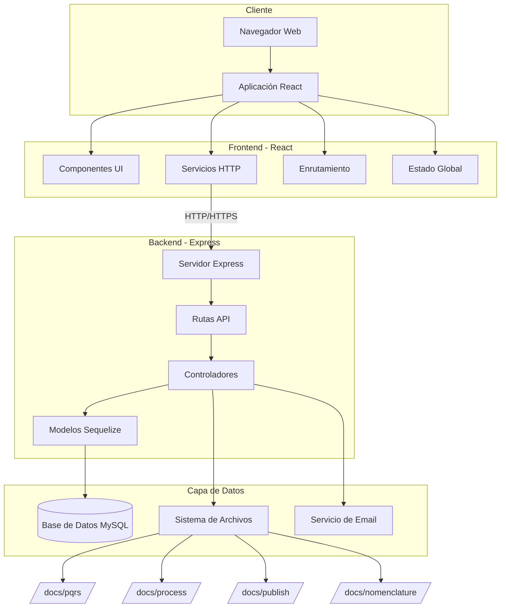
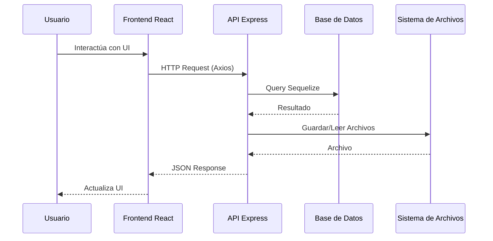
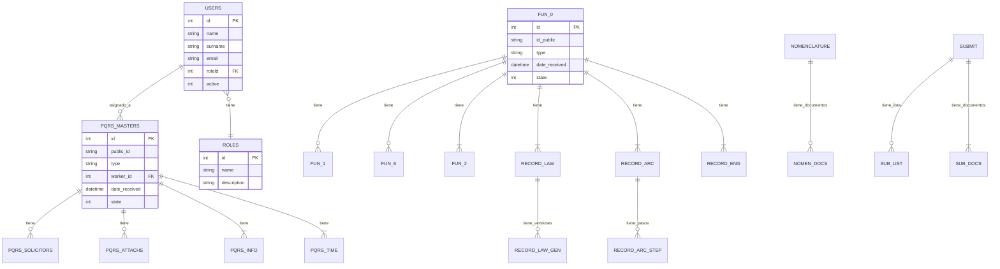
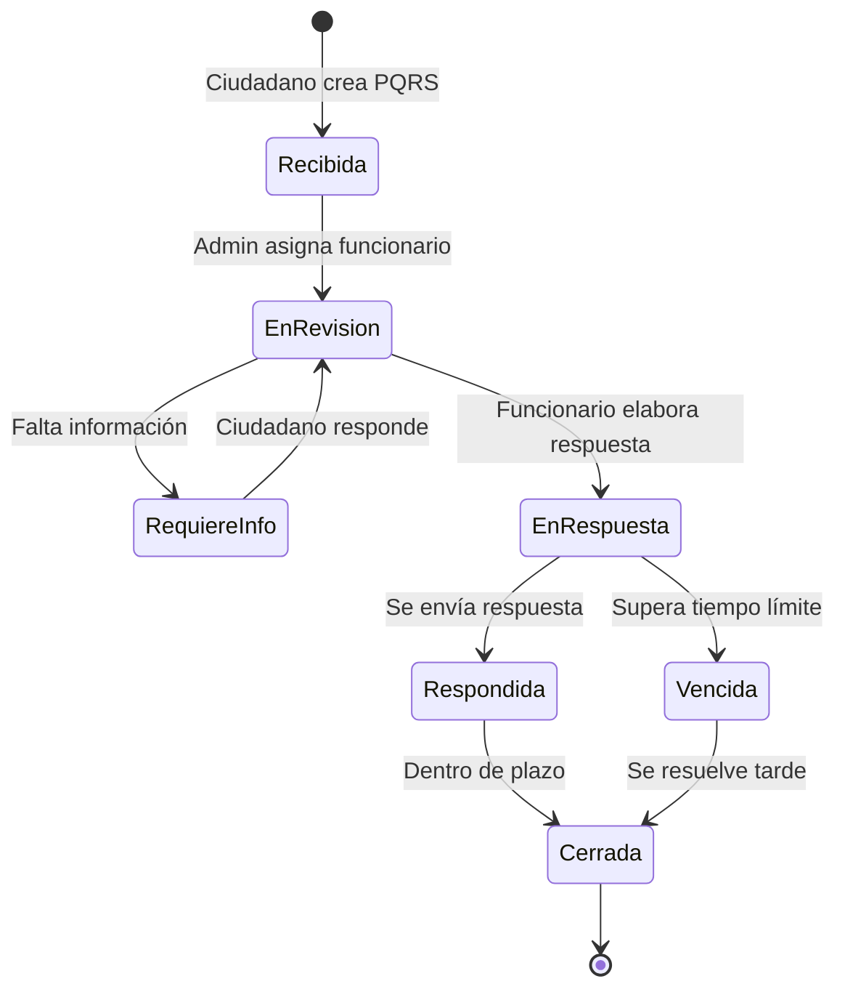
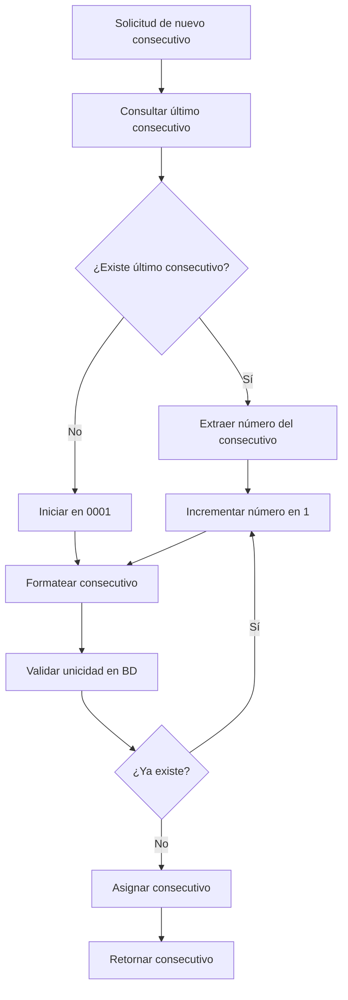
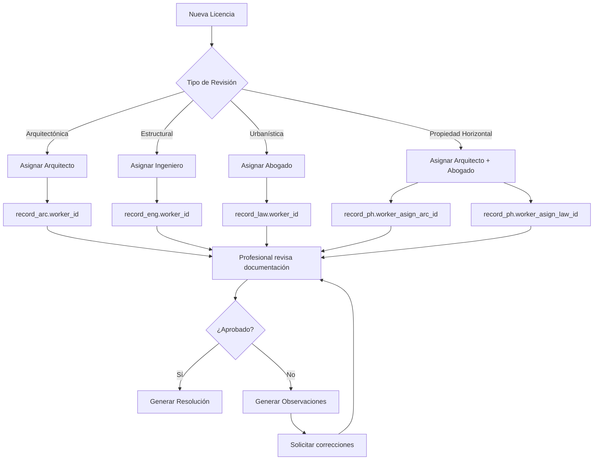
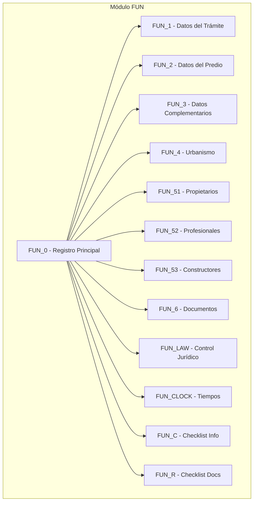
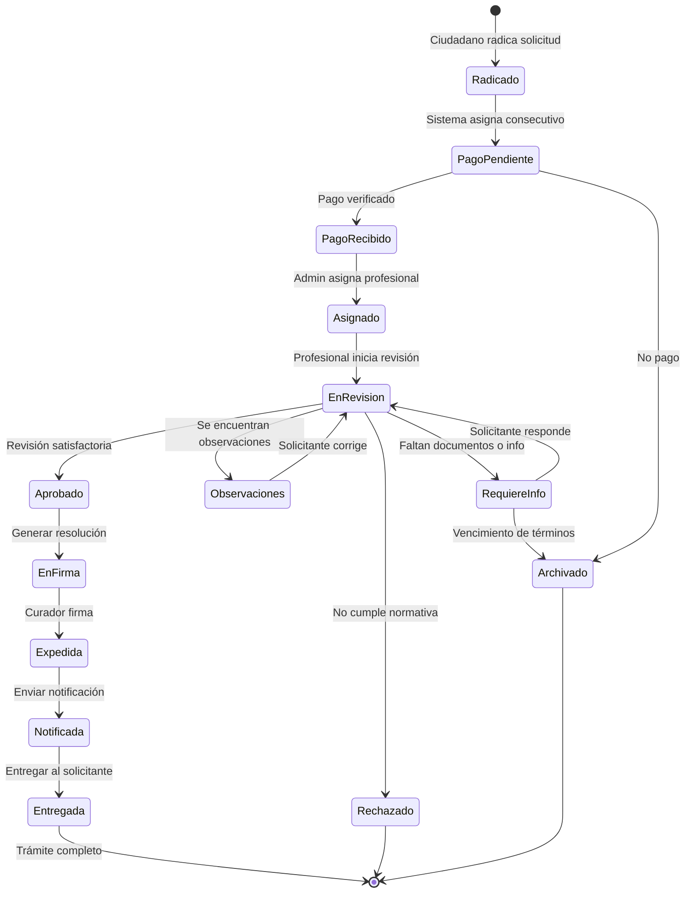
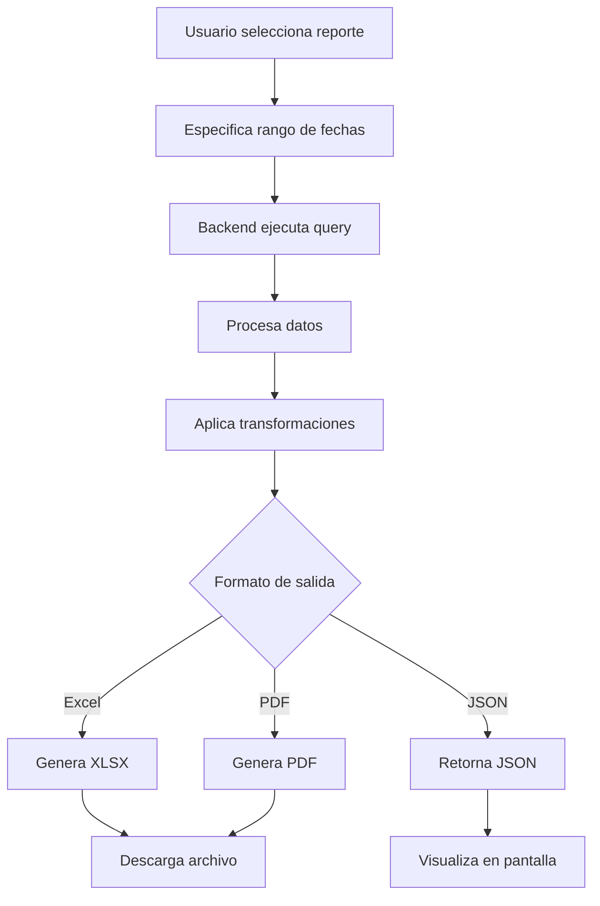

# Documentación Técnica - Sistema Curaduría

## Tabla de Contenidos

1. [Propósito General y Resumen Técnico](#1-propósito-general-y-resumen-técnico)
2. [Arquitectura del Sistema](#2-arquitectura-del-sistema)
3. [Estructura de Carpetas y Archivos](#3-estructura-de-carpetas-y-archivos)
4. [Dependencias Principales](#4-dependencias-principales)
5. [Módulo Frontend (React)](#5-módulo-frontend-react)
6. [Módulo Backend (Node.js/Express)](#6-módulo-backend-nodejsexpress)
7. [Base de Datos](#7-base-de-datos)
8. [APIs y Endpoints](#8-apis-y-endpoints)
9. [Componentes Principales](#9-componentes-principales)
10. [Funciones y Utilidades](#10-funciones-y-utilidades)
11. [Despliegue](#11-despliegue)
12. [Testing](#12-testing)
13. [Carencias y Recomendaciones](#13-carencias-y-recomendaciones)
14. [Sistema de Consecutivos](#14-sistema-de-consecutivos)
15. [Gestión de Profesionales y Asignación a Proyectos](#15-gestión-de-profesionales-y-asignación-a-proyectos)
16. [Módulo de Gestión de Licencias (FUN)](#16-módulo-de-gestión-de-licencias-fun)
17. [Sistema de Métricas y Reportes](#17-sistema-de-métricas-y-reportes)

---

## 1. Propósito General y Resumen Técnico

### 1.1 Propósito General

Este sistema es una aplicación web completa diseñada para la gestión de la **Curaduría N°1 de Bucaramanga**. La aplicación facilita la administración de procesos relacionados con licencias de construcción, trámites urbanísticos, PQRS (Peticiones, Quejas, Reclamos y Sugerencias), citas, nomenclaturas, expedientes y otras funciones administrativas propias de una curaduría urbana.

### 1.2 Resumen Técnico

**Tipo de aplicación:** Aplicación web full-stack con arquitectura cliente-servidor

**Frontend:**
- Framework: React 16.9.0
- Ubicación: Raíz del proyecto
- Tecnologías: React Router, Axios, Bootstrap 5, i18next (internacionalización)
- Características: SPA (Single Page Application), tema claro/oscuro, accesibilidad

**Backend:**
- Framework: Express (Node.js)
- Ubicación: `./dovela-backend/`
- Base de datos: MySQL con Sequelize ORM
- Características: API RESTful, generación de PDFs, envío de correos, manejo de archivos

---

## 2. Arquitectura del Sistema

### 2.1 Diagrama de Arquitectura



### 2.2 Flujo de Comunicación



---

## 3. Estructura de Carpetas y Archivos

### 3.1 Estructura del Frontend (Raíz)

```
/
├── public/                    # Archivos estáticos públicos
│   ├── index.html            # HTML principal
│   ├── favicon.ico           # Icono del sitio
│   └── templates/            # Plantillas de documentos
├── src/                      # Código fuente React
│   ├── index.js             # Punto de entrada
│   ├── http-common.js       # Configuración Axios
│   ├── app/
│   │   ├── App.js           # Componente principal
│   │   ├── components/      # Componentes reutilizables
│   │   │   ├── navbar.js    # Barra de navegación
│   │   │   ├── footer.js    # Pie de página
│   │   │   ├── forms/       # Componentes de formularios
│   │   │   └── jsons/       # Datos de configuración
│   │   ├── pages/           # Páginas de la aplicación
│   │   │   ├── user/        # Páginas de usuario
│   │   │   │   ├── dashboard.js      # Panel principal
│   │   │   │   ├── pqrs/             # Módulo PQRS
│   │   │   │   ├── fun/              # Módulo FUN (licencias)
│   │   │   │   ├── records/          # Expedientes
│   │   │   │   │   ├── arc/          # Arquitectónicos
│   │   │   │   │   ├── eng/          # Ingenierías
│   │   │   │   │   ├── law/          # Urbanísticos
│   │   │   │   │   └── ph/           # Propiedad horizontal
│   │   │   │   ├── nomenclature/     # Nomenclaturas
│   │   │   │   ├── submit/           # Radicación
│   │   │   │   ├── archive/          # Archivo
│   │   │   │   ├── norms/            # Normativas
│   │   │   │   └── certifications/   # Certificaciones
│   │   │   └── liquidator/  # Liquidador de costos
│   │   ├── services/        # Servicios HTTP
│   │   │   ├── data.service.js        # Gestión de datos usuario
│   │   │   ├── appointments.service.js # Servicio de citas
│   │   │   ├── record_arc.service.js   # Expedientes arquitectónicos
│   │   │   └── ...                     # Otros servicios
│   │   ├── translation/     # Internacionalización
│   │   │   ├── i18n.js      # Configuración i18next
│   │   │   ├── es/          # Traducciones español
│   │   │   └── en/          # Traducciones inglés
│   │   └── utils/           # Utilidades
│   │       ├── TemplateEngine.js      # Motor de plantillas
│   │       ├── BusinessDaysCol.js     # Días hábiles Colombia
│   │       └── BaseDocumentUtils.js   # Generación documentos
│   └── styles/              # Estilos CSS
├── package.json             # Dependencias frontend
└── README.md                # Documentación básica
```

### 3.2 Estructura del Backend (dovela-backend/)

```
dovela-backend/
├── server.js                # Punto de entrada del servidor
├── app/
│   ├── config/             # Configuraciones
│   │   ├── db.config.js    # Configuración MySQL
│   │   ├── mailer.config.js       # Configuración email
│   │   ├── variables.global.json  # Variables globales
│   │   ├── curaduria.json         # Datos de la curaduría
│   │   └── holydays.json          # Días festivos
│   ├── models/             # Modelos Sequelize
│   │   ├── index.js        # Inicialización Sequelize
│   │   ├── users.model.js  # Modelo de usuarios
│   │   ├── appointments.model.js  # Modelo de citas
│   │   ├── pqrs/           # Modelos PQRS
│   │   ├── fun/            # Modelos FUN (licencias)
│   │   ├── record_arc/     # Modelos expedientes arquitectónicos
│   │   ├── record_eng/     # Modelos expedientes ingeniería
│   │   ├── record_law/     # Modelos expedientes urbanísticos
│   │   ├── record_ph/      # Modelos propiedad horizontal
│   │   ├── nomenclature/   # Modelos nomenclaturas
│   │   ├── submit/         # Modelos radicación
│   │   ├── norm/           # Modelos normativas
│   │   └── new_pqrs/       # Nuevo sistema PQRS
│   ├── controllers/        # Controladores
│   │   ├── appointments.controller.js    # Gestión de citas
│   │   ├── pqrs_main.controller.js       # Gestión PQRS
│   │   ├── fun.controller.js             # Gestión licencias
│   │   ├── record_arc.controller.js      # Expedientes arquitectónicos
│   │   ├── users.controller.js           # Gestión usuarios
│   │   ├── generate-docs.controller.js   # Generación documentos
│   │   └── ...                           # Otros controladores
│   ├── routes/             # Rutas API
│   │   ├── appointments.routes.js  # Rutas de citas
│   │   ├── pqrs_main.routes.js     # Rutas PQRS
│   │   ├── fun.routes.js           # Rutas licencias
│   │   ├── users.routes.js         # Rutas usuarios
│   │   └── ...                     # Otras rutas
│   ├── mailer/             # Plantillas de correo
│   ├── templates/          # Plantillas de documentos
│   └── fonts/              # Fuentes para PDFs
├── docs/                   # Almacenamiento de archivos
│   ├── pqrs/              # Documentos PQRS
│   │   ├── input/         # Archivos recibidos
│   │   └── output/        # Respuestas generadas
│   ├── process/           # Documentos en proceso
│   ├── publish/           # Publicaciones
│   ├── nomenclature/      # Documentos de nomenclaturas
│   ├── norms/             # Normativas
│   └── submit/            # Radicaciones
└── package.json           # Dependencias backend
```

---

## 4. Dependencias Principales

### 4.1 Frontend (React)

| Dependencia | Versión | Propósito |
|------------|---------|-----------|
| **react** | 16.9.0 | Framework UI principal |
| **react-dom** | 16.9.0 | Renderizado del DOM |
| **react-router-dom** | 5.2.0 | Enrutamiento SPA |
| **axios** | 0.21.4 | Cliente HTTP para API |
| **bootstrap** | 5.3.7 | Framework CSS |
| **react-bootstrap** | 1.6.8 | Componentes Bootstrap para React |
| **i18next** | 20.2.2 | Internacionalización |
| **react-i18next** | 11.8.13 | Integración i18next con React |
| **moment** | 2.29.1 | Manipulación de fechas |
| **moment-business-days** | 1.2.0 | Cálculo días hábiles |
| **sweetalert2** | 10.16.7 | Modales y alertas |
| **jspdf** | 2.5.2 | Generación de PDFs |
| **pdf-lib** | 1.16.0 | Manipulación de PDFs |
| **react-pdf** | 5.3.0 | Visor de PDFs |
| **react-quill** | 1.3.5 | Editor de texto enriquecido |
| **jodit-pro** | 4.6.9 | Editor WYSIWYG profesional |
| **react-data-table-component** | 7.4.6 | Tablas de datos |
| **rsuite** | 5.15.0 | Biblioteca de componentes UI |
| **styled-components** | 5.3.0 | CSS-in-JS |
| **file-saver** | 2.0.5 | Descarga de archivos |
| **react-google-recaptcha** | 2.1.0 | Protección reCAPTCHA |

### 4.2 Backend (Node.js/Express)

| Dependencia | Versión | Propósito |
|------------|---------|-----------|
| **express** | 4.21.2 | Framework web |
| **sequelize** | 6.6.2 | ORM para MySQL |
| **mysql2** | 3.14.1 | Driver MySQL |
| **cors** | 2.8.5 | Manejo de CORS |
| **body-parser** | 2.2.0 | Parsing de cuerpos HTTP |
| **multer** | 2.0.1 | Manejo de archivos multipart |
| **dotenv** | 16.0.0 | Variables de entorno |
| **nodemailer** | 7.0.3 | Envío de correos |
| **moment** | 2.29.1 | Manipulación de fechas |
| **moment-timezone** | 0.6.0 | Zonas horarias |
| **moment-business-days** | 1.2.0 | Cálculo días hábiles |
| **pdf-lib** | 1.16.0 | Manipulación de PDFs |
| **pdfkit** | 0.12.1 | Generación de PDFs |
| **html-pdf** | 3.0.1 | Conversión HTML a PDF |
| **docx** | 9.5.0 | Generación de documentos Word |
| **html-docx-js** | 0.3.1 | Conversión HTML a DOCX |
| **cheerio** | 1.1.0 | Parsing y manipulación HTML |
| **puppeteer-core** | 5.5.0 | Automatización de navegador |
| **qrcode** | 1.5.3 | Generación de códigos QR |
| **nodemon** | 3.1.10 | Desarrollo (reinicio automático) |

---

## 5. Módulo Frontend (React)

### 5.1 Configuración HTTP

**Archivo:** `src/http-common.js`

```javascript
import axios from "axios";

export default axios.create({
  baseURL: process.env.REACT_APP_API_URL,
  headers: {
    "Content-type": 'multipart/form-data;boundary=----WebKitFormBoundaryyrV7KO0BoCBuDbT'
  }
});
```

**Variables de entorno requeridas:**
- `REACT_APP_API_URL`: URL del backend (ej: `http://localhost:3001/api`)

### 5.2 Servicios (Capa de Comunicación con API)

#### Ejemplo: Servicio de Citas

**Archivo:** `src/app/services/appointments.service.js`

```javascript
import http from "../../http-common";

const route = "appointments"

class AppointmentsDataService {
  // Obtener todas las citas
  getAll() {
    return http.get(`/${route}`);
  }

  // Obtener cita por ID
  get(id) {
    return http.get(`/${route}/${id}`);
  }

  // Crear nueva cita
  create(data) {
    return http.post(`/${route}`, data);
  }

  // Verificar disponibilidad de fecha
  checkforAvailableDate(data) {
    return http.post(`/${route}/search/aviailabledate/`, data);
  }

  // Actualizar cita
  update(id, data) {
    return http.put(`/${route}/${id}`, data);
  }

  // Eliminar cita
  delete(id) {
    return http.delete(`/${route}/${id}`);
  }
}

export default new AppointmentsDataService();
```

**Uso en componentes:**

```javascript
import AppointmentsService from '../../services/appointments.service';

// Crear una cita
const createAppointment = async () => {
  const appointmentData = {
    name: "Juan Pérez",
    email: "juan@example.com",
    date: "2024-01-15",
    time: "10:00",
    worker_id: 1,
    // ... más campos
  };
  
  try {
    const response = await AppointmentsService.create(appointmentData);
    console.log("Cita creada:", response.data);
  } catch (error) {
    console.error("Error:", error);
  }
};
```

### 5.3 Componentes Principales

#### Navbar (Barra de Navegación)

**Archivo:** `src/app/components/navbar.js`

Proporciona:
- Navegación entre módulos
- Cambio de idioma (ES/EN)
- Cambio de tema (claro/oscuro)
- Ajuste de tamaño de fuente
- Información de usuario logueado

#### Footer

**Archivo:** `src/app/components/footer.js`

Muestra información de contacto y enlaces legales.

### 5.4 Páginas Principales

#### Dashboard

**Ruta:** `/dashboard`
**Archivo:** `src/app/pages/user/dashboard.js`

Panel principal con resumen de:
- Expedientes activos
- PQRS pendientes
- Citas del día
- Estadísticas generales

#### Módulo PQRS

**Ruta:** `/pqrs`
**Archivo:** `src/app/pages/user/pqrs/pqrsadmin.js`

Gestión de Peticiones, Quejas, Reclamos y Sugerencias:
- Registro de PQRS
- Asignación a funcionarios
- Seguimiento de tiempos de respuesta
- Generación de respuestas
- Historial y consultas

#### Módulo FUN (Licencias)

**Ruta:** `/fun`
**Archivo:** `src/app/pages/user/fun.js`

Gestión de trámites de licencias de construcción:
- Radicación de solicitudes
- Revisión de documentos
- Control de tiempos
- Generación de resoluciones
- Liquidación de costos

### 5.5 Internacionalización (i18n)

**Archivo:** `src/app/translation/i18n.js`

Soporta español e inglés. Ejemplo de uso:

```javascript
import { useTranslation } from "react-i18next";

function MyComponent() {
  const { t } = useTranslation();
  
  return (
    <div>
      <h1>{t('welcome.title')}</h1>
      <p>{t('welcome.description')}</p>
    </div>
  );
}
```

### 5.6 Temas y Estilos

**Archivos:** `src/app/components/theme.js`, `src/app/components/global.js`

El sistema soporta:
- Tema claro/oscuro
- 5 tamaños de fuente
- Estilos personalizados con styled-components

---

## 6. Módulo Backend (Node.js/Express)

### 6.1 Configuración del Servidor

**Archivo:** `dovela-backend/server.js`

```javascript
const express = require('express');
const cors = require('cors');
const multer = require('multer');
require('dotenv').config();

const app = express();

// Configuración de Multer para manejo de archivos
var storage = multer.diskStorage({
  destination: function (req, file, cb) {
    // Lógica para determinar carpeta destino según tipo de archivo
    var DIR = './docs/unsorted/';
    if (origin_name == 'pqrs') DIR = './docs/pqrs/input/';
    // ... más lógica
    cb(null, DIR);
  },
  filename: function (req, file, cb) {
    var name = file.originalname.substring(0, file.originalname.lastIndexOf('.'));
    var extension = file.originalname.split('.').pop();
    cb(null, name + '_' + Date.now() + '.' + extension);
  }
});

const upload = multer({ storage: storage });

// Middlewares
app.use(cors());
app.use(express.urlencoded({ extended: true }));
app.use(express.json());
app.use(upload.any());

// Inicialización de base de datos
const db = require("./app/models");
db.sequelize.sync({ alter: true }).then(() => {
  console.log("Base de datos sincronizada");
});

// Rutas
require("./app/routes/appointments.routes")(app);
require("./app/routes/pqrs_main.routes")(app);
require("./app/routes/fun.routes")(app);
// ... más rutas

const PORT = process.env.PORT || 3001;
app.listen(PORT, () => {
  console.log(`Servidor corriendo en puerto ${PORT}`);
});
```

### 6.2 Configuración de Base de Datos

**Archivo:** `dovela-backend/app/config/db.config.js`

```javascript
module.exports = {
  HOST: process.env.DB_HOST,
  USER: process.env.DB_USER,
  PASSWORD: process.env.DB_PASSWORD,
  DB: process.env.DB_NAME,
  dialect: "mysql",
  pool: {
    max: 5,
    min: 0,
    acquire: 30000,
    idle: 10000
  }
};
```

**Variables de entorno requeridas (.env):**

```env
DB_HOST=localhost
DB_USER=usuario_mysql
DB_PASSWORD=contraseña_mysql
DB_NAME=nombre_base_datos
PORT=3001
IP_ADRESS=127.0.0.1
```

### 6.3 Modelos Sequelize

#### Ejemplo: Modelo de Citas

**Archivo:** `dovela-backend/app/models/appointments.model.js`

```javascript
module.exports = (sequelize, Sequelize) => {
  const Appointments = sequelize.define("appointments", {
    id: {
      type: Sequelize.INTEGER,
      primaryKey: true,
      autoIncrement: true
    },
    name: {
      type: Sequelize.STRING
    },
    type_id: {
      type: Sequelize.INTEGER
    },
    number_id: {
      type: Sequelize.STRING
    },
    profesional: {
      type: Sequelize.STRING
    },
    profesional_id: {
      type: Sequelize.INTEGER
    },
    email: {
      type: Sequelize.STRING
    },
    number_mobile: {
      type: Sequelize.STRING
    },
    date: {
      type: Sequelize.BIGINT
    },
    time: {
      type: Sequelize.STRING
    },
    motive: {
      type: Sequelize.STRING
    },
    content: {
      type: Sequelize.TEXT
    },
    appointment_type: {
      type: Sequelize.INTEGER
    },
    accesibility: {
      type: Sequelize.INTEGER
    }
  });

  return Appointments;
};
```

### 6.4 Controladores

#### Ejemplo: Controlador de Citas

**Archivo:** `dovela-backend/app/controllers/appointments.controller.js`

```javascript
const db = require("../models");
const Appointments = db.appointments;
const nodemailer = require("nodemailer");

// Crear cita
exports.create = (req, res) => {
  const object = {
    name: req.body.name,
    email: req.body.email,
    date: req.body.date,
    time: req.body.time,
    // ... más campos
  };
  
  Appointments.create(object)
    .then(data => {
      // Enviar correo de confirmación
      confirmMail(object);
      res.send('OK');
    })
    .catch(err => {
      res.status(500).send({
        message: err.message || "Error al crear cita"
      });
    });
};

// Obtener todas las citas
exports.findAll = (req, res) => {
  Appointments.findAll()
    .then(data => {
      res.send(data);
    })
    .catch(err => {
      res.status(500).send({
        message: err.message || "Error al obtener citas"
      });
    });
};

// Obtener cita por ID
exports.findOne = (req, res) => {
  const id = req.params.id;
  
  Appointments.findByPk(id)
    .then(data => {
      if (data) {
        res.send(data);
      } else {
        res.status(404).send({
          message: `Cita con id=${id} no encontrada`
        });
      }
    })
    .catch(err => {
      res.status(500).send({
        message: "Error al obtener cita con id=" + id
      });
    });
};

// Actualizar cita
exports.update = (req, res) => {
  const id = req.params.id;
  
  Appointments.update(req.body, {
    where: { id: id }
  })
    .then(num => {
      if (num == 1) {
        res.send({
          message: "Cita actualizada exitosamente"
        });
      } else {
        res.send({
          message: `No se pudo actualizar cita con id=${id}`
        });
      }
    })
    .catch(err => {
      res.status(500).send({
        message: "Error al actualizar cita con id=" + id
      });
    });
};

// Eliminar cita
exports.delete = (req, res) => {
  const id = req.params.id;
  
  Appointments.destroy({
    where: { id: id }
  })
    .then(num => {
      if (num == 1) {
        res.send({
          message: "Cita eliminada exitosamente"
        });
      } else {
        res.send({
          message: `No se pudo eliminar cita con id=${id}`
        });
      }
    })
    .catch(err => {
      res.status(500).send({
        message: "Error al eliminar cita con id=" + id
      });
    });
};
```

### 6.5 Rutas

#### Ejemplo: Rutas de Citas

**Archivo:** `dovela-backend/app/routes/appointments.routes.js`

```javascript
module.exports = app => {
  const appointments = require("../controllers/appointments.controller.js");
  var router = require("express").Router();

  // Crear nueva cita
  router.post("/", appointments.create);

  // Verificar disponibilidad
  router.post("/search/aviailabledate", appointments.findaAviailAbleDate);

  // Obtener todas las citas
  router.get("/", appointments.findAll);

  // Obtener una cita por ID
  router.get("/:id", appointments.findOne);

  // Actualizar cita
  router.put("/:id", appointments.update);

  // Eliminar cita
  router.delete("/:id", appointments.delete);

  app.use('/api/appointments', router);
};
```

---

## 7. Base de Datos

### 7.1 Diagrama de Relaciones Principales



### 7.2 Tablas Principales

| Tabla | Descripción | Registros Estimados |
|-------|-------------|---------------------|
| **users** | Usuarios del sistema | < 50 |
| **roles** | Roles y permisos | 5-10 |
| **appointments** | Citas agendadas | Cientos |
| **pqrs_masters** | PQRS principal | Miles |
| **pqrs_solicitors** | Solicitantes PQRS | Miles |
| **fun_0** | Licencias (registro principal) | Miles |
| **fun_6** | Documentos de licencias | Decenas de miles |
| **record_arc** | Expedientes arquitectónicos | Miles |
| **record_eng** | Expedientes ingeniería | Miles |
| **record_law** | Expedientes urbanísticos | Miles |
| **nomenclature** | Nomenclaturas | Miles |
| **publications** | Publicaciones oficiales | Cientos |
| **seals** | Sellos digitales | Miles |

---

## 8. APIs y Endpoints

### 8.1 Módulo de Citas

**Base URL:** `/api/appointments`

| Método | Endpoint | Descripción | Request Body | Response |
|--------|----------|-------------|--------------|----------|
| GET | `/` | Obtener todas las citas | - | Array de citas |
| GET | `/:id` | Obtener cita por ID | - | Objeto cita |
| POST | `/` | Crear nueva cita | Datos de cita | 'OK' o error |
| POST | `/search/aviailabledate` | Verificar disponibilidad | `{date, time, worker_id}` | Boolean |
| PUT | `/:id` | Actualizar cita | Datos parciales | Mensaje |
| DELETE | `/:id` | Eliminar cita | - | Mensaje |

**Ejemplo de Request - Crear Cita:**

```http
POST /api/appointments
Content-Type: application/json

{
  "name": "María González",
  "type_id": 1,
  "number_id": "1234567890",
  "worker_name": "Arquitecto Juan",
  "worker_id": 3,
  "email": "maria@example.com",
  "number_mobile": "3001234567",
  "date": 1704067200000,
  "time": "14:30",
  "motive": "Consulta licencia",
  "content": "Consulta sobre requisitos para licencia de construcción",
  "appointment_type": 1,
  "accesibility": 0
}
```

**Response:**

```http
HTTP/1.1 200 OK
Content-Type: text/plain

OK
```

### 8.2 Módulo PQRS

**Base URL:** `/api/pqrs_main`

| Método | Endpoint | Descripción |
|--------|----------|-------------|
| GET | `/` | Listar todas las PQRS |
| GET | `/pqrs/all` | PQRS con datos completos |
| GET | `/pqrs/pending` | PQRS pendientes |
| GET | `/:id` | Obtener PQRS por ID |
| POST | `/` | Crear PQRS (interno) |
| POST | `/create_public` | Crear PQRS (público) |
| POST | `/search/` | Buscar PQRS |
| PUT | `/:id` | Actualizar PQRS |
| POST | `/process/formalreply` | Generar respuesta formal |
| POST | `/process/emailreply` | Enviar respuesta por email |
| POST | `/pdfgen/reply` | Generar PDF de respuesta |
| DELETE | `/:id` | Eliminar PQRS |

**Ejemplo - Crear PQRS Pública:**

```javascript
// Request
POST /api/pqrs_main/create_public

{
  "type": "Petición",
  "solicitor_name": "Pedro Ramírez",
  "solicitor_id": "987654321",
  "email": "pedro@example.com",
  "phone": "3009876543",
  "subject": "Solicitud de información",
  "content": "Requiero información sobre el estado de mi licencia...",
  "attachments": []
}

// Response
{
  "message": "PQRS creada exitosamente",
  "public_id": "PQRS-2024-0123",
  "id": 456
}
```

### 8.3 Módulo FUN (Licencias)

**Base URL:** `/api/fun`

| Método | Endpoint | Descripción |
|--------|----------|-------------|
| GET | `/` | Listar todas las licencias |
| GET | `/get/idpublic/:id_public` | Obtener por ID público |
| GET | `/getlast/id` | Obtener último ID público |
| GET | `/loadsubmit/:date_start&:date_end` | Radicados por rango de fechas |
| GET | `/reports/:date_start&:date_end` | Reporte de licencias |
| POST | `/` | Crear nueva licencia |
| PUT | `/:id` | Actualizar licencia |
| POST | `/gendoc/confirm` | Generar documento de confirmación |

### 8.4 Flujo de Trabajo PQRS



### 8.5 Módulo de Usuarios

**Base URL:** `/api/users`

| Método | Endpoint | Descripción |
|--------|----------|-------------|
| GET | `/` | Listar usuarios |
| GET | `/:id` | Obtener usuario |
| POST | `/signin` | Iniciar sesión |
| POST | `/` | Crear usuario |
| PUT | `/:id` | Actualizar usuario |
| DELETE | `/:id` | Eliminar usuario |

---

## 9. Componentes Principales

### 9.1 Sistema de Autenticación

El sistema utiliza un contexto de React para manejar la autenticación:

```javascript
// Uso en App.js
const ProvideAuth = ({ children }) => {
  const auth = useProvideAuth();
  return (
    <authContext.Provider value={auth}>
      {children}
    </authContext.Provider>
  );
};

// Hook personalizado
function useAuth() {
  return useContext(authContext);
}

// Uso en componentes
const { signin, signout, user } = useAuth();
```

### 9.2 Generación de Documentos

#### Plantillas de Documentos

El sistema usa motores de plantillas para generar documentos:

**Archivo:** `src/app/utils/TemplateEngine.js`

Funciones principales:
- `replaceVariables(template, data)`: Reemplaza variables en plantilla
- `generatePDF(html, options)`: Genera PDF desde HTML
- `generateDOCX(template, data)`: Genera documento Word

#### Generación de PDFs en Backend

**Archivo:** `dovela-backend/app/controllers/generate-docs.controller.js`

```javascript
const PDFDocument = require('pdfkit');
const { PDFDocument: PDFLib } = require('pdf-lib');

exports.generateCertificate = async (req, res) => {
  const doc = new PDFDocument();
  
  // Configurar PDF
  res.setHeader('Content-Type', 'application/pdf');
  res.setHeader('Content-Disposition', 'attachment; filename=certificado.pdf');
  
  doc.pipe(res);
  
  // Agregar contenido
  doc.fontSize(25).text('CERTIFICACIÓN', 100, 100);
  doc.fontSize(12).text(`La Curaduría certifica que...`, 100, 150);
  
  // Agregar logo, firma, etc.
  
  doc.end();
};
```

### 9.3 Sistema de Notificaciones por Email

**Archivo:** `dovela-backend/app/config/mailer.config.js`

```javascript
module.exports = {
  transporter: {
    host: process.env.MAIL_HOST,
    port: process.env.MAIL_PORT,
    secure: true,
    auth: {
      user: process.env.MAIL_USER,
      pass: process.env.MAIL_PASSWORD
    }
  },
  mailOptions: {
    from: 'Curaduría N°1 <no-reply@curaduria1bucaramanga.com.co>',
    // ... más opciones
  }
};
```

**Uso:**

```javascript
const nodemailer = require("nodemailer");
const mailerConfig = require("../config/mailer.config");

async function sendNotification(to, subject, html) {
  let transporter = nodemailer.createTransport(mailerConfig.transporter);
  
  let mailOptions = {
    from: mailerConfig.mailOptions.from,
    to: to,
    subject: subject,
    html: html
  };
  
  await transporter.sendMail(mailOptions);
}
```

### 9.4 Manejo de Archivos

El sistema organiza archivos por:
- Tipo de documento (PQRS, licencias, nomenclaturas)
- Año
- ID del proceso

Estructura automática:

```
docs/
  process/
    2024/
      LIC-2024-0001/
        - solicitud.pdf
        - planos.dwg
        - presupuesto.xlsx
      LIC-2024-0002/
        ...
```

---

## 10. Funciones y Utilidades

### 10.1 Cálculo de Días Hábiles

**Archivo:** `src/app/utils/BusinessDaysCol.js`

```javascript
import moment from 'moment-business-days';
import holidays from '../config/holydays.json';

// Configurar días festivos colombianos
moment.updateLocale('es', {
  holidays: holidays,
  holidayFormat: 'YYYY-MM-DD'
});

export function addBusinessDays(date, days) {
  return moment(date).businessAdd(days).format('YYYY-MM-DD');
}

export function businessDaysBetween(startDate, endDate) {
  return moment(endDate).businessDiff(moment(startDate));
}

export function isBusinessDay(date) {
  return moment(date).isBusinessDay();
}
```

**Uso:**

```javascript
import { addBusinessDays, businessDaysBetween } from './utils/BusinessDaysCol';

// Calcular fecha límite de respuesta PQRS (15 días hábiles)
const fechaLimite = addBusinessDays(new Date(), 15);

// Calcular días transcurridos
const diasTranscurridos = businessDaysBetween('2024-01-01', new Date());
```

### 10.2 Liquidador de Costos

**Archivo:** `src/app/pages/liquidator/liquidator.js`

Calcula costos de licencias según:
- Tipo de licencia
- Área de construcción
- Estrato socioeconómico
- Uso del inmueble
- Normativa vigente (SMMLV, UVT)

**Ejemplo de cálculo:**

```javascript
function calcularLiquidacion(datos) {
  const { area, estrato, tipoLicencia, uso } = datos;
  
  // Tarifa base según tipo
  let tarifaBase = TARIFAS[tipoLicencia];
  
  // Ajuste por área
  let costoArea = area * tarifaBase;
  
  // Descuento por estrato
  let descuento = DESCUENTOS_ESTRATO[estrato];
  
  // Cálculo final
  let total = costoArea * (1 - descuento);
  
  return {
    subtotal: costoArea,
    descuento: costoArea * descuento,
    total: total,
    // ... más detalles
  };
}
```

### 10.3 Validaciones de Formularios

Validaciones comunes:
- Número de identificación (Cédula, NIT)
- Correo electrónico
- Número de teléfono colombiano
- Fechas
- Archivos (tamaño, tipo)

```javascript
export const validarCedula = (cedula) => {
  return /^\d{7,10}$/.test(cedula);
};

export const validarEmail = (email) => {
  return /^[^\s@]+@[^\s@]+\.[^\s@]+$/.test(email);
};

export const validarTelefono = (telefono) => {
  return /^3\d{9}$/.test(telefono);
};
```

---

## 11. Despliegue

### 11.1 Requisitos del Sistema

#### Servidor

- **Sistema Operativo:** Linux (Ubuntu 20.04+ recomendado) o Windows Server
- **Node.js:** v14.x o superior
- **MySQL:** 5.7 o superior / MariaDB 10.3+
- **Memoria RAM:** Mínimo 4GB (8GB recomendado)
- **Almacenamiento:** Mínimo 50GB (depende del volumen de documentos)
- **Navegador Web:** Chrome/Firefox/Edge (últimas 2 versiones)

#### Software Adicional

- Chromium/Chrome (para puppeteer)
- Certbot (para SSL/HTTPS)
- Nginx o Apache (proxy reverso)

### 11.2 Instalación

#### Paso 1: Clonar Repositorio

```bash
git clone https://github.com/neoygdrassyl/bedrock_client.git
cd bedrock_client
```

#### Paso 2: Configurar Frontend

```bash
# Instalar dependencias
npm install

# Crear archivo de variables de entorno
cp .env.example .env

# Editar .env
nano .env
```

**Contenido de `.env` (frontend):**

```env
REACT_APP_API_URL=http://localhost:3001/api
REACT_APP_RECAPTCHA_SITE_KEY=tu_site_key_aqui
```

#### Paso 3: Configurar Backend

```bash
cd dovela-backend

# Instalar dependencias
npm install

# Crear archivo de variables de entorno
cp .env.example .env

# Editar .env
nano .env
```

**Contenido de `.env` (backend):**

```env
# Base de datos
DB_HOST=localhost
DB_USER=curaduria_user
DB_PASSWORD=contraseña_segura_aqui
DB_NAME=curaduria_db

# Servidor
PORT=3001
IP_ADRESS=0.0.0.0

# Email
MAIL_HOST=smtp.gmail.com
MAIL_PORT=465
MAIL_USER=correo@curaduria.com
MAIL_PASSWORD=contraseña_email

# Otros
NODE_ENV=production
```

#### Paso 4: Configurar Base de Datos

```bash
# Conectar a MySQL
mysql -u root -p

# Crear base de datos y usuario
CREATE DATABASE curaduria_db CHARACTER SET utf8mb4 COLLATE utf8mb4_unicode_ci;
CREATE USER 'curaduria_user'@'localhost' IDENTIFIED BY 'contraseña_segura_aqui';
GRANT ALL PRIVILEGES ON curaduria_db.* TO 'curaduria_user'@'localhost';
FLUSH PRIVILEGES;
EXIT;
```

**Nota:** El backend inicializa automáticamente las tablas al iniciar usando Sequelize sync.

#### Paso 5: Crear Estructura de Carpetas

```bash
cd dovela-backend
mkdir -p docs/{pqrs/{input,output},process,publish,nomenclature,norms,submit,unsorted}
```

### 11.3 Compilación y Ejecución

#### Modo Desarrollo

**Frontend:**

```bash
npm start
```

Abre [http://localhost:3000](http://localhost:3000)

**Backend:**

```bash
cd dovela-backend
npm run dev
```

Servidor corriendo en [http://localhost:3001](http://localhost:3001)

#### Modo Producción

**Frontend:**

```bash
# Compilar
npm run build

# Los archivos compilados estarán en ./build/
```

**Backend:**

```bash
cd dovela-backend
npm start
```

### 11.4 Configuración con Nginx

**Archivo:** `/etc/nginx/sites-available/curaduria`

```nginx
# Frontend
server {
    listen 80;
    server_name curaduria1bucaramanga.com.co;
    
    root /var/www/curaduria/build;
    index index.html;
    
    location / {
        try_files $uri $uri/ /index.html;
    }
    
    # Proxy para API
    location /api/ {
        proxy_pass http://localhost:3001/api/;
        proxy_http_version 1.1;
        proxy_set_header Upgrade $http_upgrade;
        proxy_set_header Connection 'upgrade';
        proxy_set_header Host $host;
        proxy_cache_bypass $http_upgrade;
    }
}

# Backend directo (opcional)
server {
    listen 3001;
    server_name api.curaduria1bucaramanga.com.co;
    
    location / {
        proxy_pass http://localhost:3001;
        proxy_http_version 1.1;
        proxy_set_header Upgrade $http_upgrade;
        proxy_set_header Connection 'upgrade';
        proxy_set_header Host $host;
        proxy_cache_bypass $http_upgrade;
    }
}
```

Activar configuración:

```bash
sudo ln -s /etc/nginx/sites-available/curaduria /etc/nginx/sites-enabled/
sudo nginx -t
sudo systemctl reload nginx
```

### 11.5 SSL/HTTPS con Certbot

```bash
sudo certbot --nginx -d curaduria1bucaramanga.com.co
```

### 11.6 PM2 para Producción

```bash
# Instalar PM2
npm install -g pm2

# Iniciar backend
cd dovela-backend
pm2 start server.js --name curaduria-backend

# Configurar inicio automático
pm2 startup
pm2 save

# Monitoreo
pm2 monit
pm2 logs curaduria-backend
```

### 11.7 Copias de Seguridad

#### Base de Datos

```bash
# Backup automático diario
crontab -e

# Agregar línea (backup a las 2 AM):
0 2 * * * mysqldump -u curaduria_user -pcontraseña curaduria_db > /backups/db_$(date +\%Y\%m\%d).sql
```

#### Archivos

```bash
# Backup semanal de documentos
0 3 * * 0 tar -czf /backups/docs_$(date +\%Y\%m\%d).tar.gz /path/to/dovela-backend/docs/
```

---

## 12. Testing

### 12.1 Estado Actual

**⚠️ CARENCIA IDENTIFICADA:** El proyecto actualmente **NO** cuenta con pruebas automatizadas implementadas.

Los archivos `package.json` indican:

```json
// Frontend
"scripts": {
  "test": "react-scripts test"
}

// Backend
"scripts": {
  "test": "echo \"Error: no test specified\" && exit 1"
}
```

### 12.2 Recomendaciones de Testing

#### Para Frontend (React)

**Herramientas sugeridas:**
- **Jest**: Framework de testing (ya incluido con create-react-app)
- **React Testing Library**: Testing de componentes
- **Cypress**: Testing E2E

**Ejemplo de test de componente:**

```javascript
// src/app/services/__tests__/appointments.service.test.js
import AppointmentsService from '../appointments.service';
import http from '../../http-common';

jest.mock('../../http-common');

describe('AppointmentsService', () => {
  test('getAll should fetch appointments', async () => {
    const mockData = [{ id: 1, name: 'Test' }];
    http.get.mockResolvedValue({ data: mockData });
    
    const result = await AppointmentsService.getAll();
    
    expect(http.get).toHaveBeenCalledWith('/appointments');
    expect(result.data).toEqual(mockData);
  });
  
  test('create should post appointment', async () => {
    const appointmentData = { name: 'Juan', email: 'juan@test.com' };
    http.post.mockResolvedValue({ data: 'OK' });
    
    const result = await AppointmentsService.create(appointmentData);
    
    expect(http.post).toHaveBeenCalledWith('/appointments', appointmentData);
    expect(result.data).toBe('OK');
  });
});
```

#### Para Backend (Node.js/Express)

**Herramientas sugeridas:**
- **Jest**: Framework de testing
- **Supertest**: Testing de APIs HTTP
- **Mock-Sequelize**: Mocking de base de datos

**Ejemplo de test de API:**

```javascript
// dovela-backend/app/__tests__/appointments.test.js
const request = require('supertest');
const app = require('../server');
const db = require('../models');

describe('Appointments API', () => {
  beforeAll(async () => {
    await db.sequelize.sync({ force: true });
  });
  
  test('POST /api/appointments should create appointment', async () => {
    const appointmentData = {
      name: 'Test User',
      email: 'test@example.com',
      date: Date.now(),
      time: '10:00'
    };
    
    const response = await request(app)
      .post('/api/appointments')
      .send(appointmentData)
      .expect(200);
    
    expect(response.text).toBe('OK');
  });
  
  test('GET /api/appointments should return all appointments', async () => {
    const response = await request(app)
      .get('/api/appointments')
      .expect(200);
    
    expect(Array.isArray(response.body)).toBe(true);
  });
});
```

### 12.3 Testing Manual

#### Checklist de Pruebas Manuales

**Módulo de Citas:**
- [ ] Crear cita presencial
- [ ] Crear cita virtual
- [ ] Verificar disponibilidad de horarios
- [ ] Recibir email de confirmación
- [ ] Editar cita existente
- [ ] Cancelar cita

**Módulo PQRS:**
- [ ] Crear PQRS pública (sin autenticación)
- [ ] Asignar PQRS a funcionario
- [ ] Cambiar estado de PQRS
- [ ] Generar respuesta formal
- [ ] Enviar respuesta por email
- [ ] Generar PDF de respuesta
- [ ] Cerrar PQRS

**Módulo FUN (Licencias):**
- [ ] Radicar nueva solicitud
- [ ] Cargar documentos adjuntos
- [ ] Asignar revisores
- [ ] Registrar observaciones
- [ ] Generar resolución
- [ ] Liquidar costos
- [ ] Expedir licencia

#### Comandos de Testing

```bash
# Frontend
npm test                    # Ejecutar tests interactivos
npm test -- --coverage      # Con reporte de cobertura
npm test -- --watchAll      # Watch mode

# Backend (después de implementar tests)
cd dovela-backend
npm test                    # Ejecutar todos los tests
npm test -- appointments    # Ejecutar tests específicos
npm test -- --coverage      # Con cobertura
```

---

## 13. Carencias y Recomendaciones

### 13.1 Carencias Identificadas

#### 🔴 Críticas

1. **Falta de Tests Automatizados**
   - No existen pruebas unitarias ni de integración
   - **Riesgo:** Alta probabilidad de regresiones al hacer cambios
   - **Recomendación:** Implementar suite de tests con Jest y React Testing Library para frontend, Jest y Supertest para backend
   - **Prioridad:** ALTA

2. **Gestión de Secretos**
   - Archivos `.env` no están en `.gitignore` adecuadamente
   - Variables sensibles podrían exponerse
   - **Recomendación:** Usar gestores de secretos (AWS Secrets Manager, Azure Key Vault) o herramientas como `dotenv-vault`
   - **Prioridad:** ALTA

3. **Falta de Validación de Entrada**
   - No se observan validaciones robustas en el backend
   - **Riesgo:** Vulnerabilidades de seguridad (SQL injection, XSS)
   - **Recomendación:** Implementar validación con `joi` o `express-validator`
   - **Prioridad:** ALTA

4. **Sin Documentación de API**
   - No hay especificación OpenAPI/Swagger
   - **Recomendación:** Implementar Swagger/OpenAPI para documentar endpoints
   - **Prioridad:** MEDIA

#### 🟡 Importantes

5. **Logging Insuficiente**
   - Solo `console.log` para debugging
   - **Recomendación:** Implementar logger estructurado (Winston, Pino)
   - **Prioridad:** MEDIA

6. **Sin Control de Versiones de API**
   - Todos los endpoints en `/api/*` sin versionado
   - **Recomendación:** Implementar versionado `/api/v1/*`, `/api/v2/*`
   - **Prioridad:** MEDIA

7. **Manejo de Errores Inconsistente**
   - No hay middleware centralizado de manejo de errores
   - **Recomendación:** Crear middleware de error handling global
   - **Prioridad:** MEDIA

8. **Sin Rate Limiting**
   - API vulnerable a abuso y DDoS
   - **Recomendación:** Implementar `express-rate-limit`
   - **Prioridad:** MEDIA

9. **Dependencias Desactualizadas**
   - React 16.9.0 (actual: 18.x)
   - Algunas dependencias con vulnerabilidades conocidas
   - **Recomendación:** Actualizar dependencias críticas
   - **Prioridad:** MEDIA

#### 🟢 Mejoras Recomendadas

10. **Sin CI/CD**
    - No hay pipeline automatizado
    - **Recomendación:** Implementar GitHub Actions o GitLab CI
    - **Prioridad:** BAJA

11. **Falta de Monitoreo**
    - No hay herramientas de monitoreo en producción
    - **Recomendación:** Implementar APM (New Relic, DataDog) o self-hosted (Grafana + Prometheus)
    - **Prioridad:** BAJA

12. **Sin Análisis de Código Estático**
    - No hay linters configurados
    - **Recomendación:** Configurar ESLint, Prettier, y Husky para pre-commit hooks
    - **Prioridad:** BAJA

13. **Documentación de Código**
    - Comentarios limitados en el código
    - **Recomendación:** Agregar JSDoc para funciones públicas
    - **Prioridad:** BAJA

### 13.2 Plan de Acción Sugerido

#### Fase 1: Seguridad (1-2 semanas)
```
✓ Implementar validación de entradas
✓ Configurar gestión de secretos
✓ Agregar rate limiting
✓ Actualizar dependencias con vulnerabilidades
```

#### Fase 2: Calidad (2-3 semanas)
```
✓ Implementar suite de tests (objetivo: 60% cobertura)
✓ Configurar linters y formatters
✓ Agregar middleware de error handling
✓ Implementar logging estructurado
```

#### Fase 3: Documentación (1 semana)
```
✓ Generar documentación OpenAPI/Swagger
✓ Agregar JSDoc en código crítico
✓ Crear guías de contribución
```

#### Fase 4: DevOps (2 semanas)
```
✓ Configurar CI/CD pipeline
✓ Implementar monitoreo básico
✓ Automatizar backups
✓ Configurar alertas
```

### 13.3 Mejores Prácticas Recomendadas

1. **Estructura de Commits**: Adoptar Conventional Commits
2. **Code Reviews**: Requerir aprobación antes de merge
3. **Branching Strategy**: Implementar GitFlow o trunk-based development
4. **Semantic Versioning**: Para releases
5. **Changelog**: Mantener changelog actualizado
6. **Security Scanning**: Usar herramientas como Snyk o Dependabot

### 13.4 Recursos Adicionales

**Documentación Oficial:**
- React: https://react.dev/
- Express: https://expressjs.com/
- Sequelize: https://sequelize.org/
- Node.js Best Practices: https://github.com/goldbergyoni/nodebestpractices

**Herramientas Recomendadas:**
- Testing: Jest, React Testing Library, Supertest
- Linting: ESLint, Prettier
- Security: Snyk, npm audit
- Documentation: Swagger UI, JSDoc
- CI/CD: GitHub Actions, Jenkins
- Monitoring: PM2, New Relic, Grafana

---

## Conclusión

Este sistema es una aplicación robusta y funcional para la gestión de una curaduría urbana. Maneja múltiples módulos complejos incluyendo PQRS, licencias de construcción, nomenclaturas, y más.

**Fortalezas:**
- Arquitectura bien definida (frontend/backend separados)
- Uso de tecnologías estándar y probadas
- Funcionalidad completa para procesos críticos
- Generación automatizada de documentos
- Sistema de notificaciones por email

**Áreas de Mejora:**
- Implementar tests automatizados (crítico)
- Mejorar seguridad (validaciones, gestión de secretos)
- Actualizar dependencias
- Agregar documentación de API
- Implementar CI/CD y monitoreo

Con las mejoras sugeridas en este documento, el sistema alcanzará estándares de producción enterprise y será más mantenible, seguro y escalable a largo plazo.

---

---

## 14. Sistema de Consecutivos

### 14.1 Propósito del Sistema de Consecutivos

El sistema implementa un mecanismo de generación de identificadores únicos (consecutivos) para diferentes entidades del sistema. Estos identificadores facilitan el seguimiento, trazabilidad y referencia de trámites, documentos y procesos.

### 14.2 Tipos de Consecutivos

El sistema maneja varios tipos de consecutivos según la configuración en `curaduria.json`:

| Tipo | Prefijo | Formato | Ejemplo | Entidad |
|------|---------|---------|---------|---------|
| **Licencias/Trámites** | 68001-1 | `{prefijo}-{año}-{número}` | 68001-1-2024-0123 | fun_0 |
| **Radicaciones** | VR | `VR-{año}-{número}` | VR-2024-0456 | submit |
| **Expediciones** | CUB | `CUB-{año}-{número}` | CUB-2024-0789 | expedition |
| **Nomenclaturas** | N | `N-{año}-{número}` | N-2024-0012 | nomenclature |
| **PQRS** | PQRS | `PQRS-{año}-{número}` | PQRS-2024-0345 | pqrs_masters |

### 14.3 Configuración de Consecutivos

**Archivo:** `dovela-backend/app/config/curaduria.json`

```json
{
  "serials": {
    "start": "VR",        // Prefijo para radicaciones
    "end": "CUB",         // Prefijo para expediciones
    "process": "68001-1",  // Prefijo para licencias
    "nomen": "N"          // Prefijo para nomenclaturas
  }
}
```

### 14.4 Generación de Consecutivos

#### Algoritmo de Generación



#### Implementación Backend

**Archivo:** `dovela-backend/app/controllers/fun.controller.js`

```javascript
// Obtener último ID público de licencias
exports.getLastIdPublic = (req, res) => {
  const { QueryTypes } = require('sequelize');
  var query = `
  SELECT MAX(fun_0s.id_public) AS id
  FROM fun_0s 
  WHERE fun_0s.id_public LIKE '${curaduriaInfo.serials.process}%'
  `;

  db.sequelize.query(query, { type: QueryTypes.SELECT })
    .then(data => {
      res.send(data);
    })
    .catch(err => {
      res.status(500).send({
        message: err.message || "Error al obtener último consecutivo"
      });
    });
};

// Obtener último ID de expedición
exports.getLastIdPublicRes = (req, res) => {
  const { QueryTypes } = require('sequelize');
  var query = `
  SELECT MAX(expeditions.id_public) AS id
  FROM expeditions
  `;

  db.sequelize.query(query, { type: QueryTypes.SELECT })
    .then(data => {
      res.send(data);
    })
    .catch(err => {
      res.status(500).send({
        message: err.message || "Error al obtener último consecutivo"
      });
    });
};
```

#### Validación de Duplicados

```javascript
// Al crear una nueva licencia
exports.create = (req, res) => {
  const id_public = req.body.id_public;
  
  // Validar que no exista el consecutivo
  const { QueryTypes } = require('sequelize');
  var query = `
  SELECT fun_0s.id_public
  FROM fun_0s
  WHERE fun_0s.id_public LIKE '${id_public}'
  `;

  db.sequelize.query(query, { type: QueryTypes.SELECT })
    .then(data => {
      if (data.length) { 
        return res.send("ERROR_DUPLICATE"); 
      } else {
        // Continuar con la creación
        createRecord();
      }
    })
    .catch(err => {
      return res.status(500).send({
        message: err.message || "Error al validar consecutivo"
      });
    });
};
```

### 14.5 Uso en Frontend

**Ejemplo: Generación de consecutivo para nueva licencia**

```javascript
import FUNService from '../../services/fun.service';

// Obtener último consecutivo
const getNextConsecutive = async () => {
  try {
    const response = await FUNService.getLastIdPublic();
    const lastId = response.data[0].id;
    
    // Extraer año y número del último consecutivo
    // Ejemplo: "68001-1-2024-0123" -> año=2024, num=123
    const parts = lastId.split('-');
    const year = new Date().getFullYear();
    const lastYear = parseInt(parts[2]);
    const lastNum = parseInt(parts[3]);
    
    let nextNum;
    if (year === lastYear) {
      // Mismo año, incrementar número
      nextNum = lastNum + 1;
    } else {
      // Año nuevo, reiniciar en 1
      nextNum = 1;
    }
    
    // Formatear nuevo consecutivo
    const newId = `68001-1-${year}-${nextNum.toString().padStart(4, '0')}`;
    
    return newId;
  } catch (error) {
    console.error("Error al obtener consecutivo:", error);
  }
};

// Uso al crear nueva licencia
const createNewLicense = async () => {
  const consecutivo = await getNextConsecutive();
  
  const licenseData = {
    id_public: consecutivo,
    // ... más datos
  };
  
  await FUNService.create(licenseData);
};
```

### 14.6 Ventajas del Sistema de Consecutivos

1. **Unicidad garantizada**: Cada trámite tiene un identificador único
2. **Trazabilidad**: Fácil seguimiento cronológico de procesos
3. **Organización**: Separación por tipo de entidad y año
4. **Auditoría**: Facilita reportes y consultas históricas
5. **Referencia clara**: Usuarios pueden referenciar trámites fácilmente

### 14.7 Consideraciones Importantes

**⚠️ Concurrencia:**  
El sistema actual no implementa bloqueos de concurrencia. Si dos usuarios solicitan un consecutivo simultáneamente, podría generarse un duplicado. 

**Recomendación:** Implementar transacciones de base de datos o un servicio de generación de consecutivos con bloqueo optimista/pesimista.

**Ejemplo de mejora con transacciones:**

```javascript
const createWithConsecutive = async (data) => {
  const transaction = await db.sequelize.transaction();
  
  try {
    // Bloquear la tabla mientras se genera el consecutivo
    const lastId = await db.sequelize.query(
      'SELECT MAX(id_public) AS id FROM fun_0s FOR UPDATE',
      { type: QueryTypes.SELECT, transaction }
    );
    
    // Generar nuevo consecutivo
    const newId = generateNext(lastId[0].id);
    
    // Crear registro
    await FUN_0.create({ ...data, id_public: newId }, { transaction });
    
    await transaction.commit();
    return newId;
  } catch (error) {
    await transaction.rollback();
    throw error;
  }
};
```

---

## 15. Gestión de Profesionales y Asignación a Proyectos

### 15.1 Profesionales del Sistema

El sistema cuenta con un equipo de profesionales definidos en la configuración global.

**Archivo:** `dovela-backend/app/config/variables.global.json`

```json
{
  "WORKERS_INFO": {
    "0": {
      "name": "LUIS CARLOS PARRA SALAZAR",
      "email": "luiskparra@gmail.com",
      "email_work": "curador@curaduria1bucaramanga.com",
      "role": "CURADOR"
    },
    "1": {
      "name": "CARLOS ULLOA",
      "email": "caruk21@yahoo.com",
      "email_work": "ingeniero@curaduria1bucaramanga.com",
      "role": "INGENIERO"
    },
    "3": {
      "name": "MAYRA ANDREA CEPEDA GOMEZ",
      "email": "divisiondearquitectura1@gmail.com",
      "email_work": "arquitecta@curaduria1bucaramanga.com",
      "role": "ARQUITECTA"
    }
    // ... más profesionales
  }
}
```

### 15.2 Roles de Profesionales

| ID | Nombre | Rol | Responsabilidad |
|----|--------|-----|-----------------|
| 0 | Luis Carlos Parra | CURADOR | Firma y aprobación final de licencias |
| 1 | Carlos Ulloa | INGENIERO | Revisión estructural y sismorresistente |
| 2 | María Margarita Jerez | ABOGADA | Revisión jurídica y urbanística |
| 3 | Mayra Andrea Cepeda | ARQUITECTA | Revisión arquitectónica |
| 4 | Linda Julieth Páez | ABOGADA | Apoyo jurídico |
| 5 | José Daniel Triana | ARQUITECTO | Revisión arquitectónica |
| 6 | Lina María Rocha | ARQUITECTA | Revisión arquitectónica |
| 7 | Antonio Granados | INGENIERO | Revisión estructural |

### 15.3 Asignación de Profesionales a Proyectos

#### Diagrama de Asignación



#### Modelo de Relaciones

**Tablas involucradas:**

1. **fun_0**: Licencia principal
2. **record_arc**: Expediente arquitectónico
3. **record_eng**: Expediente de ingeniería
4. **record_law**: Expediente urbanístico
5. **record_ph**: Expediente de propiedad horizontal

**Relaciones:**

```sql
-- Una licencia puede tener un expediente arquitectónico
fun_0 (1) --> (1) record_arc
  - record_arc.worker_id: ID del arquitecto asignado
  - record_arc.worker_name: Nombre del arquitecto

-- Una licencia puede tener un expediente de ingeniería
fun_0 (1) --> (1) record_eng
  - record_eng.worker_id: ID del ingeniero asignado
  - record_eng.worker_name: Nombre del ingeniero

-- Una licencia puede tener un expediente urbanístico
fun_0 (1) --> (1) record_law
  - record_law.worker_id: ID del abogado asignado
  - record_law.worker_name: Nombre del abogado

-- Propiedad horizontal requiere dos revisiones
fun_0 (1) --> (1) record_ph
  - record_ph.worker_asign_arc_id: ID del arquitecto
  - record_ph.worker_arc_name: Nombre del arquitecto
  - record_ph.worker_asign_law_id: ID del abogado
  - record_ph.worker_law_name: Nombre del abogado
```

### 15.4 Proceso de Asignación

#### Paso 1: Creación de Licencia

Cuando se crea una nueva licencia (`fun_0`), se determina qué tipo de expediente requiere según el tipo de trámite.

#### Paso 2: Creación de Expediente

```javascript
// Ejemplo: Crear expediente arquitectónico
const createArchitecturalRecord = async (fun0Id, workerId) => {
  const workerInfo = WORKERS_INFO[workerId];
  
  const recordData = {
    fun0Id: fun0Id,
    worker_id: workerId,
    worker_name: workerInfo.name,
    state: 0, // Estado inicial: pendiente
    date_assigned: new Date()
  };
  
  await RecordArc.create(recordData);
};
```

#### Paso 3: Consulta de Asignaciones

**Backend Query - Licencias asignadas a un profesional:**

```javascript
// Obtener licencias asignadas a un profesional específico
exports.loadAsign = (req, res) => {
  const worker_id = req.params.worker_id;
  const record_type = req.params.record_type; // 'arc', 'eng', 'law'
  
  let query = `
  SELECT
    fun_0s.id,
    fun_0s.id_public,
    fun_0s.state,
    ${record_type === 'arc' ? 'record_arcs.worker_id' : ''}
    ${record_type === 'eng' ? 'record_engs.worker_id' : ''}
    ${record_type === 'law' ? 'record_laws.worker_id' : ''}
  FROM fun_0s
  LEFT JOIN record_arcs ON record_arcs.fun0Id = fun_0s.id
  LEFT JOIN record_engs ON record_engs.fun0Id = fun_0s.id
  LEFT JOIN record_laws ON record_laws.fun0Id = fun_0s.id
  WHERE
    ${record_type === 'arc' ? `record_arcs.worker_id = ${worker_id}` : ''}
    ${record_type === 'eng' ? `record_engs.worker_id = ${worker_id}` : ''}
    ${record_type === 'law' ? `record_laws.worker_id = ${worker_id}` : ''}
  AND fun_0s.state < 200
  ORDER BY fun_0s.createdAt DESC
  `;
  
  db.sequelize.query(query, { type: QueryTypes.SELECT })
    .then(data => res.send(data))
    .catch(err => res.status(500).send({ message: err.message }));
};
```

### 15.5 Notificaciones a Profesionales

Cuando se asigna un proyecto a un profesional, el sistema envía una notificación por correo electrónico.

```javascript
const notifyAssignment = async (workerId, licenseId) => {
  const workerInfo = WORKERS_INFO[workerId];
  
  let transporter = nodemailer.createTransport(mailerConfig.transporter);
  
  let mailOptions = {
    from: 'Curaduría N°1 <no-reply@curaduria1bucaramanga.com.co>',
    to: workerInfo.email_work,
    subject: `Nueva asignación: Licencia ${licenseId}`,
    html: `
      <h3>Asignación de Licencia</h3>
      <p>Estimado/a ${workerInfo.name},</p>
      <p>Se le ha asignado la revisión de la licencia <strong>${licenseId}</strong>.</p>
      <p>Por favor ingrese al sistema para revisar la documentación.</p>
      <br/>
      <p>Este es un mensaje automático del sistema de Curaduría.</p>
    `
  };
  
  await transporter.sendMail(mailOptions);
};
```

### 15.6 Gestión de Carga de Trabajo

El sistema permite consultar la carga de trabajo de cada profesional:

**Query de carga de trabajo:**

```sql
SELECT
  record_arcs.worker_id,
  record_arcs.worker_name,
  COUNT(*) as total_asignados,
  SUM(CASE WHEN fun_0s.state < 100 THEN 1 ELSE 0 END) as en_revision,
  SUM(CASE WHEN fun_0s.state >= 100 AND fun_0s.state < 200 THEN 1 ELSE 0 END) as aprobados,
  SUM(CASE WHEN fun_0s.state >= 200 THEN 1 ELSE 0 END) as finalizados
FROM record_arcs
INNER JOIN fun_0s ON fun_0s.id = record_arcs.fun0Id
GROUP BY record_arcs.worker_id, record_arcs.worker_name
ORDER BY total_asignados DESC
```

### 15.7 Interfaz de Asignación (Frontend)

El frontend proporciona una interfaz para:
- Ver proyectos asignados
- Filtrar por estado
- Acceder rápidamente a la documentación
- Registrar avances y observaciones

**Componente:** `src/app/pages/user/funmanage.page.js`

```javascript
// Vista de proyectos asignados al profesional logueado
const MyAssignedProjects = () => {
  const [projects, setProjects] = useState([]);
  const currentUserId = window.user.id;
  
  useEffect(() => {
    loadAssignedProjects();
  }, []);
  
  const loadAssignedProjects = async () => {
    try {
      const response = await FUNService.loadAsign(currentUserId, 'arc');
      setProjects(response.data);
    } catch (error) {
      console.error("Error al cargar proyectos:", error);
    }
  };
  
  return (
    <div>
      <h2>Mis Proyectos Asignados</h2>
      <table>
        <thead>
          <tr>
            <th>ID Público</th>
            <th>Estado</th>
            <th>Fecha Asignación</th>
            <th>Acciones</th>
          </tr>
        </thead>
        <tbody>
          {projects.map(project => (
            <tr key={project.id}>
              <td>{project.id_public}</td>
              <td>{getStateName(project.state)}</td>
              <td>{formatDate(project.date_assigned)}</td>
              <td>
                <button onClick={() => viewProject(project.id)}>
                  Ver Detalles
                </button>
              </td>
            </tr>
          ))}
        </tbody>
      </table>
    </div>
  );
};
```

---

## 16. Módulo de Gestión de Licencias (FUN)

### 16.1 Estructura del Módulo FUN

FUN (Ficha Única Nacional) es el módulo central del sistema que gestiona todo el proceso de licencias de construcción.

#### Diagrama de Componentes FUN



### 16.2 Modelo de Datos FUN

#### FUN_0 - Tabla Principal

```javascript
// Modelo principal de licencias
{
  id: INTEGER (PK),
  version: INTEGER,        // Versión de la licencia
  state: INTEGER,          // Estado del trámite (0-500)
  id_public: STRING,       // Consecutivo público (ej: 68001-1-2024-0123)
  id_pqrs: INTEGER,        // Relación con PQRS si aplica
  date: DATE,              // Fecha de radicación
  id_payment: STRING,      // ID de pago
  type: STRING,            // Tipo de licencia
  model: STRING,           // Modelo de trámite
  tags: STRING,            // Etiquetas
  rules: STRING            // Reglas aplicables
}
```

#### Tablas Relacionadas

| Tabla | Propósito | Relación |
|-------|-----------|----------|
| **fun_1** | Datos del trámite (tipo, modalidad, uso) | ONE-TO-MANY |
| **fun_2** | Datos del predio (dirección, matrícula, catastro) | ONE-TO-ONE |
| **fun_3** | Información complementaria | ONE-TO-MANY |
| **fun_4** | Datos de urbanismo | ONE-TO-MANY |
| **fun_51** | Propietarios del predio | ONE-TO-MANY |
| **fun_52** | Profesionales responsables (arquitecto, ingeniero) | ONE-TO-MANY |
| **fun_53** | Constructores | ONE-TO-MANY |
| **fun_6** | Documentos adjuntos | ONE-TO-MANY |
| **fun_law** | Control de términos legales | ONE-TO-ONE |
| **fun_clock** | Registro de tiempos y pausas | ONE-TO-MANY |

### 16.3 Estados de las Licencias

El sistema utiliza códigos numéricos para representar el estado de una licencia:

```javascript
// Estados principales
const ESTADOS_FUN = {
  // Radicación e inicio (0-49)
  0: "Radicado - Pendiente de pago",
  10: "Pago recibido - Pendiente de asignación",
  20: "Asignado a revisor",
  
  // En revisión (50-99)
  50: "En revisión inicial",
  60: "Requiere información adicional",
  70: "Información adicional recibida",
  80: "En revisión final",
  
  // Aprobación (100-149)
  100: "Aprobado con observaciones menores",
  110: "Observaciones subsanadas",
  120: "Listo para expedición",
  130: "En firma del curador",
  
  // Expedición (150-199)
  150: "Licencia expedida",
  160: "Notificación enviada",
  170: "Publicado",
  
  // Finalización (200-299)
  200: "Licencia entregada",
  210: "Trámite finalizado",
  
  // Rechazos (300-399)
  300: "Rechazado - No cumple normativa",
  310: "Rechazado - Documentación incompleta",
  
  // Archivado (400-499)
  400: "Archivado - Desistimiento",
  410: "Archivado - No pago",
  420: "Archivado - Vencimiento de términos"
};
```

### 16.4 Flujo de Trabajo de una Licencia



### 16.5 Interfaz de Gestión

#### Vista Principal (Dashboard FUN)

La interfaz principal muestra:

**Archivo:** `src/app/pages/user/fun.js`

1. **Barra de búsqueda**: Por ID público, solicitante, dirección
2. **Filtros**:
   - Por estado
   - Por profesional asignado
   - Por rango de fechas
   - Por tipo de licencia
3. **Tabla de resultados**:
   - ID Público
   - Solicitante
   - Dirección del predio
   - Estado actual
   - Profesional asignado
   - Fecha de radicación
   - Acciones (ver, editar, generar documentos)

**Código de ejemplo:**

```javascript
const FunDashboard = () => {
  const [licencias, setLicencias] = useState([]);
  const [filtros, setFiltros] = useState({
    estado: '',
    profesional: '',
    fechaInicio: '',
    fechaFin: ''
  });
  
  useEffect(() => {
    cargarLicencias();
  }, [filtros]);
  
  const cargarLicencias = async () => {
    try {
      const response = await FUNService.findAllFiltered(filtros);
      setLicencias(response.data);
    } catch (error) {
      console.error("Error al cargar licencias:", error);
    }
  };
  
  return (
    <div className="fun-dashboard">
      <h1>Gestión de Licencias</h1>
      
      {/* Filtros */}
      <div className="filtros">
        <select 
          value={filtros.estado} 
          onChange={(e) => setFiltros({...filtros, estado: e.target.value})}
        >
          <option value="">Todos los estados</option>
          <option value="50">En revisión</option>
          <option value="100">Aprobado</option>
          <option value="150">Expedida</option>
        </select>
        
        <input 
          type="date" 
          value={filtros.fechaInicio}
          onChange={(e) => setFiltros({...filtros, fechaInicio: e.target.value})}
        />
        
        <input 
          type="date" 
          value={filtros.fechaFin}
          onChange={(e) => setFiltros({...filtros, fechaFin: e.target.value})}
        />
        
        <button onClick={cargarLicencias}>Buscar</button>
      </div>
      
      {/* Tabla de resultados */}
      <table className="licencias-table">
        <thead>
          <tr>
            <th>ID Público</th>
            <th>Solicitante</th>
            <th>Dirección</th>
            <th>Estado</th>
            <th>Profesional</th>
            <th>Fecha</th>
            <th>Acciones</th>
          </tr>
        </thead>
        <tbody>
          {licencias.map(licencia => (
            <tr key={licencia.id}>
              <td>{licencia.id_public}</td>
              <td>{licencia.propietario}</td>
              <td>{licencia.direccion}</td>
              <td>
                <span className={`estado estado-${licencia.state}`}>
                  {ESTADOS_FUN[licencia.state]}
                </span>
              </td>
              <td>{licencia.profesional_asignado}</td>
              <td>{formatDate(licencia.date)}</td>
              <td>
                <button onClick={() => verDetalle(licencia.id)}>
                  <MDBIcon icon="eye" />
                </button>
                <button onClick={() => editarLicencia(licencia.id)}>
                  <MDBIcon icon="edit" />
                </button>
                <button onClick={() => generarDocumentos(licencia.id)}>
                  <MDBIcon icon="file-pdf" />
                </button>
              </td>
            </tr>
          ))}
        </tbody>
      </table>
    </div>
  );
};
```

#### Vista de Detalle de Licencia

Cuando se selecciona una licencia, se muestra una vista detallada con pestañas:

1. **Información General**:
   - Datos del trámite (FUN_1)
   - Datos del predio (FUN_2)
   - Propietarios (FUN_51)
   - Profesionales responsables (FUN_52)

2. **Expedientes**:
   - Arquitectónico (record_arc)
   - Estructural (record_eng)
   - Urbanístico (record_law)
   - Propiedad Horizontal (record_ph)

3. **Documentos**:
   - Documentos adjuntos (FUN_6)
   - Planos
   - Estudios técnicos
   - Resoluciones generadas

4. **Historial**:
   - Cambios de estado
   - Observaciones
   - Comunicaciones

5. **Control de Tiempos**:
   - Tiempo transcurrido
   - Pausas y reanudaciones
   - Días hábiles restantes

### 16.6 Generación de Documentos

El módulo FUN genera automáticamente varios documentos durante el proceso:

#### Tipos de Documentos Generados

| Documento | Etapa | Descripción |
|-----------|-------|-------------|
| **Recibo de Radicación** | Inicial | Constancia de recepción de documentos |
| **Liquidación de Costos** | Inicial | Cálculo de tarifas |
| **Auto de Trámite** | Revisión | Inicia formalmente el trámite |
| **Requerimiento** | Revisión | Solicitud de información adicional |
| **Resolución de Licencia** | Aprobación | Documento que otorga la licencia |
| **Acto de Notificación** | Expedición | Notifica al solicitante |
| **Acto de Publicación** | Expedición | Para publicación oficial |

#### Proceso de Generación

```javascript
// Controlador de generación de documentos
exports.gendoc_confirm = async (req, res) => {
  const funId = req.body.funId;
  const docType = req.body.docType;
  
  try {
    // Obtener datos de la licencia
    const licencia = await FUN_0.findByPk(funId, {
      include: [
        { model: FUN_1 },
        { model: FUN_2 },
        { model: FUN_51 },
        { model: FUN_52 }
      ]
    });
    
    // Cargar plantilla según tipo de documento
    const template = loadTemplate(docType);
    
    // Reemplazar variables en plantilla
    const documentData = {
      id_public: licencia.id_public,
      fecha: formatDate(licencia.date),
      propietario: licencia.fun_51s[0].name,
      direccion: licencia.fun_2.direccion,
      // ... más datos
    };
    
    const html = replaceVariables(template, documentData);
    
    // Generar PDF
    const pdf = await generatePDF(html);
    
    // Guardar en sistema de archivos
    const filename = `${docType}_${licencia.id_public}_${Date.now()}.pdf`;
    const filepath = `./docs/process/${licencia.id_public}/${filename}`;
    
    fs.writeFileSync(filepath, pdf);
    
    // Registrar documento en BD
    await FUN_6.create({
      fun0Id: funId,
      type: docType,
      filename: filename,
      path: filepath,
      date: new Date()
    });
    
    res.send({ success: true, filepath: filepath });
  } catch (error) {
    res.status(500).send({ message: error.message });
  }
};
```

### 16.7 Control de Tiempos

El sistema implementa control de tiempos para cumplir con los plazos legales:

**Tabla:** `fun_law`

```javascript
{
  fun0Id: INTEGER (FK),
  date_start: DATE,          // Fecha de inicio del término
  days_total: INTEGER,       // Días totales del término
  days_elapsed: INTEGER,     // Días transcurridos
  days_remaining: INTEGER,   // Días restantes
  status: STRING,            // 'active', 'paused', 'expired'
  pause_reason: TEXT,        // Razón de la pausa
  pause_date: DATE          // Fecha de pausa
}
```

**Cálculo de días hábiles:**

```javascript
const calculateRemainingDays = (licencia) => {
  const startDate = licencia.fun_law.date_start;
  const today = new Date();
  
  // Calcular días hábiles transcurridos
  const elapsedDays = businessDaysBetween(startDate, today);
  
  // Restar pausas
  const pausedDays = calculatePausedDays(licencia.fun_clocks);
  
  const netElapsed = elapsedDays - pausedDays;
  const remaining = licencia.fun_law.days_total - netElapsed;
  
  return {
    elapsed: netElapsed,
    remaining: remaining,
    status: remaining > 0 ? 'active' : 'expired'
  };
};
```

### 16.8 Indicadores de Gestión

El dashboard del módulo FUN muestra indicadores clave:

```javascript
// Indicadores principales
const indicators = {
  total_tramites: 0,
  en_termino: 0,
  proximos_vencer: 0,  // Menos de 3 días hábiles
  vencidos: 0,
  aprobados_mes: 0,
  rechazados_mes: 0,
  tiempo_promedio_revision: 0,  // En días hábiles
  tasa_aprobacion: 0            // Porcentaje
};
```

---

## 17. Sistema de Métricas y Reportes

### 17.1 Tipos de Reportes

El sistema genera múltiples tipos de reportes para diferentes entidades:

| Reporte | Destinatario | Frecuencia | Propósito |
|---------|--------------|------------|-----------|
| **Contraloría** | Ente de control | Mensual | Supervisión financiera y de gestión |
| **CAMACOL** | Gremio constructor | Mensual | Estadísticas del sector |
| **DANE** | Estadísticas nacionales | Mensual | Censo de construcción |
| **Planeación Municipal** | Alcaldía | Mensual | Planificación urbana |
| **Ministerio de Vivienda** | Gobierno Nacional | Trimestral | Política pública |
| **Auditoría Interna** | Curaduría | Mensual | Control interno |
| **Reporte Financiero** | Administración | Mensual | Gestión financiera |

### 17.2 Arquitectura del Sistema de Reportes



### 17.3 Queries de Reportes

**Archivo:** `dovela-backend/app/config/generalQueries.js`

#### Reporte General (Contraloría)

```javascript
module.exports.reportsQuery = (date_start, date_end, min_state = 50, max_state = 200) => {
  return `
  SELECT
    fun_0s.id,
    fun_0s.state,
    fun_0s.date AS pay_date,
    fun_0s.id_public,
    fun_1s.tramite,
    fun_1s.tipo,
    fun_1s.usos,
    fun_1s.vivienda,
    fun_2s.matricula,
    fun_2s.catastral,
    fun_2s.direccion,
    fun_2s.barrio,
    fun_2s.estrato,
    expeditions.taxes,
    expeditions.reso,
    
    -- Propietarios
    (SELECT GROUP_CONCAT(f51.name SEPARATOR ';') 
     FROM fun_51s AS f51
     WHERE f51.fun0Id = fun_0s.id AND f51.role = 'PROPIETARIO') AS propietarios_nombre,
    
    (SELECT GROUP_CONCAT(f51.surname SEPARATOR ';')
     FROM fun_51s AS f51
     WHERE f51.fun0Id = fun_0s.id AND f51.role = 'PROPIETARIO') AS propietarios_apellido,
    
    -- Profesionales responsables
    (SELECT GROUP_CONCAT(CONCAT(f52.name,' ',f52.surname) SEPARATOR ';')
     FROM fun_52s AS f52
     WHERE f52.fun0Id = fun_0s.id) AS profesionales,
    
    -- Áreas y cargos
    (SELECT GROUP_CONCAT(expa.area SEPARATOR ';')
     FROM exp_areas AS expa
     WHERE expa.expeditionId = expeditions.id) AS areas,
    
    (SELECT GROUP_CONCAT(expa.charge SEPARATOR ';')
     FROM exp_areas AS expa
     WHERE expa.expeditionId = expeditions.id) AS cargos,
    
    -- Información financiera
    expeditions.taxes,
    expeditions.duty
    
  FROM fun_0s
  INNER JOIN fun_1s ON fun_1s.fun0Id = fun_0s.id
  INNER JOIN fun_2s ON fun_2s.fun0Id = fun_0s.id
  LEFT JOIN expeditions ON expeditions.fun0Id = fun_0s.id
  
  WHERE
    fun_0s.date BETWEEN '${date_start}' AND '${date_end}'
    AND fun_0s.state BETWEEN ${min_state} AND ${max_state}
  
  ORDER BY fun_0s.date DESC
  `;
};
```

#### Reporte Financiero

```javascript
module.exports.reportsFinance = (date_start, date_end) => {
  return `
  SELECT
    fun_0s.id_public,
    fun_0s.date,
    fun_1s.tramite,
    fun_1s.tipo,
    
    -- Cálculo de costos
    JSON_EXTRACT(expeditions.taxes, '$.total') AS total_liquidacion,
    JSON_EXTRACT(expeditions.taxes, '$.cargo_variable') AS cargo_variable,
    JSON_EXTRACT(expeditions.taxes, '$.delineacion') AS delineacion,
    JSON_EXTRACT(expeditions.taxes, '$.subsuelo') AS subsuelo,
    JSON_EXTRACT(expeditions.taxes, '$.embellecimiento') AS embellecimiento,
    JSON_EXTRACT(expeditions.taxes, '$.pro_uis') AS pro_uis,
    
    -- Estado de pago
    fun_0s.id_payment,
    CASE 
      WHEN fun_0s.id_payment IS NOT NULL THEN 'PAGADO'
      ELSE 'PENDIENTE'
    END AS estado_pago
    
  FROM fun_0s
  INNER JOIN fun_1s ON fun_1s.fun0Id = fun_0s.id
  LEFT JOIN expeditions ON expeditions.fun0Id = fun_0s.id
  
  WHERE
    fun_0s.date BETWEEN '${date_start}' AND '${date_end}'
    AND fun_0s.state >= 10
  
  ORDER BY fun_0s.date DESC
  `;
};
```

#### Reporte Resumen

```javascript
module.exports.reportsResume = (date_start, date_end) => {
  return `
  SELECT
    -- Totales por tipo de trámite
    COUNT(*) AS total_tramites,
    SUM(CASE WHEN fun_1s.tramite = 'LICENCIA DE CONSTRUCCION' THEN 1 ELSE 0 END) AS lic_construccion,
    SUM(CASE WHEN fun_1s.tramite = 'RECONOCIMIENTO' THEN 1 ELSE 0 END) AS reconocimientos,
    SUM(CASE WHEN fun_1s.tramite = 'MODIFICACION' THEN 1 ELSE 0 END) AS modificaciones,
    
    -- Totales por tipo
    SUM(CASE WHEN fun_1s.tipo = 'OBRA NUEVA' THEN 1 ELSE 0 END) AS obra_nueva,
    SUM(CASE WHEN fun_1s.tipo = 'AMPLIACION' THEN 1 ELSE 0 END) AS ampliaciones,
    SUM(CASE WHEN fun_1s.tipo = 'ADECUACION' THEN 1 ELSE 0 END) AS adecuaciones,
    
    -- Totales por uso
    SUM(CASE WHEN fun_1s.usos LIKE '%RESIDENCIAL%' THEN 1 ELSE 0 END) AS uso_residencial,
    SUM(CASE WHEN fun_1s.usos LIKE '%COMERCIAL%' THEN 1 ELSE 0 END) AS uso_comercial,
    SUM(CASE WHEN fun_1s.usos LIKE '%INDUSTRIAL%' THEN 1 ELSE 0 END) AS uso_industrial,
    
    -- Estados
    SUM(CASE WHEN fun_0s.state < 100 THEN 1 ELSE 0 END) AS en_revision,
    SUM(CASE WHEN fun_0s.state >= 100 AND fun_0s.state < 150 THEN 1 ELSE 0 END) AS aprobados,
    SUM(CASE WHEN fun_0s.state >= 150 AND fun_0s.state < 200 THEN 1 ELSE 0 END) AS expedidos,
    SUM(CASE WHEN fun_0s.state >= 200 THEN 1 ELSE 0 END) AS finalizados,
    SUM(CASE WHEN fun_0s.state >= 300 AND fun_0s.state < 400 THEN 1 ELSE 0 END) AS rechazados,
    
    -- Áreas totales
    SUM(
      (SELECT SUM(CAST(expa.area AS DECIMAL(10,2)))
       FROM exp_areas AS expa
       WHERE expa.expeditionId = expeditions.id)
    ) AS area_total_m2,
    
    -- Recaudos totales
    SUM(
      CAST(JSON_EXTRACT(expeditions.taxes, '$.total') AS DECIMAL(10,2))
    ) AS recaudo_total
    
  FROM fun_0s
  INNER JOIN fun_1s ON fun_1s.fun0Id = fun_0s.id
  LEFT JOIN expeditions ON expeditions.fun0Id = fun_0s.id
  
  WHERE
    fun_0s.date BETWEEN '${date_start}' AND '${date_end}'
  `;
};
```

### 17.4 Componente Frontend de Reportes

**Archivo:** `src/app/pages/user/fun_forms/fun_reports/fun_gen.report.js`

```javascript
const FUN_REPORT_GEN = (props) => {
  const { date_i, date_f } = props;
  
  const [reportData, setReportData] = useState({});
  const [loading, setLoading] = useState(false);
  
  // Generar reporte
  const generateReport = async () => {
    setLoading(true);
    
    try {
      // Obtener datos del backend
      const response = await FUNService.reportsQuery(date_i, date_f);
      const data = response.data;
      
      // Procesar datos para cada tipo de reporte
      const processed = processReportData(data);
      
      setReportData(processed);
    } catch (error) {
      console.error("Error al generar reporte:", error);
    } finally {
      setLoading(false);
    }
  };
  
  // Procesar datos según formato requerido
  const processReportData = (rawData) => {
    return {
      contraloria: formatForContraloria(rawData),
      camacol: formatForCamacol(rawData),
      dane: formatForDane(rawData),
      planeacion: formatForPlaneacion(rawData),
      ministerio: formatForMinisterio(rawData),
      financiero: formatFinancial(rawData),
      resumen: calculateSummary(rawData)
    };
  };
  
  // Exportar a Excel
  const exportToExcel = (reportType) => {
    const data = reportData[reportType];
    const ws = XLSX.utils.json_to_sheet(data);
    const wb = XLSX.utils.book_new();
    XLSX.utils.book_append_sheet(wb, ws, "Reporte");
    
    const filename = `Reporte_${reportType}_${date_i}_${date_f}.xlsx`;
    XLSX.writeFile(wb, filename);
  };
  
  return (
    <div className="report-generator">
      <h2>Generador de Reportes</h2>
      
      <div className="date-selector">
        <label>Fecha Inicio:</label>
        <input type="date" value={date_i} />
        
        <label>Fecha Fin:</label>
        <input type="date" value={date_f} />
        
        <button onClick={generateReport}>
          {loading ? 'Generando...' : 'Generar Reportes'}
        </button>
      </div>
      
      {!loading && reportData && (
        <div className="report-options">
          <div className="report-card">
            <h3>Reporte Contraloría</h3>
            <p>Supervisión financiera y de gestión</p>
            <button onClick={() => exportToExcel('contraloria')}>
              <MDBIcon icon="file-excel" /> Descargar Excel
            </button>
          </div>
          
          <div className="report-card">
            <h3>Reporte CAMACOL</h3>
            <p>Estadísticas del sector constructor</p>
            <button onClick={() => exportToExcel('camacol')}>
              <MDBIcon icon="file-excel" /> Descargar Excel
            </button>
          </div>
          
          <div className="report-card">
            <h3>Reporte DANE</h3>
            <p>Censo de construcción</p>
            <button onClick={() => exportToExcel('dane')}>
              <MDBIcon icon="file-excel" /> Descargar Excel
            </button>
          </div>
          
          <div className="report-card">
            <h3>Reporte Financiero</h3>
            <p>Gestión de recaudos</p>
            <button onClick={() => exportToExcel('financiero')}>
              <MDBIcon icon="file-excel" /> Descargar Excel
            </button>
          </div>
          
          <div className="report-card">
            <h3>Reporte Resumen</h3>
            <p>Indicadores generales</p>
            <button onClick={() => viewSummary()}>
              <MDBIcon icon="chart-bar" /> Ver Resumen
            </button>
          </div>
        </div>
      )}
    </div>
  );
};
```

### 17.5 Visualización de Métricas

El sistema incluye gráficas y tablas para visualizar métricas:

**Componentes de visualización:**

1. **Gráfica de barras**: Trámites por tipo
2. **Gráfica de línea**: Tendencia mensual
3. **Gráfica de torta**: Distribución por uso
4. **Mapa de calor**: Actividad por día/mes
5. **Tabla de indicadores**: KPIs principales

```javascript
// Ejemplo de gráfica con react-vis
import { XYPlot, VerticalBarSeries, XAxis, YAxis } from 'react-vis';

const TramitesPorTipo = ({ data }) => {
  const chartData = [
    { x: 'Obra Nueva', y: data.obra_nueva },
    { x: 'Ampliación', y: data.ampliaciones },
    { x: 'Modificación', y: data.modificaciones },
    { x: 'Adecuación', y: data.adecuaciones }
  ];
  
  return (
    <div>
      <h3>Trámites por Tipo</h3>
      <XYPlot width={400} height={300} xType="ordinal">
        <XAxis />
        <YAxis />
        <VerticalBarSeries data={chartData} color="#0088FE" />
      </XYPlot>
    </div>
  );
};
```

### 17.6 APIs de Reportes

**Endpoints disponibles:**

| Endpoint | Método | Parámetros | Descripción |
|----------|--------|------------|-------------|
| `/api/fun/reports/:date_start&:date_end` | GET | Fechas | Reporte general |
| `/api/fun/reports_2/:date_start&:date_end` | GET | Fechas | Reporte detallado |
| `/api/fun/reports_finance/:date_start&:date_end` | GET | Fechas | Reporte financiero |
| `/api/fun/reports_resume/:date_start&:date_end` | GET | Fechas | Reporte resumen |
| `/api/fun/reporstPublicQuery/:id_start&:id_end` | GET | IDs | Rango de consecutivos |

**Ejemplo de uso:**

```javascript
// Obtener reporte financiero
const getFinancialReport = async (startDate, endDate) => {
  try {
    const response = await axios.get(
      `/api/fun/reports_finance/${startDate}&${endDate}`
    );
    
    return response.data;
  } catch (error) {
    console.error("Error al obtener reporte:", error);
  }
};

// Uso
const report = await getFinancialReport('2024-01-01', '2024-01-31');
console.log("Recaudo total:", report.recaudo_total);
```

### 17.7 Exportación de Datos

El sistema soporta múltiples formatos de exportación:

1. **Excel (.xlsx)**: Para análisis en hojas de cálculo
2. **PDF**: Para impresión y distribución
3. **CSV**: Para importación en otros sistemas
4. **JSON**: Para integración con APIs

```javascript
// Función de exportación genérica
const exportData = (data, format, filename) => {
  switch(format) {
    case 'excel':
      const ws = XLSX.utils.json_to_sheet(data);
      const wb = XLSX.utils.book_new();
      XLSX.utils.book_append_sheet(wb, ws, "Datos");
      XLSX.writeFile(wb, `${filename}.xlsx`);
      break;
      
    case 'csv':
      const csv = convertToCSV(data);
      downloadFile(csv, `${filename}.csv`, 'text/csv');
      break;
      
    case 'json':
      const json = JSON.stringify(data, null, 2);
      downloadFile(json, `${filename}.json`, 'application/json');
      break;
      
    case 'pdf':
      generatePDFReport(data, filename);
      break;
  }
};
```

### 17.8 Automatización de Reportes

El sistema puede configurarse para generar reportes automáticamente:

**Configuración de tareas programadas (Cron jobs):**

```javascript
// dovela-backend/server.js

const cron = require('node-cron');

// Generar reporte mensual el último día de cada mes a las 23:00
cron.schedule('0 23 L * *', async () => {
  console.log('Generando reporte mensual automático...');
  
  const lastMonth = moment().subtract(1, 'month');
  const startDate = lastMonth.startOf('month').format('YYYY-MM-DD');
  const endDate = lastMonth.endOf('month').format('YYYY-MM-DD');
  
  // Generar reportes
  const report = await generateMonthlyReport(startDate, endDate);
  
  // Enviar por email a destinatarios
  await sendReportByEmail(report, [
    'contraloria@example.com',
    'planeacion@example.com'
  ]);
  
  console.log('Reporte mensual generado y enviado');
});
```

---

**Última actualización:** Octubre 2024  
**Versión del documento:** 3.0  
**Autor:** Equipo de Desarrollo Curaduría N°1
