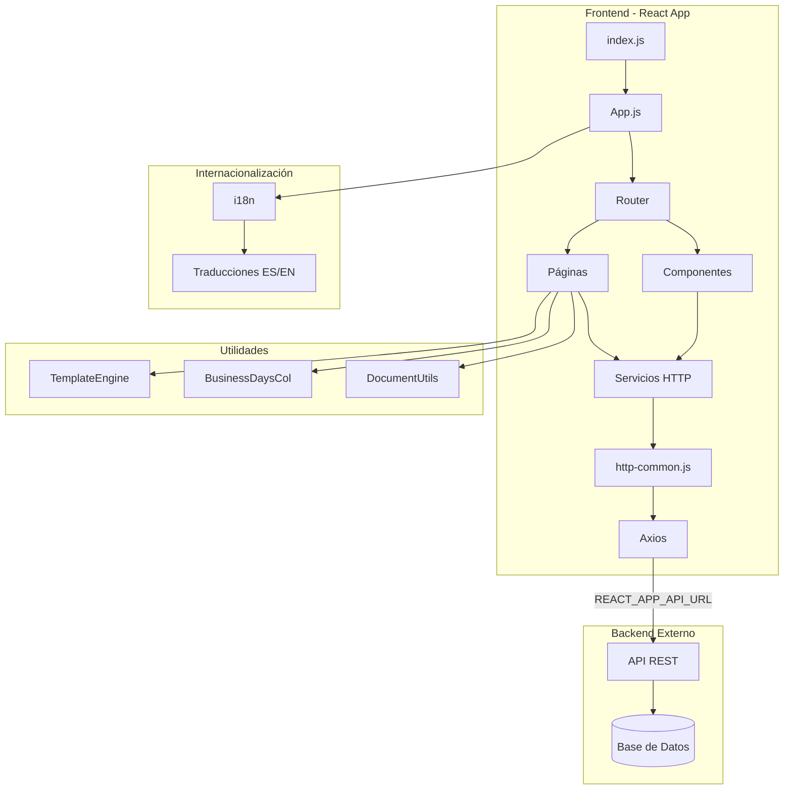
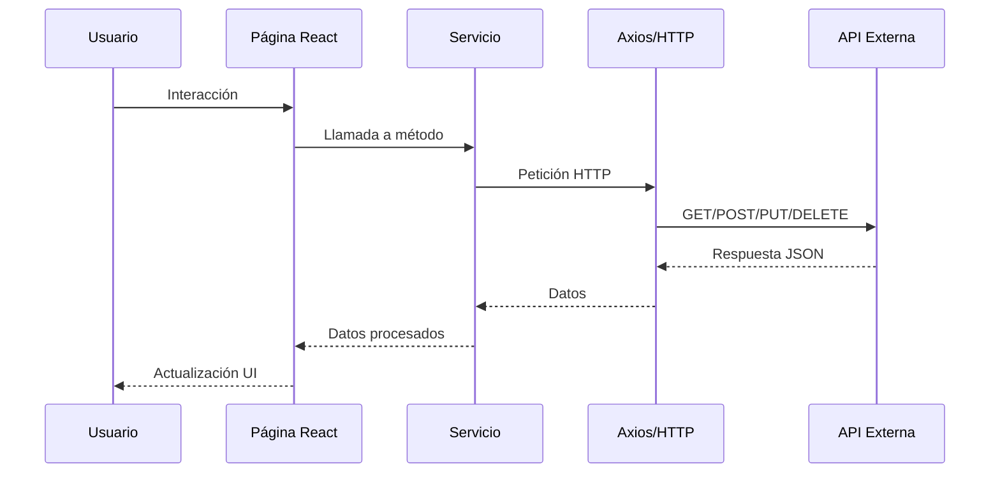
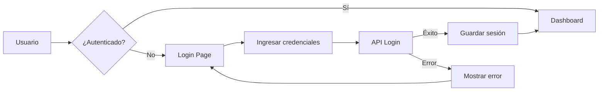
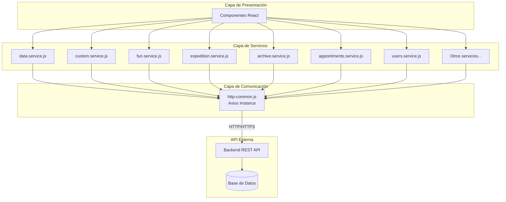
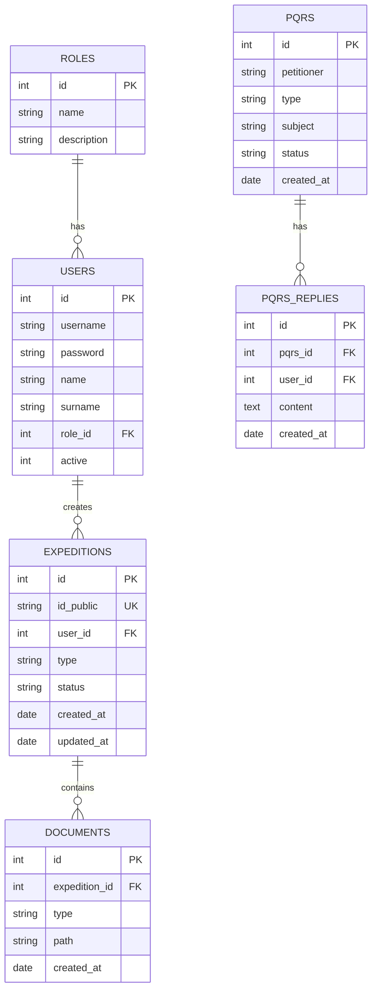

# Documentación Técnica - Sistema DOVELA

## Tabla de Contenidos

1. [Propósito General y Resumen Técnico](#1-propósito-general-y-resumen-técnico)
2. [Arquitectura del Sistema](#2-arquitectura-del-sistema)
3. [Estructura de Carpetas y Archivos Principales](#3-estructura-de-carpetas-y-archivos-principales)
4. [Dependencias Principales](#4-dependencias-principales)
5. [Componentes Frontend](#5-componentes-frontend)
6. [Servicios y APIs](#6-servicios-y-apis)
7. [Utilidades y Motores de Plantillas](#7-utilidades-y-motores-de-plantillas)
8. [Páginas y Rutas](#8-páginas-y-rutas)
9. [Internacionalización](#9-internacionalización)
10. [Configuración y Variables de Entorno](#10-configuración-y-variables-de-entorno)
11. [Instrucciones de Despliegue](#11-instrucciones-de-despliegue)
12. [Testing](#12-testing)
13. [Carencias Detectadas y Recomendaciones](#13-carencias-detectadas-y-recomendaciones)

---

## 1. Propósito General y Resumen Técnico

### Propósito General

**DOVELA** es una aplicación web desarrollada para la **Curaduría 1 de Bucaramanga**, Colombia. El sistema está diseñado para gestionar procesos administrativos relacionados con:

- **Licencias urbanísticas y construcción**
- **Expedientes y radicados**
- **PQRS (Peticiones, Quejas, Reclamos y Sugerencias)**
- **Gestión de archivos y documentación**
- **Citas y agendamiento**
- **Sellos y certificaciones**
- **Nomenclaturas y normativas**
- **Profesionales y trabajadores**
- **Liquidaciones**

### Resumen Técnico

**Frontend:**
- **Framework:** React 16.9.0
- **Librería de enrutamiento:** React Router DOM 5.2.0
- **UI Components:** Bootstrap 5.3.7, MDB React UI Kit, RSuite
- **Gestión de estado:** React Context API y hooks
- **Internacionalización:** i18next
- **Peticiones HTTP:** Axios
- **Generación de PDFs:** jsPDF, pdf-lib
- **Visualización de PDFs:** react-pdf, pdf-viewer-reactjs
- **Editor de texto enriquecido:** Jodit Pro, React Quill
- **Mapas:** React Google Maps
- **Tema:** Soporte para tema claro/oscuro con styled-components
- **Accesibilidad:** Configuración de tamaños de fuente ajustables

**Backend:**
- ⚠️ **ADVERTENCIA:** El directorio `dovela-backend` existe en el repositorio pero está **completamente vacío**. No hay implementación de backend en este repositorio.
- El frontend consume APIs externas configuradas mediante la variable de entorno `REACT_APP_API_URL`

---

## 2. Arquitectura del Sistema

### Diagrama de Arquitectura



### Flujo de Datos



---

## 3. Estructura de Carpetas y Archivos Principales

### Estructura General del Proyecto

```
bedrock_client/
├── public/                          # Archivos públicos estáticos
│   ├── index.html                   # HTML principal
│   ├── favicon.ico                  # Ícono de la aplicación
│   ├── manifest.json                # PWA manifest
│   └── templates/                   # Plantillas HTML para generación de documentos
│       ├── resolution/              # Plantillas de resoluciones
│       ├── ActDesist/              # Plantillas de actas de desistimiento
│       └── Executory/              # Plantillas de ejecutorias
├── src/                            # Código fuente
│   ├── index.js                    # Punto de entrada de React
│   ├── index.css                   # Estilos globales
│   ├── http-common.js             # Configuración de Axios
│   ├── styles/                     # Hojas de estilo
│   └── app/                        # Aplicación principal
│       ├── App.js                  # Componente raíz
│       ├── App.css                 # Estilos de App
│       ├── components/             # Componentes reutilizables
│       │   ├── navbar.js           # Barra de navegación
│       │   ├── footer.js           # Pie de página
│       │   ├── btnStart.js         # Botón flotante de inicio
│       │   ├── btnChat.js          # Botón de chat
│       │   ├── btnAccesibility.js  # Botón de accesibilidad
│       │   ├── map.js              # Componente de mapas
│       │   ├── global.js           # Estilos globales con styled-components
│       │   ├── theme.js            # Temas claro/oscuro
│       │   ├── font.js             # Tamaños de fuente
│       │   ├── forms/              # Componentes de formularios
│       │   ├── jsons/              # Archivos JSON de configuración
│       │   ├── customClasses/      # Clases personalizadas
│       │   └── dashBoardCards/     # Tarjetas del dashboard
│       ├── pages/                  # Páginas de la aplicación
│       │   ├── user/               # Páginas de usuario
│       │   │   ├── dashboard.js    # Panel principal
│       │   │   ├── publish.js      # Publicaciones
│       │   │   ├── seal.js         # Sellos
│       │   │   ├── appointments.js # Citas
│       │   │   ├── mail.js         # Correo
│       │   │   ├── fun.js          # Formulario único nacional
│       │   │   ├── osha.js         # OSHA
│       │   │   ├── dictionary.page.js    # Diccionario
│       │   │   ├── funmanage.page.js     # Gestión FUN
│       │   │   ├── archive/              # Archivos
│       │   │   │   └── archive.page.js
│       │   │   ├── pqrs/                 # PQRS
│       │   │   │   ├── pqrsadmin.js
│       │   │   │   └── components/
│       │   │   ├── records/              # Expedientes
│       │   │   │   ├── law/              # Ley
│       │   │   │   ├── arc/              # Archivo
│       │   │   │   ├── ph/               # PH
│       │   │   │   └── eng/              # Ingeniería
│       │   │   ├── submit/               # Radicación
│       │   │   ├── profesionals/         # Profesionales
│       │   │   ├── fun_forms/            # Formularios FUN
│       │   │   ├── guide_user/           # Guía de usuario
│       │   │   ├── norms/                # Normas
│       │   │   ├── nomenclature/         # Nomenclatura
│       │   │   ├── certifications/       # Certificaciones
│       │   │   ├── clocks/               # Relojes/Timers
│       │   │   └── expeditions/          # Expediciones
│       │   └── liquidator/               # Páginas de liquidador
│       │       └── liquidator.js
│       ├── services/               # Servicios de API
│       │   ├── data.service.js     # Servicio de datos de usuario
│       │   ├── custom.service.js   # Servicios personalizados
│       │   ├── fun.service.js      # Servicio FUN
│       │   ├── expedition.service.js     # Servicio de expediciones
│       │   ├── archive.service.js        # Servicio de archivo
│       │   ├── appointments.service.js   # Servicio de citas
│       │   ├── users.service.js          # Servicio de usuarios
│       │   ├── seal.service.js           # Servicio de sellos
│       │   ├── nomeclature.service.js    # Servicio de nomenclatura
│       │   ├── record_arc.service.js     # Servicio de expedientes archivo
│       │   ├── record_law.service.js     # Servicio de expedientes ley
│       │   ├── record_review.service.js  # Servicio de revisión de expedientes
│       │   ├── emails.service.js         # Servicio de correos
│       │   ├── certifications.service.js # Servicio de certificaciones
│       │   ├── cubXvr.service.js         # Servicio cubXvr
│       │   ├── mailbox.service.js        # Servicio de buzón
│       │   ├── http-emails.js            # Cliente HTTP para emails
│       │   └── http-profs.js             # Cliente HTTP para profesionales
│       ├── utils/                  # Utilidades
│       │   ├── TemplateEngine.js   # Motor de plantillas
│       │   ├── ResoEngineTemplate.js     # Motor de resoluciones
│       │   ├── ExecEngineTemp.js         # Motor de ejecutorias
│       │   ├── ActDesistEngineTemp.js    # Motor de actas de desistimiento
│       │   ├── BaseDocumentUtils.js      # Utilidades de documentos
│       │   └── BusinessDaysCol.js        # Días hábiles Colombia
│       └── translation/            # Internacionalización
│           ├── i18n.js             # Configuración i18next
│           ├── en/                 # Traducciones en inglés
│           └── es/                 # Traducciones en español
├── dovela-backend/                 # ⚠️ DIRECTORIO VACÍO
├── package.json                    # Dependencias y scripts
├── package-lock.json               # Lock de dependencias
├── .gitignore                      # Archivos ignorados por Git
└── README.md                       # README del proyecto
```

### Descripción de Archivos Clave

| Archivo | Descripción |
|---------|-------------|
| `src/index.js` | Punto de entrada de React. Renderiza el componente `App` en el DOM |
| `src/http-common.js` | Configuración centralizada de Axios con baseURL y headers |
| `src/app/App.js` | Componente raíz que configura rutas, autenticación, tema y contexto global |
| `src/app/components/navbar.js` | Barra de navegación principal con menús y autenticación |
| `src/app/components/footer.js` | Pie de página con información de contacto y enlaces |
| `src/app/pages/user/dashboard.js` | Panel principal del usuario con tarjetas y estadísticas |
| `src/app/services/*.service.js` | Servicios que encapsulan llamadas a APIs externas |
| `src/app/utils/TemplateEngine.js` | Motor para generar documentos HTML/PDF desde plantillas |
| `public/templates/` | Plantillas HTML para generación de documentos oficiales |

---

## 4. Dependencias Principales

### Dependencias del Frontend

#### Core de React
| Dependencia | Versión | Propósito |
|-------------|---------|-----------|
| `react` | ^16.9.0 | Librería principal de UI |
| `react-dom` | ^16.9.0 | Renderizado en el DOM |
| `react-router-dom` | ^5.2.0 | Enrutamiento y navegación |
| `react-scripts` | 4.0.3 | Scripts de Create React App |

#### UI y Estilos
| Dependencia | Versión | Propósito |
|-------------|---------|-----------|
| `bootstrap` | ^5.3.7 | Framework CSS |
| `react-bootstrap` | ^1.6.8 | Componentes Bootstrap para React |
| `mdb-react-ui-kit` | ^1.0.0-beta3 | Material Design Bootstrap |
| `mdbreact` | ^5.2.0 | Componentes Material Design |
| `rsuite` | ^5.15.0 | Componentes UI adicionales |
| `styled-components` | ^5.3.0 | CSS-in-JS para temas |
| `sweetalert2` | ^10.16.7 | Alertas y modales elegantes |

#### Gestión de Datos y APIs
| Dependencia | Versión | Propósito |
|-------------|---------|-----------|
| `axios` | ^0.21.4 | Cliente HTTP para APIs |

#### Manejo de Fechas
| Dependencia | Versión | Propósito |
|-------------|---------|-----------|
| `moment` | ^2.29.1 | Manipulación de fechas |
| `moment-business-days` | ^1.2.0 | Cálculo de días hábiles |
| `react-calendar` | ^3.4.0 | Componente de calendario |
| `react-date-picker` | ^8.2.0 | Selector de fechas |

#### Generación y Visualización de Documentos
| Dependencia | Versión | Propósito |
|-------------|---------|-----------|
| `jspdf` | ^2.5.2 | Generación de PDFs |
| `pdf-lib` | ^1.16.0 | Manipulación de PDFs |
| `react-pdf` | ^5.3.0 | Visualización de PDFs |
| `pdf-viewer-reactjs` | ^2.2.3 | Visor de PDFs alternativo |
| `jodit-pro` | ^4.6.9 | Editor WYSIWYG profesional |
| `jodit-pro-react` | ^1.3.63 | Integración de Jodit con React |
| `react-quill` | ^1.3.5 | Editor de texto enriquecido |
| `markdown-to-jsx` | ^7.1.8 | Renderizado de Markdown |
| `react-markdown` | ^8.0.4 | Componente de Markdown |

#### Utilidades
| Dependencia | Versión | Propósito |
|-------------|---------|-----------|
| `file-saver` | ^2.0.5 | Descarga de archivos |
| `js-file-download` | ^0.4.12 | Descarga de archivos JS |
| `js-sha256` | ^0.9.0 | Hashing SHA256 |
| `written-number` | ^0.11.1 | Números a texto |

#### Internacionalización
| Dependencia | Versión | Propósito |
|-------------|---------|-----------|
| `i18next` | ^20.2.2 | Framework de i18n |
| `react-i18next` | ^11.8.13 | Integración i18next con React |
| `i18next-browser-languagedetector` | ^6.1.0 | Detección automática de idioma |

#### Mapas y Geolocalización
| Dependencia | Versión | Propósito |
|-------------|---------|-----------|
| `react-google-maps` | ^9.4.5 | Integración con Google Maps |

#### Tablas y Grillas
| Dependencia | Versión | Propósito |
|-------------|---------|-----------|
| `react-data-table-component` | ^7.4.6 | Tablas con paginación y búsqueda |
| `@silevis/reactgrid` | ^4.0.4 | Grilla editable estilo Excel |
| `rsuite-table` | ^5.3.1 | Tablas avanzadas |
| `react-spreadsheet` | ^0.6.1 | Hoja de cálculo en React |

#### Visualización de Datos
| Dependencia | Versión | Propósito |
|-------------|---------|-----------|
| `react-vis` | ^1.11.7 | Gráficos y visualizaciones |
| `@uiw/react-heat-map` | ^1.4.8 | Mapas de calor |

#### Formularios y Validación
| Dependencia | Versión | Propósito |
|-------------|---------|-----------|
| `react-form-stepper` | ^1.4.3 | Formularios multi-paso |
| `@pathofdev/react-tag-input` | ^1.0.7 | Input de tags |
| `react-html-datalist` | ^2.0.4 | Datalist HTML5 |
| `react-google-recaptcha` | ^2.1.0 | reCAPTCHA de Google |

#### Otros Componentes
| Dependencia | Versión | Propósito |
|-------------|---------|-----------|
| `react-modal` | ^3.14.3 | Modales |
| `react-sidebar` | ^3.0.2 | Barra lateral |
| `react-collapsible` | ^2.8.3 | Contenido colapsable |
| `react-multi-carousel` | ^2.6.2 | Carruseles |

#### Variables de Entorno
| Dependencia | Versión | Propósito |
|-------------|---------|-----------|
| `env-cmd` | ^10.1.0 | Gestión de variables de entorno |

### Scripts Disponibles

```json
{
  "start": "env-cmd react-scripts start",
  "build": "env-cmd react-scripts build",
  "test": "react-scripts test",
  "eject": "react-scripts eject"
}
```

| Script | Comando | Descripción |
|--------|---------|-------------|
| `start` | `npm start` | Inicia el servidor de desarrollo en modo watch |
| `build` | `npm run build` | Genera build de producción optimizado |
| `test` | `npm test` | Ejecuta tests en modo watch |
| `eject` | `npm run eject` | Expone configuración de Webpack (irreversible) |

---

## 5. Componentes Frontend

### Componentes Principales

#### 5.1. App.js - Componente Raíz

El componente `App.js` es el punto central de la aplicación y maneja:

**Características:**
- **Autenticación:** Context API para gestión de sesión
- **Rutas:** React Router con rutas privadas y públicas
- **Tema:** Soporte para tema claro/oscuro
- **Accesibilidad:** Tamaños de fuente ajustables
- **Internacionalización:** i18next integrado

**Ejemplo de código:**

```javascript
import React, { useState } from "react";
import { BrowserRouter as Router, Switch, Route } from "react-router-dom";
import { ThemeProvider } from 'styled-components';
import { lightTheme, darkTheme } from './components/theme';
import { useTranslation } from "react-i18next";

export default function App() {
  const { t } = useTranslation();
  const [theme, setTheme] = useState('light');
  const [font, setFont] = useState(3);

  const toggleTheme = () => {
    theme === 'light' ? setTheme('dark') : setTheme('light')
  }

  return (
    <ProvideAuth>
      <Router>
        <ThemeProvider theme={theme === 'light' ? lightTheme : darkTheme}>
          <GlobalStyles />
          <div className="App">
            <NavbarWithAuth />
            <main className="app-main">
              <Switch>
                <Route path='/home' component={LoginPage} />
                <PrivateRoute path='/dashboard'>
                  <Dashboard />
                </PrivateRoute>
                {/* Más rutas... */}
              </Switch>
            </main>
            <Footer />
          </div>
        </ThemeProvider>
      </Router>
    </ProvideAuth>
  );
}
```

**Diagrama de flujo de autenticación:**



#### 5.2. Navbar - Barra de Navegación

Componente de navegación principal con menús dinámicos según rol de usuario.

**Características:**
- Menú responsive
- Submenús jerárquicos
- Indicador de usuario autenticado
- Botón de logout
- Cambio de tema
- Ajuste de tamaño de fuente

**Ubicación:** `src/app/components/navbar.js`

#### 5.3. Footer - Pie de Página

**Ubicación:** `src/app/components/footer.js`

Pie de página con:
- Información de contacto
- Enlaces legales
- Redes sociales
- Logo de la entidad

#### 5.4. Componentes de Utilidad

| Componente | Ubicación | Propósito |
|------------|-----------|-----------|
| `btnStart.js` | `src/app/components/` | Botón flotante de inicio |
| `btnChat.js` | `src/app/components/` | Botón de chat en vivo |
| `btnAccesibility.js` | `src/app/components/` | Controles de accesibilidad |
| `map.js` | `src/app/components/` | Integración de Google Maps |
| `pdfViewer.component.js` | `src/app/components/` | Visualizador de PDFs |
| `emails.component.js` | `src/app/components/` | Gestión de correos |

#### 5.5. Componentes de Formularios

**Ubicación:** `src/app/components/forms/`

Componentes reutilizables de formularios para:
- Inputs de texto
- Selectores
- Date pickers
- File uploads
- Validación

### Componentes de Páginas Específicas

#### 5.6. Dashboard Cards

**Ubicación:** `src/app/components/dashBoardCards/`

Tarjetas del dashboard que muestran:
- Estadísticas
- Accesos rápidos
- Notificaciones
- Gráficos

---

## 6. Servicios y APIs

### 6.1. http-common.js - Configuración de Axios

Archivo de configuración centralizado para todas las peticiones HTTP.

**Ubicación:** `src/http-common.js`

```javascript
import axios from "axios";

export default axios.create({
  baseURL: process.env.REACT_APP_API_URL,
  headers: {
    "Content-type": 'multipart/form-data;boundary=----WebKitFormBoundaryyrV7KO0BoCBuDbT'
  }
});
```

**Configuración:**
- **baseURL:** Definida en variable de entorno `REACT_APP_API_URL`
- **headers:** Configurados para envío de archivos multipart

### 6.2. Servicios Disponibles

Cada servicio encapsula las llamadas a la API para un módulo específico.

#### data.service.js - Servicio de Datos de Usuario

**Ubicación:** `src/app/services/data.service.js`

Gestiona datos del usuario en sesión usando `window.user`.

**Métodos:**

```javascript
class DataService {
  getFullName()         // Retorna nombre completo
  getActive()           // Estado de activación
  getRoleName()         // Nombre del rol
  getRoleDesc()         // Descripción del rol
  getUserData()         // Objeto completo del usuario
  setUser(userData)     // Establecer usuario
  setUserNull()         // Limpiar usuario
}
```

**Ejemplo de uso:**

```javascript
import DataService from './services/data.service';

// Obtener datos del usuario
const fullName = DataService.getFullName();
const userData = DataService.getUserData();

// Establecer usuario después de login
DataService.setUser({
  id: 123,
  name: "Juan",
  surname: "Pérez",
  role: "Admin",
  active: 1,
  roleId: 1
});
```

#### custom.service.js - Servicios Personalizados

**Ubicación:** `src/app/services/custom.service.js`

Servicios generales de la aplicación.

**Métodos principales:**

```javascript
class CustomlDataService {
  appLogin(data)                    // Login de usuario
  searchDate(date)                  // Búsqueda por fecha
  generate(data)                    // Generar sello
  seal(name)                        // Obtener sello
  getRepositoryList()               // Lista de repositorios
  checkStatus_Jur(id)              // Verificar estado jurídico
  checkStatus_Nr(id)               // Verificar estado NR
  checkStatus_Lc(id)               // Verificar estado LC
  checkStatus_In(id)               // Verificar estado IN
  checkStatus_vr(id)               // Verificar estado VR
  loadDictionary_vr()              // Cargar diccionario VR
  loadDictionary_cub()             // Cargar diccionario CUB
  loadDictionary_fun()             // Cargar diccionario FUN
  loadDictionary_prof()            // Cargar profesionales
  loadDictionary_out()             // Cargar diccionario OUT
  loadDictionary_oc()              // Cargar diccionario OC
}
```

**Ejemplo de uso:**

```javascript
import CustomService from './services/custom.service';

// Login
const loginData = { username: "user", password: "pass" };
CustomService.appLogin(loginData)
  .then(response => {
    console.log("Login exitoso", response.data);
  })
  .catch(error => {
    console.error("Error en login", error);
  });

// Cargar diccionario
CustomService.loadDictionary_fun()
  .then(response => {
    const dictionary = response.data;
    // Procesar diccionario...
  });
```

#### fun.service.js - Servicio FUN (Formulario Único Nacional)

**Ubicación:** `src/app/services/fun.service.js`

Gestión del Formulario Único Nacional de licencias.

**Métodos principales:**

```javascript
class FunDataService {
  getAll()                          // Obtener todos los FUN
  getAll_c()                        // Obtener todos (variante C)
  getAll_fun()                      // Obtener todos FUN
  getAll_fun_6_h(id)               // Obtener FUN 6 horas
  getAll_clocks()                   // Obtener todos los relojes
  getSearch(field, string)          // Búsqueda por campo
  getclock(id, state)               // Obtener reloj por ID y estado
  getclockData(id)                  // Obtener datos de reloj
  get(id)                           // Obtener FUN por ID
  getFun6(id)                       // Obtener FUN 6 por ID
  getFun6Doc(path, name)            // Obtener documento FUN 6
  get_fun1(id_public)               // Obtener FUN 1 por ID público
  get_fun_IdPublic(id_public)       // Obtener FUN por ID público
  loadMacro(date_start, date_end)   // Cargar macro por rango de fechas
  loadMacroSingle(date_start, date_end, id) // Cargar macro individual
  // ... más métodos CRUD
}
```

**Ejemplo de uso:**

```javascript
import FunService from './services/fun.service';

// Obtener todos los FUN
FunService.getAll_fun()
  .then(response => {
    const funs = response.data;
    console.log("Total FUNs:", funs.length);
  });

// Buscar por rango de fechas
FunService.loadMacro('2024-01-01', '2024-12-31')
  .then(response => {
    const macroData = response.data;
    // Procesar datos macro...
  });
```

#### expedition.service.js - Servicio de Expediciones

**Ubicación:** `src/app/services/expedition.service.js`

Gestión de expediciones de licencias.

**Métodos principales:**

```javascript
class ExpeditionService {
  getAll()                          // Obtener todas las expediciones
  get(id)                           // Obtener por ID
  getRecord(id)                     // Buscar expediente
  create(data)                      // Crear expedición
  create_exp_area(data)             // Crear área de expedición
  update(id, data)                  // Actualizar expedición
  update_exp_area(id, data)         // Actualizar área
  delete(id)                        // Eliminar expedición
  delete_exp_area(id)               // Eliminar área
  gen_doc_1(data)                   // Generar documento 1
  gen_doc_2(data)                   // Generar documento 2
  gen_doc_3(data)                   // Generar documento 3
  gen_doc_4(data)                   // Generar documento 4
  gen_doc_5(data)                   // Generar documento 5
  gen_doc_6(data)                   // Generar documento 6
  gen_doc_7(data)                   // Generar documento 7
  gen_doc_eje(data)                 // Generar documento ejecutoria
  gen_doc_res(data)                 // Generar resolución
  gen_doc_final_not(data)           // Generar notificación final
}
```

**Ejemplo de uso:**

```javascript
import ExpeditionService from './services/expedition.service';

// Crear nueva expedición
const expeditionData = {
  id_public: "2024-001",
  type: "construction",
  status: "pending"
};

ExpeditionService.create(expeditionData)
  .then(response => {
    console.log("Expedición creada:", response.data);
  })
  .catch(error => {
    console.error("Error:", error);
  });

// Generar documento de resolución
const docData = {
  expedition_id: 123,
  template: "resolution",
  data: { /* ... */ }
};

ExpeditionService.gen_doc_res(docData)
  .then(response => {
    // Descargar o mostrar documento generado
    const pdfUrl = response.data.url;
  });
```

#### Otros Servicios

| Servicio | Ubicación | Propósito |
|----------|-----------|-----------|
| `archive.service.js` | `src/app/services/` | Gestión de archivos y documentos |
| `appointments.service.js` | `src/app/services/` | Sistema de citas |
| `users.service.js` | `src/app/services/` | Gestión de usuarios |
| `seal.service.js` | `src/app/services/` | Generación y gestión de sellos |
| `nomeclature.service.js` | `src/app/services/` | Nomenclaturas urbanas |
| `record_arc.service.js` | `src/app/services/` | Expedientes de archivo |
| `record_law.service.js` | `src/app/services/` | Expedientes legales |
| `record_review.service.js` | `src/app/services/` | Revisión de expedientes |
| `emails.service.js` | `src/app/services/` | Envío de correos |
| `certifications.service.js` | `src/app/services/` | Certificaciones |
| `mailbox.service.js` | `src/app/services/` | Buzón de mensajes |

### 6.3. Diagrama de Arquitectura de Servicios



---

## 7. Utilidades y Motores de Plantillas

### 7.1. TemplateEngine.js - Motor de Plantillas

**Ubicación:** `src/app/utils/TemplateEngine.js`

Motor para generar documentos HTML/PDF desde plantillas predefinidas.

**Funcionalidad:**
- Carga plantillas HTML desde `public/templates/`
- Reemplaza variables dinámicas
- Genera documentos personalizados según tipo
- Soporta múltiples tipos de documentos

**Tipos de documentos soportados:**
- `open` - Resoluciones de apertura
- `des` - Resoluciones de desistimiento
- `delete`, `return`, `transfer` - Actas administrativas
- `eje_open`, `eje_des`, `eje_neg` - Ejecutorias

**Ejemplo de código:**

```javascript
export class TemplateEngine {
  static async buildTemplate(data, model) {
    let header_file, part_cons, part_res, main;

    if (model === "open") {
      header_file = "/templates/resolution/header/header.html";
      part_cons   = "/templates/resolution/considerate/reso_open_cons.html";
      part_res    = "/templates/resolution/resolutive/reso_open_resol.html";
      main        = "/templates/resolution/main.html";
    } else if (model === "des") {
      header_file = "/templates/resolution/header/header_des.html";
      part_cons   = "/templates/resolution/considerate/des_cons.html";
      part_res    = "/templates/resolution/resolutive/des_resol.html";
      main        = "/templates/resolution/main.html";
    }
    // ... más modelos

    // Fetch en paralelo de todas las plantillas
    const [header, footer, mainTemplate, partConsiderate, partResolutive, customCSS] =
      await Promise.all([
        fetch(header_file).then(r => r.text()),
        fetch("/templates/resolution/footer.html").then(r => r.text()),
        fetch(main).then(r => r.text()),
        fetch(part_cons).then(r => r.text()),
        fetch(part_res).then(r => r.text()),
        fetch("/templates/resolution/considerate/style_part_cons.css").then(r => r.text()),
      ]);

    // Componer plantilla final
    let template = mainTemplate
      .replace("{{header}}", header)
      .replace("{{footer}}", footer)
      .replace("{{considerate}}", partConsiderate)
      .replace("{{resolutive}}", partResolutive)
      .replace("{{css}}", customCSS);

    // Reemplazar variables dinámicas
    Object.keys(data).forEach(key => {
      template = template.replace(new RegExp(`{{${key}}}`, 'g'), data[key]);
    });

    return template;
  }
}
```

**Ejemplo de uso:**

```javascript
import { TemplateEngine } from './utils/TemplateEngine';

// Datos del documento
const documentData = {
  resolution_number: "001-2024",
  date: "15 de enero de 2024",
  applicant_name: "Juan Pérez",
  project_address: "Calle 45 #23-67",
  // ... más datos
};

// Generar documento
const htmlDocument = await TemplateEngine.buildTemplate(documentData, "open");

// Convertir a PDF o mostrar
console.log(htmlDocument);
```

**Diagrama de flujo:**

```mermaid
graph TD
    A[Solicitar documento] --> B{Tipo de documento?}
    B -->|open| C[Cargar plantillas de apertura]
    B -->|des| D[Cargar plantillas de desistimiento]
    B -->|eje_*| E[Cargar plantillas de ejecutoria]
    
    C --> F[Fetch paralelo de archivos HTML]
    D --> F
    E --> F
    
    F --> G[Ensamblar template principal]
    G --> H[Reemplazar variables {{var}}]
    H --> I[Retornar HTML completo]
    I --> J[Generar PDF o mostrar]
```

### 7.2. ResoEngineTemplate.js - Motor de Resoluciones

**Ubicación:** `src/app/utils/ResoEngineTemplate.js`

Motor especializado en generación de resoluciones administrativas.

### 7.3. ExecEngineTemp.js - Motor de Ejecutorias

**Ubicación:** `src/app/utils/ExecEngineTemp.js`

Motor para generar documentos de ejecutoria de licencias.

### 7.4. ActDesistEngineTemp.js - Motor de Actas de Desistimiento

**Ubicación:** `src/app/utils/ActDesistEngineTemp.js`

Motor para generar actas de desistimiento y retiro.

### 7.5. BaseDocumentUtils.js - Utilidades de Documentos

**Ubicación:** `src/app/utils/BaseDocumentUtils.js`

Funciones auxiliares para manipulación de documentos:
- Formato de texto
- Conversión de números a letras
- Validaciones
- Utilidades de fecha

### 7.6. BusinessDaysCol.js - Días Hábiles Colombia

**Ubicación:** `src/app/utils/BusinessDaysCol.js`

Utilidad para cálculo de días hábiles según calendario colombiano.

**Funcionalidad:**
- Calendario de festivos de Colombia
- Cálculo de días hábiles entre fechas
- Validación de días hábiles
- Suma/resta de días hábiles

**Ejemplo de uso:**

```javascript
import { BusinessDaysCol } from './utils/BusinessDaysCol';

// Calcular días hábiles entre fechas
const startDate = new Date('2024-01-01');
const endDate = new Date('2024-01-31');
const businessDays = BusinessDaysCol.businessDaysBetween(startDate, endDate);

// Agregar días hábiles a una fecha
const today = new Date();
const futureDate = BusinessDaysCol.addBusinessDays(today, 15);

// Verificar si es día hábil
const isBusinessDay = BusinessDaysCol.isBusinessDay(new Date());
```

---

## 8. Páginas y Rutas

### 8.1. Estructura de Rutas

El sistema utiliza React Router DOM para gestionar la navegación.

**Tipos de rutas:**
- **Públicas:** Accesibles sin autenticación
- **Privadas:** Requieren autenticación (componente `PrivateRoute`)
- **Por rol:** Filtradas según permisos del usuario

### 8.2. Rutas Públicas

| Ruta | Componente | Descripción |
|------|------------|-------------|
| `/home` | `LoginPage` | Página de inicio/login |
| `/login` | `LoginPage` | Página de login |

### 8.3. Rutas Privadas (Requieren Autenticación)

#### Rutas Principales

| Ruta | Componente | Descripción |
|------|------------|-------------|
| `/dashboard` | `Dashboard` | Panel principal del usuario |
| `/publish` | `Publish` | Gestión de publicaciones |
| `/seals` | `Seals` | Generación y gestión de sellos |
| `/appointments` | `Appointments` | Sistema de citas |
| `/mail` | `Mail` | Correo interno |
| `/fun` | `FUN` | Formulario Único Nacional |
| `/osha` | `OSHA` | OSHA (seguridad) |
| `/nomenclature` | `NOMENCLATURE` | Nomenclaturas urbanas |
| `/submit` | `SUBMIT` | Radicación de documentos |
| `/archive` | `ARCHIVE` | Gestión de archivos |
| `/dictionary` | `DICTIONARY` | Diccionarios y catálogos |
| `/fun-manage` | `FUN_MANAGE` | Gestión de FUN |
| `/profesionals` | `PROFESIONALS` | Gestión de profesionales |
| `/guide-user` | `GUIDE_USER` | Guía de usuario |
| `/norms` | `NORMS` | Normas y regulaciones |
| `/certifications` | `CERTIFICATE_WORKER` | Certificaciones de trabajadores |

#### Rutas PQRS

| Ruta | Componente | Descripción |
|------|------------|-------------|
| `/pqrs-admin` | `PQRSADMIN` | Administración de PQRS |
| `/pqrs-macro` | Componente macro | Tabla macro de PQRS |

#### Rutas de Expedientes (Records)

| Ruta | Componente | Descripción |
|------|------------|-------------|
| `/records/law` | Componentes de ley | Expedientes legales |
| `/records/arc` | Componentes de archivo | Expedientes de archivo |
| `/records/ph` | Componentes PH | Propiedad horizontal |
| `/records/eng` | Componentes ENG | Ingeniería |

#### Rutas de Liquidador

| Ruta | Componente | Descripción |
|------|------------|-------------|
| `/liquidator` | `Liquidator` | Sistema de liquidaciones |

### 8.4. Componente PrivateRoute

Protección de rutas que requieren autenticación:

```javascript
function PrivateRoute({ children, ...rest }) {
  let auth = useAuth();
  return (
    <Route
      {...rest}
      render={({ location }) =>
        auth.user ? (
          children
        ) : (
          <Redirect
            to={{
              pathname: "/login",
              state: { from: location }
            }}
          />
        )
      }
    />
  );
}
```

### 8.5. Diagrama de Navegación

```mermaid
graph TD
    A[/ - Root] --> B{¿Autenticado?}
    B -->|No| C[/login]
    B -->|Sí| D[/dashboard]
    
    D --> E[/publish]
    D --> F[/seals]
    D --> G[/appointments]
    D --> H[/pqrs-admin]
    D --> I[/records/*]
    D --> J[/fun]
    D --> K[/archive]
    D --> L[/liquidator]
    
    I --> M[/records/law]
    I --> N[/records/arc]
    I --> O[/records/ph]
    I --> P[/records/eng]
    
    H --> Q[/pqrs-macro]
    
    C -->|Login exitoso| D
```

---

## 9. Internacionalización

### 9.1. Configuración i18next

**Ubicación:** `src/app/translation/i18n.js`

El sistema soporta múltiples idiomas usando i18next.

**Idiomas soportados:**
- Español (es) - Idioma por defecto
- Inglés (en)

**Estructura de traducciones:**

```
src/app/translation/
├── i18n.js                         # Configuración i18next
├── en/                             # Traducciones en inglés
│   ├── translations.js             # Traducciones generales
│   ├── curatorship/
│   │   └── mision.translation.js
│   ├── scheduling/
│   │   └── scheduling.translation.js
│   ├── transparency/
│   │   ├── pqrs.translation.js
│   │   └── mailbox.translation.js
│   └── liquidator/
│       └── liquidator.translation.js
└── es/                             # Traducciones en español
    ├── translations.js
    ├── curatorship/
    ├── scheduling/
    ├── transparency/
    └── liquidator/
```

**Ejemplo de uso en componentes:**

```javascript
import { useTranslation } from "react-i18next";

function MyComponent() {
  const { t, i18n } = useTranslation();

  const changeLanguage = (lng) => {
    i18n.changeLanguage(lng);
  };

  return (
    <div>
      <h1>{t("title.welcome")}</h1>
      <p>{t("description.main")}</p>
      <button onClick={() => changeLanguage('en')}>English</button>
      <button onClick={() => changeLanguage('es')}>Español</button>
    </div>
  );
}
```

**Estructura típica de archivo de traducción:**

```javascript
// es/translations.js
export default {
  title: {
    welcome: "Bienvenido a DOVELA",
    dashboard: "Panel de Control",
    // ...
  },
  buttons: {
    save: "Guardar",
    cancel: "Cancelar",
    submit: "Enviar",
    // ...
  },
  messages: {
    success: "Operación exitosa",
    error: "Ocurrió un error",
    // ...
  }
}
```

---

## 10. Configuración y Variables de Entorno

### 10.1. Variables de Entorno

El sistema utiliza `env-cmd` para gestionar variables de entorno.

**Variable principal:**

| Variable | Descripción | Ejemplo |
|----------|-------------|---------|
| `REACT_APP_API_URL` | URL base del backend API | `https://api.curaduria1bucaramanga.com.co` |

**Archivo de configuración (no incluido en el repositorio):**

Crear archivo `.env` en la raíz del proyecto:

```env
REACT_APP_API_URL=https://api.curaduria1bucaramanga.com.co
```

**Archivos de entorno por ambiente:**

```
.env                    # Variables por defecto
.env.local              # Variables locales (ignorado por Git)
.env.development        # Variables de desarrollo
.env.production         # Variables de producción
```

### 10.2. Configuración de package.json

**Homepage:**
```json
"homepage": "https://curaduria1bucaramanga.com.co/"
```

**ESLint:**
```json
"eslintConfig": {
  "extends": [
    "react-app",
    "react-app/jest"
  ]
}
```

**Browserslist:**
```json
"browserslist": {
  "production": [
    ">0.2%",
    "not dead",
    "not op_mini all"
  ],
  "development": [
    "last 1 chrome version",
    "last 1 firefox version",
    "last 1 safari version"
  ]
}
```

---

## 11. Instrucciones de Despliegue

### 11.1. Requisitos Previos

**Software necesario:**
- Node.js >= 14.x
- npm >= 6.x
- Git

### 11.2. Instalación Local

**Paso 1: Clonar el repositorio**

```bash
git clone https://github.com/neoygdrassyl/bedrock_client.git
cd bedrock_client
```

**Paso 2: Instalar dependencias**

```bash
npm install
```

**Paso 3: Configurar variables de entorno**

Crear archivo `.env` en la raíz:

```bash
# .env
REACT_APP_API_URL=https://api.curaduria1bucaramanga.com.co
```

**Paso 4: Iniciar en modo desarrollo**

```bash
npm start
```

La aplicación se abrirá en `http://localhost:3000`

### 11.3. Build de Producción

**Generar build optimizado:**

```bash
npm run build
```

Esto crea una carpeta `build/` con los archivos optimizados.

**Estructura del build:**

```
build/
├── static/
│   ├── css/               # CSS minificado
│   ├── js/                # JavaScript minificado
│   └── media/             # Imágenes y assets
├── templates/             # Plantillas HTML
├── index.html             # HTML principal
├── manifest.json          # PWA manifest
└── asset-manifest.json    # Manifiesto de assets
```

### 11.4. Despliegue en Servidor

#### Opción 1: Servidor Apache

**Paso 1: Copiar archivos del build**

```bash
scp -r build/* user@server:/var/www/html/curaduria/
```

**Paso 2: Configurar .htaccess**

Crear archivo `.htaccess` en el directorio del build:

```apache
<IfModule mod_rewrite.c>
  RewriteEngine On
  RewriteBase /
  RewriteRule ^index\.html$ - [L]
  RewriteCond %{REQUEST_FILENAME} !-f
  RewriteCond %{REQUEST_FILENAME} !-d
  RewriteCond %{REQUEST_FILENAME} !-l
  RewriteRule . /index.html [L]
</IfModule>
```

#### Opción 2: Servidor Nginx

**Configuración de Nginx:**

```nginx
server {
    listen 80;
    server_name curaduria1bucaramanga.com.co;
    root /var/www/html/curaduria;
    index index.html;

    location / {
        try_files $uri $uri/ /index.html;
    }

    location /static/ {
        expires 1y;
        add_header Cache-Control "public, immutable";
    }

    location /templates/ {
        expires 1d;
        add_header Cache-Control "public";
    }
}
```

#### Opción 3: Despliegue con Docker

**Crear Dockerfile:**

```dockerfile
# Etapa de build
FROM node:14-alpine as build
WORKDIR /app
COPY package*.json ./
RUN npm ci
COPY . .
RUN npm run build

# Etapa de producción
FROM nginx:alpine
COPY --from=build /app/build /usr/share/nginx/html
COPY nginx.conf /etc/nginx/conf.d/default.conf
EXPOSE 80
CMD ["nginx", "-g", "daemon off;"]
```

**Construir y ejecutar:**

```bash
# Construir imagen
docker build -t dovela-frontend .

# Ejecutar contenedor
docker run -p 80:80 -d dovela-frontend
```

#### Opción 4: Despliegue en servicios cloud

**Vercel:**

```bash
npm install -g vercel
vercel --prod
```

**Netlify:**

```bash
npm install -g netlify-cli
netlify deploy --prod --dir=build
```

**AWS S3 + CloudFront:**

```bash
# Sincronizar con S3
aws s3 sync build/ s3://curaduria-bucket/ --delete

# Invalidar caché de CloudFront
aws cloudfront create-invalidation --distribution-id YOUR_DIST_ID --paths "/*"
```

### 11.5. Configuración de CI/CD

**Ejemplo con GitHub Actions:**

Crear `.github/workflows/deploy.yml`:

```yaml
name: Deploy to Production

on:
  push:
    branches: [ main ]

jobs:
  build-and-deploy:
    runs-on: ubuntu-latest
    
    steps:
    - uses: actions/checkout@v2
    
    - name: Setup Node.js
      uses: actions/setup-node@v2
      with:
        node-version: '14'
        
    - name: Install dependencies
      run: npm ci
      
    - name: Build
      run: npm run build
      env:
        REACT_APP_API_URL: ${{ secrets.API_URL }}
        
    - name: Deploy to Server
      uses: easingthemes/ssh-deploy@main
      env:
        SSH_PRIVATE_KEY: ${{ secrets.SSH_KEY }}
        REMOTE_HOST: ${{ secrets.HOST }}
        REMOTE_USER: ${{ secrets.USERNAME }}
        TARGET: /var/www/html/curaduria/
        SOURCE: "build/"
```

---

## 12. Testing

### 12.1. Configuración de Testing

El proyecto usa **Jest** y **React Testing Library** (incluidos con Create React App).

**Scripts de testing:**

```bash
# Ejecutar tests en modo watch
npm test

# Ejecutar tests una vez
npm test -- --watchAll=false

# Ejecutar tests con coverage
npm test -- --coverage --watchAll=false
```

### 12.2. Estructura de Tests

**Ubicación recomendada:**

```
src/
├── app/
│   ├── components/
│   │   ├── navbar.js
│   │   └── navbar.test.js        # Test del componente
│   ├── services/
│   │   ├── data.service.js
│   │   └── data.service.test.js  # Test del servicio
│   └── utils/
│       ├── TemplateEngine.js
│       └── TemplateEngine.test.js # Test de utilidad
```

### 12.3. Ejemplo de Test de Componente

```javascript
// navbar.test.js
import { render, screen, fireEvent } from '@testing-library/react';
import { BrowserRouter } from 'react-router-dom';
import Navbar from './navbar';

describe('Navbar Component', () => {
  test('renders navbar with logo', () => {
    render(
      <BrowserRouter>
        <Navbar />
      </BrowserRouter>
    );
    
    const logo = screen.getByAltText(/logo/i);
    expect(logo).toBeInTheDocument();
  });

  test('toggles theme when button clicked', () => {
    const mockToggle = jest.fn();
    render(
      <BrowserRouter>
        <Navbar toggleTheme={mockToggle} />
      </BrowserRouter>
    );
    
    const themeButton = screen.getByRole('button', { name: /theme/i });
    fireEvent.click(themeButton);
    expect(mockToggle).toHaveBeenCalledTimes(1);
  });
});
```

### 12.4. Ejemplo de Test de Servicio

```javascript
// data.service.test.js
import DataService from './data.service';

describe('DataService', () => {
  beforeEach(() => {
    // Mock window.user
    window.user = {
      id: 1,
      name: "Juan",
      surname: "Pérez",
      role: "Admin",
      active: 1,
      roleId: 1
    };
  });

  test('getFullName returns correct full name', () => {
    const fullName = DataService.getFullName();
    expect(fullName).toBe("Juan Pérez");
  });

  test('getUserData returns complete user object', () => {
    const userData = DataService.getUserData();
    expect(userData).toHaveProperty('id', 1);
    expect(userData).toHaveProperty('name', 'Juan');
    expect(userData).toHaveProperty('role', 'Admin');
  });

  test('setUserNull clears user data', () => {
    DataService.setUserNull();
    expect(window.user).toBeNull();
  });
});
```

### 12.5. Tests de Integración

**Ejemplo de test de flujo completo:**

```javascript
// login.integration.test.js
import { render, screen, fireEvent, waitFor } from '@testing-library/react';
import { BrowserRouter } from 'react-router-dom';
import App from './App';
import CustomService from './services/custom.service';

jest.mock('./services/custom.service');

describe('Login Integration Test', () => {
  test('successful login redirects to dashboard', async () => {
    // Mock API response
    CustomService.appLogin.mockResolvedValue({
      data: {
        user: { id: 1, name: "Test", role: "Admin" },
        token: "fake-token"
      }
    });

    render(
      <BrowserRouter>
        <App />
      </BrowserRouter>
    );

    // Fill login form
    const usernameInput = screen.getByLabelText(/username/i);
    const passwordInput = screen.getByLabelText(/password/i);
    const submitButton = screen.getByRole('button', { name: /login/i });

    fireEvent.change(usernameInput, { target: { value: 'testuser' } });
    fireEvent.change(passwordInput, { target: { value: 'password123' } });
    fireEvent.click(submitButton);

    // Wait for redirect to dashboard
    await waitFor(() => {
      expect(screen.getByText(/dashboard/i)).toBeInTheDocument();
    });
  });
});
```

### 12.6. Coverage Report

**Generar reporte de cobertura:**

```bash
npm test -- --coverage --watchAll=false
```

**Reporte generado en:**
```
coverage/
├── lcov-report/
│   └── index.html      # Reporte visual HTML
└── lcov.info           # Datos de cobertura
```

**Abrir reporte:**

```bash
# Linux/Mac
open coverage/lcov-report/index.html

# Windows
start coverage/lcov-report/index.html
```

---

## 13. Carencias Detectadas y Recomendaciones

### 13.1. ⚠️ Carencias Críticas Detectadas

#### Backend Inexistente

**Problema:**
El directorio `dovela-backend` existe en el repositorio pero está **completamente vacío**. No hay implementación de backend en Node.js/Express como se sugiere en la solicitud.

**Impacto:**
- No es posible documentar la estructura del backend
- No hay endpoints documentables en el repositorio
- No hay modelo de base de datos visible
- No hay lógica de negocio del lado del servidor

**Evidencia:**
```bash
$ ls -la dovela-backend/
total 8
drwxrwxr-x 2 runner runner 4096 Oct 27 21:38 .
drwxr-xr-x 7 runner runner 4096 Oct 27 21:38 ..
# Directorio vacío - sin archivos
```

**Recomendaciones:**
1. **Opción 1:** Si el backend existe en otro repositorio, documentarlo por separado y actualizar esta documentación con referencias cruzadas
2. **Opción 2:** Si el backend está por desarrollarse, crear la estructura base en `dovela-backend/` con:
   - `package.json` con dependencias de Express
   - Estructura de carpetas (routes, controllers, models, middleware)
   - Documentación de APIs con Swagger/OpenAPI
   - Scripts de inicialización de base de datos
3. **Opción 3:** Si el frontend consume un backend de terceros, documentar los endpoints externos en una sección separada

#### Variables de Entorno no Documentadas

**Problema:**
No existe archivo `.env.example` que documente las variables requeridas.

**Recomendación:**
Crear archivo `.env.example`:

```bash
# .env.example
REACT_APP_API_URL=https://api.example.com
REACT_APP_GOOGLE_MAPS_KEY=YOUR_GOOGLE_MAPS_KEY
REACT_APP_RECAPTCHA_KEY=YOUR_RECAPTCHA_KEY
```

### 13.2. Carencias de Documentación

#### 1. Falta Documentación de APIs Externas

**Problema:**
Los servicios hacen llamadas a APIs externas pero no hay documentación de:
- Endpoints disponibles
- Estructura de peticiones
- Estructura de respuestas
- Códigos de error
- Autenticación requerida

**Recomendación:**
Crear documentación de API en formato OpenAPI/Swagger:

```yaml
# api-documentation.yaml
openapi: 3.0.0
info:
  title: DOVELA Backend API
  version: 1.0.0
  description: API para gestión de curaduría

paths:
  /login:
    post:
      summary: Autenticación de usuario
      requestBody:
        required: true
        content:
          application/json:
            schema:
              type: object
              properties:
                username:
                  type: string
                password:
                  type: string
      responses:
        '200':
          description: Login exitoso
          content:
            application/json:
              schema:
                type: object
                properties:
                  user:
                    type: object
                  token:
                    type: string
        '401':
          description: Credenciales inválidas
```

#### 2. Falta Documentación de Base de Datos

**Problema:**
No hay diagrama ni documentación del modelo de datos.

**Recomendación:**
Crear diagrama ER de la base de datos:



#### 3. Falta Guía de Contribución

**Problema:**
No hay documentación sobre cómo contribuir al proyecto.

**Recomendación:**
Crear archivo `CONTRIBUTING.md`:

```markdown
# Guía de Contribución

## Configuración del Entorno de Desarrollo

1. Fork del repositorio
2. Clonar el fork
3. Instalar dependencias
4. Crear rama de feature

## Estándares de Código

- Usar ESLint con la configuración del proyecto
- Seguir convenciones de nombres de React
- Comentar código complejo
- Escribir tests para nuevas funcionalidades

## Proceso de Pull Request

1. Crear rama descriptiva: `feature/nueva-funcionalidad`
2. Commit con mensajes claros
3. Ejecutar tests antes de PR
4. Solicitar revisión de código
```

#### 4. Falta Documentación de Componentes UI

**Problema:**
No hay catálogo visual de componentes reutilizables.

**Recomendación:**
Implementar Storybook para documentar componentes:

```bash
# Instalar Storybook
npx sb init

# Crear stories para componentes
# src/app/components/navbar.stories.js
export default {
  title: 'Components/Navbar',
  component: Navbar,
};

export const Default = () => <Navbar />;
export const WithUser = () => <Navbar user={{ name: "Juan" }} />;
```

### 13.3. Mejoras de Seguridad Recomendadas

#### 1. Gestión de Tokens

**Problema:**
No hay evidencia de gestión segura de tokens de autenticación.

**Recomendaciones:**
- Usar localStorage o sessionStorage para tokens
- Implementar refresh tokens
- Limpiar tokens al cerrar sesión
- Validar expiración de tokens

```javascript
// auth.service.js
class AuthService {
  setToken(token) {
    localStorage.setItem('authToken', token);
  }
  
  getToken() {
    return localStorage.getItem('authToken');
  }
  
  removeToken() {
    localStorage.removeItem('authToken');
  }
  
  isTokenExpired(token) {
    // Validar expiración
  }
}
```

#### 2. Protección CSRF

**Recomendación:**
Implementar tokens CSRF en formularios:

```javascript
// http-common.js
axios.interceptors.request.use(config => {
  const token = getCsrfToken();
  if (token) {
    config.headers['X-CSRF-Token'] = token;
  }
  return config;
});
```

#### 3. Sanitización de Inputs

**Recomendación:**
Validar y sanitizar todos los inputs de usuario:

```javascript
import DOMPurify from 'dompurify';

function sanitizeInput(input) {
  return DOMPurify.sanitize(input);
}
```

### 13.4. Mejoras de Performance

#### 1. Code Splitting

**Recomendación:**
Implementar lazy loading de rutas:

```javascript
import React, { lazy, Suspense } from 'react';

const Dashboard = lazy(() => import('./pages/user/dashboard'));
const PQRSADMIN = lazy(() => import('./pages/user/pqrs/pqrsadmin'));

function App() {
  return (
    <Suspense fallback={<div>Cargando...</div>}>
      <Route path="/dashboard" component={Dashboard} />
      <Route path="/pqrs-admin" component={PQRSADMIN} />
    </Suspense>
  );
}
```

#### 2. Optimización de Imágenes

**Recomendación:**
- Usar formatos modernos (WebP)
- Implementar lazy loading de imágenes
- Comprimir assets

#### 3. Caché de Datos

**Recomendación:**
Implementar caché de peticiones frecuentes:

```javascript
import { useQuery } from 'react-query';

function useFunData() {
  return useQuery('funData', () => FunService.getAll(), {
    staleTime: 5 * 60 * 1000, // 5 minutos
    cacheTime: 10 * 60 * 1000, // 10 minutos
  });
}
```

### 13.5. Mejoras de Accesibilidad

#### Recomendaciones:

1. **Agregar atributos ARIA:**
```html
<button aria-label="Cerrar modal" onClick={closeModal}>
  <span aria-hidden="true">&times;</span>
</button>
```

2. **Mejorar navegación por teclado:**
```javascript
<div role="dialog" aria-modal="true" tabIndex="-1">
  {/* Contenido del modal */}
</div>
```

3. **Contraste de colores:**
- Verificar que todos los textos cumplan WCAG AA (4.5:1)
- Usar herramientas como Lighthouse

4. **Textos alternativos:**
```html

```

### 13.6. Documentación Faltante

#### Archivos a Crear:

| Archivo | Propósito | Prioridad |
|---------|-----------|-----------|
| `CONTRIBUTING.md` | Guía de contribución | Alta |
| `CHANGELOG.md` | Registro de cambios | Media |
| `CODE_OF_CONDUCT.md` | Código de conducta | Media |
| `SECURITY.md` | Política de seguridad | Alta |
| `.env.example` | Ejemplo de variables de entorno | Alta |
| `docs/API.md` | Documentación de API | Alta |
| `docs/DATABASE.md` | Esquema de base de datos | Alta |
| `docs/DEPLOYMENT.md` | Guía detallada de despliegue | Media |
| `docs/ARCHITECTURE.md` | Arquitectura del sistema | Media |

### 13.7. Testing Faltante

**Recomendaciones:**

1. **Aumentar cobertura de tests:**
   - Objetivo: 80% de cobertura mínima
   - Priorizar servicios y utilidades
   - Agregar tests de integración

2. **Tests E2E:**
```bash
# Instalar Cypress
npm install --save-dev cypress

# Crear test E2E
# cypress/integration/login.spec.js
describe('Login Flow', () => {
  it('successfully logs in', () => {
    cy.visit('/login');
    cy.get('[name=username]').type('testuser');
    cy.get('[name=password]').type('password');
    cy.get('[type=submit]').click();
    cy.url().should('include', '/dashboard');
  });
});
```

3. **Tests de performance:**
```bash
# Lighthouse CI
npm install -g @lhci/cli
lhci autorun
```

### 13.8. Monitoreo y Logging

**Recomendaciones:**

1. **Implementar error tracking:**
```bash
npm install @sentry/react
```

```javascript
import * as Sentry from "@sentry/react";

Sentry.init({
  dsn: process.env.REACT_APP_SENTRY_DSN,
  environment: process.env.NODE_ENV,
});
```

2. **Analytics:**
```javascript
// Google Analytics
import ReactGA from 'react-ga4';

ReactGA.initialize('G-XXXXXXXXXX');
ReactGA.send("pageview");
```

3. **Logs estructurados:**
```javascript
import winston from 'winston';

const logger = winston.createLogger({
  level: 'info',
  format: winston.format.json(),
  transports: [
    new winston.transports.File({ filename: 'error.log', level: 'error' }),
    new winston.transports.File({ filename: 'combined.log' }),
  ],
});
```

### 13.9. Lista de Verificación para Completar Documentación

- [ ] Documentar o implementar backend en `dovela-backend/`
- [ ] Crear documentación de API (OpenAPI/Swagger)
- [ ] Documentar modelo de base de datos (diagrama ER)
- [ ] Crear archivo `.env.example`
- [ ] Agregar `CONTRIBUTING.md`
- [ ] Agregar `CHANGELOG.md`
- [ ] Agregar `SECURITY.md`
- [ ] Documentar proceso de CI/CD completo
- [ ] Crear catálogo de componentes (Storybook)
- [ ] Documentar endpoints externos consumidos
- [ ] Agregar diagramas de flujo de procesos clave
- [ ] Documentar políticas de seguridad
- [ ] Crear guía de troubleshooting
- [ ] Documentar estrategia de backups
- [ ] Agregar ejemplos de uso avanzados

---

## 14. Recursos Adicionales

### 14.1. Enlaces Útiles

| Recurso | URL |
|---------|-----|
| Sitio Web Oficial | https://curaduria1bucaramanga.com.co/ |
| React Documentation | https://reactjs.org/docs/getting-started.html |
| React Router | https://reactrouter.com/ |
| Axios Documentation | https://axios-http.com/docs/intro |
| Bootstrap Documentation | https://getbootstrap.com/docs/5.3/ |
| i18next Documentation | https://www.i18next.com/ |

### 14.2. Contacto y Soporte

**Desarrollador Principal:**
- Nombre: Nestor Triana
- Email: ing.natriana@gmail.com

**Entidad:**
- Curaduría 1 de Bucaramanga
- Santander, Colombia

### 14.3. Licencia

⚠️ **ADVERTENCIA:** No se encuentra archivo de licencia en el repositorio.

**Recomendación:** Agregar archivo `LICENSE` en la raíz del proyecto especificando los términos de uso del código.

---

## 15. Glosario de Términos

| Término | Definición |
|---------|------------|
| **Curaduría** | Entidad encargada de otorgar licencias urbanísticas en Colombia |
| **FUN** | Formulario Único Nacional - Documento estándar para solicitudes de licencias |
| **PQRS** | Peticiones, Quejas, Reclamos y Sugerencias - Sistema de atención ciudadana |
| **Expediente** | Conjunto de documentos relacionados con una licencia o trámite |
| **Radicado** | Número único asignado a un documento al ingresar al sistema |
| **Liquidación** | Cálculo de costos y tarifas de licencias |
| **Nomenclatura** | Sistema de numeración de predios urbanos |
| **PH** | Propiedad Horizontal - Régimen de copropiedad de edificios |
| **Ejecutoria** | Firmeza de un acto administrativo |
| **Desistimiento** | Renuncia voluntaria a continuar un trámite |

---

## Conclusión

Esta documentación técnica proporciona una visión completa del sistema DOVELA, una aplicación frontend desarrollada en React para la gestión de procesos de curaduría urbana. 

**Puntos clave:**

✅ **Frontend bien estructurado** con arquitectura modular basada en componentes React

✅ **Servicios organizados** que encapsulan lógica de acceso a APIs

✅ **Sistema de plantillas robusto** para generación de documentos oficiales

✅ **Internacionalización implementada** con soporte para español e inglés

✅ **UI moderna** con múltiples librerías de componentes y tema personalizable

⚠️ **Backend ausente** en el repositorio - requiere documentación o implementación

⚠️ **Documentación de APIs externa** faltante - endpoints no documentados

⚠️ **Tests limitados** - requiere mayor cobertura

**Próximos pasos recomendados:**

1. Implementar o documentar el backend en `dovela-backend/`
2. Crear documentación de API con OpenAPI/Swagger
3. Documentar modelo de base de datos
4. Aumentar cobertura de tests
5. Implementar monitoreo y logging
6. Crear guías de contribución y seguridad

Esta documentación debe mantenerse actualizada conforme evoluciona el sistema. Se recomienda revisarla cada vez que se agreguen nuevas funcionalidades o se realicen cambios arquitectónicos significativos.

---

**Versión de la documentación:** 1.0.0  
**Fecha de última actualización:** Octubre 2024  
**Autor:** Generado automáticamente del código fuente  
**Estado:** ⚠️ Documentación preliminar - Backend pendiente de documentar
