# Documentación Técnica - Sistema Curaduría

## Tabla de Contenidos

1. [Propósito General y Resumen Técnico](#1-propósito-general-y-resumen-técnico)
2. [Arquitectura del Sistema](#2-arquitectura-del-sistema)
3. [Estructura de Carpetas y Archivos](#3-estructura-de-carpetas-y-archivos)
4. [Dependencias Principales](#4-dependencias-principales)
5. [Módulo Frontend (React)](#5-módulo-frontend-react)
6. [Módulo Backend (Node.js/Express)](#6-módulo-backend-nodejsexpress)
7. [Base de Datos](#7-base-de-datos)
8. [APIs y Endpoints](#8-apis-y-endpoints)
9. [Componentes Principales](#9-componentes-principales)
10. [Funciones y Utilidades](#10-funciones-y-utilidades)
11. [Despliegue](#11-despliegue)
12. [Testing](#12-testing)
13. [Carencias y Recomendaciones](#13-carencias-y-recomendaciones)

---

## 1. Propósito General y Resumen Técnico

### 1.1 Propósito General

Este sistema es una aplicación web completa diseñada para la gestión de la **Curaduría N°1 de Bucaramanga**. La aplicación facilita la administración de procesos relacionados con licencias de construcción, trámites urbanísticos, PQRS (Peticiones, Quejas, Reclamos y Sugerencias), citas, nomenclaturas, expedientes y otras funciones administrativas propias de una curaduría urbana.

### 1.2 Resumen Técnico

**Tipo de aplicación:** Aplicación web full-stack con arquitectura cliente-servidor

**Frontend:**
- Framework: React 16.9.0
- Ubicación: Raíz del proyecto
- Tecnologías: React Router, Axios, Bootstrap 5, i18next (internacionalización)
- Características: SPA (Single Page Application), tema claro/oscuro, accesibilidad

**Backend:**
- Framework: Express (Node.js)
- Ubicación: `./dovela-backend/`
- Base de datos: MySQL con Sequelize ORM
- Características: API RESTful, generación de PDFs, envío de correos, manejo de archivos

---

## 2. Arquitectura del Sistema

### 2.1 Diagrama de Arquitectura

```mermaid
graph TB
    subgraph "Cliente"
        A[Navegador Web] --> B[Aplicación React]
    end
    
    subgraph "Frontend - React"
        B --> C[Componentes UI]
        B --> D[Servicios HTTP]
        B --> E[Enrutamiento]
        B --> F[Estado Global]
    end
    
    subgraph "Backend - Express"
        D -->|HTTP/HTTPS| G[Servidor Express]
        G --> H[Rutas API]
        H --> I[Controladores]
        I --> J[Modelos Sequelize]
    end
    
    subgraph "Capa de Datos"
        J --> K[(Base de Datos MySQL)]
        I --> L[Sistema de Archivos]
        I --> M[Servicio de Email]
    end
    
    L --> N[/docs/pqrs/]
    L --> O[/docs/process/]
    L --> P[/docs/publish/]
    L --> Q[/docs/nomenclature/]
```



### 2.2 Flujo de Comunicación


---

## 3. Estructura de Carpetas y Archivos

### 3.1 Estructura del Frontend (Raíz)

```
/
├── public/                    # Archivos estáticos públicos
│   ├── index.html            # HTML principal
│   ├── favicon.ico           # Icono del sitio
│   └── templates/            # Plantillas de documentos
├── src/                      # Código fuente React
│   ├── index.js             # Punto de entrada
│   ├── http-common.js       # Configuración Axios
│   ├── app/
│   │   ├── App.js           # Componente principal
│   │   ├── components/      # Componentes reutilizables
│   │   │   ├── navbar.js    # Barra de navegación
│   │   │   ├── footer.js    # Pie de página
│   │   │   ├── forms/       # Componentes de formularios
│   │   │   └── jsons/       # Datos de configuración
│   │   ├── pages/           # Páginas de la aplicación
│   │   │   ├── user/        # Páginas de usuario
│   │   │   │   ├── dashboard.js      # Panel principal
│   │   │   │   ├── pqrs/             # Módulo PQRS
│   │   │   │   ├── fun/              # Módulo FUN (licencias)
│   │   │   │   ├── records/          # Expedientes
│   │   │   │   │   ├── arc/          # Arquitectónicos
│   │   │   │   │   ├── eng/          # Ingenierías
│   │   │   │   │   ├── law/          # Urbanísticos
│   │   │   │   │   └── ph/           # Propiedad horizontal
│   │   │   │   ├── nomenclature/     # Nomenclaturas
│   │   │   │   ├── submit/           # Radicación
│   │   │   │   ├── archive/          # Archivo
│   │   │   │   ├── norms/            # Normativas
│   │   │   │   └── certifications/   # Certificaciones
│   │   │   └── liquidator/  # Liquidador de costos
│   │   ├── services/        # Servicios HTTP
│   │   │   ├── data.service.js        # Gestión de datos usuario
│   │   │   ├── appointments.service.js # Servicio de citas
│   │   │   ├── record_arc.service.js   # Expedientes arquitectónicos
│   │   │   └── ...                     # Otros servicios
│   │   ├── translation/     # Internacionalización
│   │   │   ├── i18n.js      # Configuración i18next
│   │   │   ├── es/          # Traducciones español
│   │   │   └── en/          # Traducciones inglés
│   │   └── utils/           # Utilidades
│   │       ├── TemplateEngine.js      # Motor de plantillas
│   │       ├── BusinessDaysCol.js     # Días hábiles Colombia
│   │       └── BaseDocumentUtils.js   # Generación documentos
│   └── styles/              # Estilos CSS
├── package.json             # Dependencias frontend
└── README.md                # Documentación básica
```

### 3.2 Estructura del Backend (dovela-backend/)

```
dovela-backend/
├── server.js                # Punto de entrada del servidor
├── app/
│   ├── config/             # Configuraciones
│   │   ├── db.config.js    # Configuración MySQL
│   │   ├── mailer.config.js       # Configuración email
│   │   ├── variables.global.json  # Variables globales
│   │   ├── curaduria.json         # Datos de la curaduría
│   │   └── holydays.json          # Días festivos
│   ├── models/             # Modelos Sequelize
│   │   ├── index.js        # Inicialización Sequelize
│   │   ├── users.model.js  # Modelo de usuarios
│   │   ├── appointments.model.js  # Modelo de citas
│   │   ├── pqrs/           # Modelos PQRS
│   │   ├── fun/            # Modelos FUN (licencias)
│   │   ├── record_arc/     # Modelos expedientes arquitectónicos
│   │   ├── record_eng/     # Modelos expedientes ingeniería
│   │   ├── record_law/     # Modelos expedientes urbanísticos
│   │   ├── record_ph/      # Modelos propiedad horizontal
│   │   ├── nomenclature/   # Modelos nomenclaturas
│   │   ├── submit/         # Modelos radicación
│   │   ├── norm/           # Modelos normativas
│   │   └── new_pqrs/       # Nuevo sistema PQRS
│   ├── controllers/        # Controladores
│   │   ├── appointments.controller.js    # Gestión de citas
│   │   ├── pqrs_main.controller.js       # Gestión PQRS
│   │   ├── fun.controller.js             # Gestión licencias
│   │   ├── record_arc.controller.js      # Expedientes arquitectónicos
│   │   ├── users.controller.js           # Gestión usuarios
│   │   ├── generate-docs.controller.js   # Generación documentos
│   │   └── ...                           # Otros controladores
│   ├── routes/             # Rutas API
│   │   ├── appointments.routes.js  # Rutas de citas
│   │   ├── pqrs_main.routes.js     # Rutas PQRS
│   │   ├── fun.routes.js           # Rutas licencias
│   │   ├── users.routes.js         # Rutas usuarios
│   │   └── ...                     # Otras rutas
│   ├── mailer/             # Plantillas de correo
│   ├── templates/          # Plantillas de documentos
│   └── fonts/              # Fuentes para PDFs
├── docs/                   # Almacenamiento de archivos
│   ├── pqrs/              # Documentos PQRS
│   │   ├── input/         # Archivos recibidos
│   │   └── output/        # Respuestas generadas
│   ├── process/           # Documentos en proceso
│   ├── publish/           # Publicaciones
│   ├── nomenclature/      # Documentos de nomenclaturas
│   ├── norms/             # Normativas
│   └── submit/            # Radicaciones
└── package.json           # Dependencias backend
```

---

## 4. Dependencias Principales

### 4.1 Frontend (React)

| Dependencia | Versión | Propósito |
|------------|---------|-----------|
| **react** | 16.9.0 | Framework UI principal |
| **react-dom** | 16.9.0 | Renderizado del DOM |
| **react-router-dom** | 5.2.0 | Enrutamiento SPA |
| **axios** | 0.21.4 | Cliente HTTP para API |
| **bootstrap** | 5.3.7 | Framework CSS |
| **react-bootstrap** | 1.6.8 | Componentes Bootstrap para React |
| **i18next** | 20.2.2 | Internacionalización |
| **react-i18next** | 11.8.13 | Integración i18next con React |
| **moment** | 2.29.1 | Manipulación de fechas |
| **moment-business-days** | 1.2.0 | Cálculo días hábiles |
| **sweetalert2** | 10.16.7 | Modales y alertas |
| **jspdf** | 2.5.2 | Generación de PDFs |
| **pdf-lib** | 1.16.0 | Manipulación de PDFs |
| **react-pdf** | 5.3.0 | Visor de PDFs |
| **react-quill** | 1.3.5 | Editor de texto enriquecido |
| **jodit-pro** | 4.6.9 | Editor WYSIWYG profesional |
| **react-data-table-component** | 7.4.6 | Tablas de datos |
| **rsuite** | 5.15.0 | Biblioteca de componentes UI |
| **styled-components** | 5.3.0 | CSS-in-JS |
| **file-saver** | 2.0.5 | Descarga de archivos |
| **react-google-recaptcha** | 2.1.0 | Protección reCAPTCHA |

### 4.2 Backend (Node.js/Express)

| Dependencia | Versión | Propósito |
|------------|---------|-----------|
| **express** | 4.21.2 | Framework web |
| **sequelize** | 6.6.2 | ORM para MySQL |
| **mysql2** | 3.14.1 | Driver MySQL |
| **cors** | 2.8.5 | Manejo de CORS |
| **body-parser** | 2.2.0 | Parsing de cuerpos HTTP |
| **multer** | 2.0.1 | Manejo de archivos multipart |
| **dotenv** | 16.0.0 | Variables de entorno |
| **nodemailer** | 7.0.3 | Envío de correos |
| **moment** | 2.29.1 | Manipulación de fechas |
| **moment-timezone** | 0.6.0 | Zonas horarias |
| **moment-business-days** | 1.2.0 | Cálculo días hábiles |
| **pdf-lib** | 1.16.0 | Manipulación de PDFs |
| **pdfkit** | 0.12.1 | Generación de PDFs |
| **html-pdf** | 3.0.1 | Conversión HTML a PDF |
| **docx** | 9.5.0 | Generación de documentos Word |
| **html-docx-js** | 0.3.1 | Conversión HTML a DOCX |
| **cheerio** | 1.1.0 | Parsing y manipulación HTML |
| **puppeteer-core** | 5.5.0 | Automatización de navegador |
| **qrcode** | 1.5.3 | Generación de códigos QR |
| **nodemon** | 3.1.10 | Desarrollo (reinicio automático) |

---

## 5. Módulo Frontend (React)

### 5.1 Configuración HTTP

**Archivo:** `src/http-common.js`

```javascript
import axios from "axios";

export default axios.create({
  baseURL: process.env.REACT_APP_API_URL,
  headers: {
    "Content-type": 'multipart/form-data;boundary=----WebKitFormBoundaryyrV7KO0BoCBuDbT'
  }
});
```

**Variables de entorno requeridas:**
- `REACT_APP_API_URL`: URL del backend (ej: `http://localhost:3001/api`)

### 5.2 Servicios (Capa de Comunicación con API)

#### Ejemplo: Servicio de Citas

**Archivo:** `src/app/services/appointments.service.js`

```javascript
import http from "../../http-common";

const route = "appointments"

class AppointmentsDataService {
  // Obtener todas las citas
  getAll() {
    return http.get(`/${route}`);
  }

  // Obtener cita por ID
  get(id) {
    return http.get(`/${route}/${id}`);
  }

  // Crear nueva cita
  create(data) {
    return http.post(`/${route}`, data);
  }

  // Verificar disponibilidad de fecha
  checkforAvailableDate(data) {
    return http.post(`/${route}/search/aviailabledate/`, data);
  }

  // Actualizar cita
  update(id, data) {
    return http.put(`/${route}/${id}`, data);
  }

  // Eliminar cita
  delete(id) {
    return http.delete(`/${route}/${id}`);
  }
}

export default new AppointmentsDataService();
```

**Uso en componentes:**

```javascript
import AppointmentsService from '../../services/appointments.service';

// Crear una cita
const createAppointment = async () => {
  const appointmentData = {
    name: "Juan Pérez",
    email: "juan@example.com",
    date: "2024-01-15",
    time: "10:00",
    worker_id: 1,
    // ... más campos
  };
  
  try {
    const response = await AppointmentsService.create(appointmentData);
    console.log("Cita creada:", response.data);
  } catch (error) {
    console.error("Error:", error);
  }
};
```

### 5.3 Componentes Principales

#### Navbar (Barra de Navegación)

**Archivo:** `src/app/components/navbar.js`

Proporciona:
- Navegación entre módulos
- Cambio de idioma (ES/EN)
- Cambio de tema (claro/oscuro)
- Ajuste de tamaño de fuente
- Información de usuario logueado

#### Footer

**Archivo:** `src/app/components/footer.js`

Muestra información de contacto y enlaces legales.

### 5.4 Páginas Principales

#### Dashboard

**Ruta:** `/dashboard`
**Archivo:** `src/app/pages/user/dashboard.js`

Panel principal con resumen de:
- Expedientes activos
- PQRS pendientes
- Citas del día
- Estadísticas generales

#### Módulo PQRS

**Ruta:** `/pqrs`
**Archivo:** `src/app/pages/user/pqrs/pqrsadmin.js`

Gestión de Peticiones, Quejas, Reclamos y Sugerencias:
- Registro de PQRS
- Asignación a funcionarios
- Seguimiento de tiempos de respuesta
- Generación de respuestas
- Historial y consultas

#### Módulo FUN (Licencias)

**Ruta:** `/fun`
**Archivo:** `src/app/pages/user/fun.js`

Gestión de trámites de licencias de construcción:
- Radicación de solicitudes
- Revisión de documentos
- Control de tiempos
- Generación de resoluciones
- Liquidación de costos

### 5.5 Internacionalización (i18n)

**Archivo:** `src/app/translation/i18n.js`

Soporta español e inglés. Ejemplo de uso:

```javascript
import { useTranslation } from "react-i18next";

function MyComponent() {
  const { t } = useTranslation();
  
  return (
    <div>
      <h1>{t('welcome.title')}</h1>
      <p>{t('welcome.description')}</p>
    </div>
  );
}
```

### 5.6 Temas y Estilos

**Archivos:** `src/app/components/theme.js`, `src/app/components/global.js`

El sistema soporta:
- Tema claro/oscuro
- 5 tamaños de fuente
- Estilos personalizados con styled-components

---

## 6. Módulo Backend (Node.js/Express)

### 6.1 Configuración del Servidor

**Archivo:** `dovela-backend/server.js`

```javascript
const express = require('express');
const cors = require('cors');
const multer = require('multer');
require('dotenv').config();

const app = express();

// Configuración de Multer para manejo de archivos
var storage = multer.diskStorage({
  destination: function (req, file, cb) {
    // Lógica para determinar carpeta destino según tipo de archivo
    var DIR = './docs/unsorted/';
    if (origin_name == 'pqrs') DIR = './docs/pqrs/input/';
    // ... más lógica
    cb(null, DIR);
  },
  filename: function (req, file, cb) {
    var name = file.originalname.substring(0, file.originalname.lastIndexOf('.'));
    var extension = file.originalname.split('.').pop();
    cb(null, name + '_' + Date.now() + '.' + extension);
  }
});

const upload = multer({ storage: storage });

// Middlewares
app.use(cors());
app.use(express.urlencoded({ extended: true }));
app.use(express.json());
app.use(upload.any());

// Inicialización de base de datos
const db = require("./app/models");
db.sequelize.sync({ alter: true }).then(() => {
  console.log("Base de datos sincronizada");
});

// Rutas
require("./app/routes/appointments.routes")(app);
require("./app/routes/pqrs_main.routes")(app);
require("./app/routes/fun.routes")(app);
// ... más rutas

const PORT = process.env.PORT || 3001;
app.listen(PORT, () => {
  console.log(`Servidor corriendo en puerto ${PORT}`);
});
```

### 6.2 Configuración de Base de Datos

**Archivo:** `dovela-backend/app/config/db.config.js`

```javascript
module.exports = {
  HOST: process.env.DB_HOST,
  USER: process.env.DB_USER,
  PASSWORD: process.env.DB_PASSWORD,
  DB: process.env.DB_NAME,
  dialect: "mysql",
  pool: {
    max: 5,
    min: 0,
    acquire: 30000,
    idle: 10000
  }
};
```

**Variables de entorno requeridas (.env):**

```env
DB_HOST=localhost
DB_USER=usuario_mysql
DB_PASSWORD=contraseña_mysql
DB_NAME=nombre_base_datos
PORT=3001
IP_ADRESS=127.0.0.1
```

### 6.3 Modelos Sequelize

#### Ejemplo: Modelo de Citas

**Archivo:** `dovela-backend/app/models/appointments.model.js`

```javascript
module.exports = (sequelize, Sequelize) => {
  const Appointments = sequelize.define("appointments", {
    id: {
      type: Sequelize.INTEGER,
      primaryKey: true,
      autoIncrement: true
    },
    name: {
      type: Sequelize.STRING
    },
    type_id: {
      type: Sequelize.INTEGER
    },
    number_id: {
      type: Sequelize.STRING
    },
    profesional: {
      type: Sequelize.STRING
    },
    profesional_id: {
      type: Sequelize.INTEGER
    },
    email: {
      type: Sequelize.STRING
    },
    number_mobile: {
      type: Sequelize.STRING
    },
    date: {
      type: Sequelize.BIGINT
    },
    time: {
      type: Sequelize.STRING
    },
    motive: {
      type: Sequelize.STRING
    },
    content: {
      type: Sequelize.TEXT
    },
    appointment_type: {
      type: Sequelize.INTEGER
    },
    accesibility: {
      type: Sequelize.INTEGER
    }
  });

  return Appointments;
};
```

### 6.4 Controladores

#### Ejemplo: Controlador de Citas

**Archivo:** `dovela-backend/app/controllers/appointments.controller.js`

```javascript
const db = require("../models");
const Appointments = db.appointments;
const nodemailer = require("nodemailer");

// Crear cita
exports.create = (req, res) => {
  const object = {
    name: req.body.name,
    email: req.body.email,
    date: req.body.date,
    time: req.body.time,
    // ... más campos
  };
  
  Appointments.create(object)
    .then(data => {
      // Enviar correo de confirmación
      confirmMail(object);
      res.send('OK');
    })
    .catch(err => {
      res.status(500).send({
        message: err.message || "Error al crear cita"
      });
    });
};

// Obtener todas las citas
exports.findAll = (req, res) => {
  Appointments.findAll()
    .then(data => {
      res.send(data);
    })
    .catch(err => {
      res.status(500).send({
        message: err.message || "Error al obtener citas"
      });
    });
};

// Obtener cita por ID
exports.findOne = (req, res) => {
  const id = req.params.id;
  
  Appointments.findByPk(id)
    .then(data => {
      if (data) {
        res.send(data);
      } else {
        res.status(404).send({
          message: `Cita con id=${id} no encontrada`
        });
      }
    })
    .catch(err => {
      res.status(500).send({
        message: "Error al obtener cita con id=" + id
      });
    });
};

// Actualizar cita
exports.update = (req, res) => {
  const id = req.params.id;
  
  Appointments.update(req.body, {
    where: { id: id }
  })
    .then(num => {
      if (num == 1) {
        res.send({
          message: "Cita actualizada exitosamente"
        });
      } else {
        res.send({
          message: `No se pudo actualizar cita con id=${id}`
        });
      }
    })
    .catch(err => {
      res.status(500).send({
        message: "Error al actualizar cita con id=" + id
      });
    });
};

// Eliminar cita
exports.delete = (req, res) => {
  const id = req.params.id;
  
  Appointments.destroy({
    where: { id: id }
  })
    .then(num => {
      if (num == 1) {
        res.send({
          message: "Cita eliminada exitosamente"
        });
      } else {
        res.send({
          message: `No se pudo eliminar cita con id=${id}`
        });
      }
    })
    .catch(err => {
      res.status(500).send({
        message: "Error al eliminar cita con id=" + id
      });
    });
};
```

### 6.5 Rutas

#### Ejemplo: Rutas de Citas

**Archivo:** `dovela-backend/app/routes/appointments.routes.js`

```javascript
module.exports = app => {
  const appointments = require("../controllers/appointments.controller.js");
  var router = require("express").Router();

  // Crear nueva cita
  router.post("/", appointments.create);

  // Verificar disponibilidad
  router.post("/search/aviailabledate", appointments.findaAviailAbleDate);

  // Obtener todas las citas
  router.get("/", appointments.findAll);

  // Obtener una cita por ID
  router.get("/:id", appointments.findOne);

  // Actualizar cita
  router.put("/:id", appointments.update);

  // Eliminar cita
  router.delete("/:id", appointments.delete);

  app.use('/api/appointments', router);
};
```

---

## 7. Base de Datos

### 7.1 Diagrama de Relaciones Principales


### 7.2 Tablas Principales

| Tabla | Descripción | Registros Estimados |
|-------|-------------|---------------------|
| **users** | Usuarios del sistema | < 50 |
| **roles** | Roles y permisos | 5-10 |
| **appointments** | Citas agendadas | Cientos |
| **pqrs_masters** | PQRS principal | Miles |
| **pqrs_solicitors** | Solicitantes PQRS | Miles |
| **fun_0** | Licencias (registro principal) | Miles |
| **fun_6** | Documentos de licencias | Decenas de miles |
| **record_arc** | Expedientes arquitectónicos | Miles |
| **record_eng** | Expedientes ingeniería | Miles |
| **record_law** | Expedientes urbanísticos | Miles |
| **nomenclature** | Nomenclaturas | Miles |
| **publications** | Publicaciones oficiales | Cientos |
| **seals** | Sellos digitales | Miles |

---

## 8. APIs y Endpoints

### 8.1 Módulo de Citas

**Base URL:** `/api/appointments`

| Método | Endpoint | Descripción | Request Body | Response |
|--------|----------|-------------|--------------|----------|
| GET | `/` | Obtener todas las citas | - | Array de citas |
| GET | `/:id` | Obtener cita por ID | - | Objeto cita |
| POST | `/` | Crear nueva cita | Datos de cita | 'OK' o error |
| POST | `/search/aviailabledate` | Verificar disponibilidad | `{date, time, worker_id}` | Boolean |
| PUT | `/:id` | Actualizar cita | Datos parciales | Mensaje |
| DELETE | `/:id` | Eliminar cita | - | Mensaje |

**Ejemplo de Request - Crear Cita:**

```http
POST /api/appointments
Content-Type: application/json

{
  "name": "María González",
  "type_id": 1,
  "number_id": "1234567890",
  "worker_name": "Arquitecto Juan",
  "worker_id": 3,
  "email": "maria@example.com",
  "number_mobile": "3001234567",
  "date": 1704067200000,
  "time": "14:30",
  "motive": "Consulta licencia",
  "content": "Consulta sobre requisitos para licencia de construcción",
  "appointment_type": 1,
  "accesibility": 0
}
```

**Response:**

```http
HTTP/1.1 200 OK
Content-Type: text/plain

OK
```

### 8.2 Módulo PQRS

**Base URL:** `/api/pqrs_main`

| Método | Endpoint | Descripción |
|--------|----------|-------------|
| GET | `/` | Listar todas las PQRS |
| GET | `/pqrs/all` | PQRS con datos completos |
| GET | `/pqrs/pending` | PQRS pendientes |
| GET | `/:id` | Obtener PQRS por ID |
| POST | `/` | Crear PQRS (interno) |
| POST | `/create_public` | Crear PQRS (público) |
| POST | `/search/` | Buscar PQRS |
| PUT | `/:id` | Actualizar PQRS |
| POST | `/process/formalreply` | Generar respuesta formal |
| POST | `/process/emailreply` | Enviar respuesta por email |
| POST | `/pdfgen/reply` | Generar PDF de respuesta |
| DELETE | `/:id` | Eliminar PQRS |

**Ejemplo - Crear PQRS Pública:**

```javascript
// Request
POST /api/pqrs_main/create_public

{
  "type": "Petición",
  "solicitor_name": "Pedro Ramírez",
  "solicitor_id": "987654321",
  "email": "pedro@example.com",
  "phone": "3009876543",
  "subject": "Solicitud de información",
  "content": "Requiero información sobre el estado de mi licencia...",
  "attachments": []
}

// Response
{
  "message": "PQRS creada exitosamente",
  "public_id": "PQRS-2024-0123",
  "id": 456
}
```

### 8.3 Módulo FUN (Licencias)

**Base URL:** `/api/fun`

| Método | Endpoint | Descripción |
|--------|----------|-------------|
| GET | `/` | Listar todas las licencias |
| GET | `/get/idpublic/:id_public` | Obtener por ID público |
| GET | `/getlast/id` | Obtener último ID público |
| GET | `/loadsubmit/:date_start&:date_end` | Radicados por rango de fechas |
| GET | `/reports/:date_start&:date_end` | Reporte de licencias |
| POST | `/` | Crear nueva licencia |
| PUT | `/:id` | Actualizar licencia |
| POST | `/gendoc/confirm` | Generar documento de confirmación |

### 8.4 Flujo de Trabajo PQRS

```mermaid
stateDiagram-v2
    [*] --> Recibida: Ciudadano crea PQRS
    Recibida --> EnRevision: Admin asigna funcionario
    EnRevision --> RequiereInfo: Falta información
    RequiereInfo --> EnRevision: Ciudadano responde
    EnRevision --> EnRespuesta: Funcionario elabora respuesta
    EnRespuesta --> Respondida: Se envía respuesta
    Respondida --> Cerrada: Dentro de plazo
    EnRespuesta --> Vencida: Supera tiempo límite
    Vencida --> Cerrada: Se resuelve tarde
    Cerrada --> [*]
```



### 8.5 Módulo de Usuarios

**Base URL:** `/api/users`

| Método | Endpoint | Descripción |
|--------|----------|-------------|
| GET | `/` | Listar usuarios |
| GET | `/:id` | Obtener usuario |
| POST | `/signin` | Iniciar sesión |
| POST | `/` | Crear usuario |
| PUT | `/:id` | Actualizar usuario |
| DELETE | `/:id` | Eliminar usuario |

---

## 9. Componentes Principales

### 9.1 Sistema de Autenticación

El sistema utiliza un contexto de React para manejar la autenticación:

```javascript
// Uso en App.js
const ProvideAuth = ({ children }) => {
  const auth = useProvideAuth();
  return (
    <authContext.Provider value={auth}>
      {children}
    </authContext.Provider>
  );
};

// Hook personalizado
function useAuth() {
  return useContext(authContext);
}

// Uso en componentes
const { signin, signout, user } = useAuth();
```

### 9.2 Generación de Documentos

#### Plantillas de Documentos

El sistema usa motores de plantillas para generar documentos:

**Archivo:** `src/app/utils/TemplateEngine.js`

Funciones principales:
- `replaceVariables(template, data)`: Reemplaza variables en plantilla
- `generatePDF(html, options)`: Genera PDF desde HTML
- `generateDOCX(template, data)`: Genera documento Word

#### Generación de PDFs en Backend

**Archivo:** `dovela-backend/app/controllers/generate-docs.controller.js`

```javascript
const PDFDocument = require('pdfkit');
const { PDFDocument: PDFLib } = require('pdf-lib');

exports.generateCertificate = async (req, res) => {
  const doc = new PDFDocument();
  
  // Configurar PDF
  res.setHeader('Content-Type', 'application/pdf');
  res.setHeader('Content-Disposition', 'attachment; filename=certificado.pdf');
  
  doc.pipe(res);
  
  // Agregar contenido
  doc.fontSize(25).text('CERTIFICACIÓN', 100, 100);
  doc.fontSize(12).text(`La Curaduría certifica que...`, 100, 150);
  
  // Agregar logo, firma, etc.
  
  doc.end();
};
```

### 9.3 Sistema de Notificaciones por Email

**Archivo:** `dovela-backend/app/config/mailer.config.js`

```javascript
module.exports = {
  transporter: {
    host: process.env.MAIL_HOST,
    port: process.env.MAIL_PORT,
    secure: true,
    auth: {
      user: process.env.MAIL_USER,
      pass: process.env.MAIL_PASSWORD
    }
  },
  mailOptions: {
    from: 'Curaduría N°1 <no-reply@curaduria1bucaramanga.com.co>',
    // ... más opciones
  }
};
```

**Uso:**

```javascript
const nodemailer = require("nodemailer");
const mailerConfig = require("../config/mailer.config");

async function sendNotification(to, subject, html) {
  let transporter = nodemailer.createTransport(mailerConfig.transporter);
  
  let mailOptions = {
    from: mailerConfig.mailOptions.from,
    to: to,
    subject: subject,
    html: html
  };
  
  await transporter.sendMail(mailOptions);
}
```

### 9.4 Manejo de Archivos

El sistema organiza archivos por:
- Tipo de documento (PQRS, licencias, nomenclaturas)
- Año
- ID del proceso

Estructura automática:

```
docs/
  process/
    2024/
      LIC-2024-0001/
        - solicitud.pdf
        - planos.dwg
        - presupuesto.xlsx
      LIC-2024-0002/
        ...
```

---

## 10. Funciones y Utilidades

### 10.1 Cálculo de Días Hábiles

**Archivo:** `src/app/utils/BusinessDaysCol.js`

```javascript
import moment from 'moment-business-days';
import holidays from '../config/holydays.json';

// Configurar días festivos colombianos
moment.updateLocale('es', {
  holidays: holidays,
  holidayFormat: 'YYYY-MM-DD'
});

export function addBusinessDays(date, days) {
  return moment(date).businessAdd(days).format('YYYY-MM-DD');
}

export function businessDaysBetween(startDate, endDate) {
  return moment(endDate).businessDiff(moment(startDate));
}

export function isBusinessDay(date) {
  return moment(date).isBusinessDay();
}
```

**Uso:**

```javascript
import { addBusinessDays, businessDaysBetween } from './utils/BusinessDaysCol';

// Calcular fecha límite de respuesta PQRS (15 días hábiles)
const fechaLimite = addBusinessDays(new Date(), 15);

// Calcular días transcurridos
const diasTranscurridos = businessDaysBetween('2024-01-01', new Date());
```

### 10.2 Liquidador de Costos

**Archivo:** `src/app/pages/liquidator/liquidator.js`

Calcula costos de licencias según:
- Tipo de licencia
- Área de construcción
- Estrato socioeconómico
- Uso del inmueble
- Normativa vigente (SMMLV, UVT)

**Ejemplo de cálculo:**

```javascript
function calcularLiquidacion(datos) {
  const { area, estrato, tipoLicencia, uso } = datos;
  
  // Tarifa base según tipo
  let tarifaBase = TARIFAS[tipoLicencia];
  
  // Ajuste por área
  let costoArea = area * tarifaBase;
  
  // Descuento por estrato
  let descuento = DESCUENTOS_ESTRATO[estrato];
  
  // Cálculo final
  let total = costoArea * (1 - descuento);
  
  return {
    subtotal: costoArea,
    descuento: costoArea * descuento,
    total: total,
    // ... más detalles
  };
}
```

### 10.3 Validaciones de Formularios

Validaciones comunes:
- Número de identificación (Cédula, NIT)
- Correo electrónico
- Número de teléfono colombiano
- Fechas
- Archivos (tamaño, tipo)

```javascript
export const validarCedula = (cedula) => {
  return /^\d{7,10}$/.test(cedula);
};

export const validarEmail = (email) => {
  return /^[^\s@]+@[^\s@]+\.[^\s@]+$/.test(email);
};

export const validarTelefono = (telefono) => {
  return /^3\d{9}$/.test(telefono);
};
```

---

## 11. Despliegue

### 11.1 Requisitos del Sistema

#### Servidor

- **Sistema Operativo:** Linux (Ubuntu 20.04+ recomendado) o Windows Server
- **Node.js:** v14.x o superior
- **MySQL:** 5.7 o superior / MariaDB 10.3+
- **Memoria RAM:** Mínimo 4GB (8GB recomendado)
- **Almacenamiento:** Mínimo 50GB (depende del volumen de documentos)
- **Navegador Web:** Chrome/Firefox/Edge (últimas 2 versiones)

#### Software Adicional

- Chromium/Chrome (para puppeteer)
- Certbot (para SSL/HTTPS)
- Nginx o Apache (proxy reverso)

### 11.2 Instalación

#### Paso 1: Clonar Repositorio

```bash
git clone https://github.com/neoygdrassyl/bedrock_client.git
cd bedrock_client
```

#### Paso 2: Configurar Frontend

```bash
# Instalar dependencias
npm install

# Crear archivo de variables de entorno
cp .env.example .env

# Editar .env
nano .env
```

**Contenido de `.env` (frontend):**

```env
REACT_APP_API_URL=http://localhost:3001/api
REACT_APP_RECAPTCHA_SITE_KEY=tu_site_key_aqui
```

#### Paso 3: Configurar Backend

```bash
cd dovela-backend

# Instalar dependencias
npm install

# Crear archivo de variables de entorno
cp .env.example .env

# Editar .env
nano .env
```

**Contenido de `.env` (backend):**

```env
# Base de datos
DB_HOST=localhost
DB_USER=curaduria_user
DB_PASSWORD=contraseña_segura_aqui
DB_NAME=curaduria_db

# Servidor
PORT=3001
IP_ADRESS=0.0.0.0

# Email
MAIL_HOST=smtp.gmail.com
MAIL_PORT=465
MAIL_USER=correo@curaduria.com
MAIL_PASSWORD=contraseña_email

# Otros
NODE_ENV=production
```

#### Paso 4: Configurar Base de Datos

```bash
# Conectar a MySQL
mysql -u root -p

# Crear base de datos y usuario
CREATE DATABASE curaduria_db CHARACTER SET utf8mb4 COLLATE utf8mb4_unicode_ci;
CREATE USER 'curaduria_user'@'localhost' IDENTIFIED BY 'contraseña_segura_aqui';
GRANT ALL PRIVILEGES ON curaduria_db.* TO 'curaduria_user'@'localhost';
FLUSH PRIVILEGES;
EXIT;
```

**Nota:** El backend inicializa automáticamente las tablas al iniciar usando Sequelize sync.

#### Paso 5: Crear Estructura de Carpetas

```bash
cd dovela-backend
mkdir -p docs/{pqrs/{input,output},process,publish,nomenclature,norms,submit,unsorted}
```

### 11.3 Compilación y Ejecución

#### Modo Desarrollo

**Frontend:**

```bash
npm start
```

Abre [http://localhost:3000](http://localhost:3000)

**Backend:**

```bash
cd dovela-backend
npm run dev
```

Servidor corriendo en [http://localhost:3001](http://localhost:3001)

#### Modo Producción

**Frontend:**

```bash
# Compilar
npm run build

# Los archivos compilados estarán en ./build/
```

**Backend:**

```bash
cd dovela-backend
npm start
```

### 11.4 Configuración con Nginx

**Archivo:** `/etc/nginx/sites-available/curaduria`

```nginx
# Frontend
server {
    listen 80;
    server_name curaduria1bucaramanga.com.co;
    
    root /var/www/curaduria/build;
    index index.html;
    
    location / {
        try_files $uri $uri/ /index.html;
    }
    
    # Proxy para API
    location /api/ {
        proxy_pass http://localhost:3001/api/;
        proxy_http_version 1.1;
        proxy_set_header Upgrade $http_upgrade;
        proxy_set_header Connection 'upgrade';
        proxy_set_header Host $host;
        proxy_cache_bypass $http_upgrade;
    }
}

# Backend directo (opcional)
server {
    listen 3001;
    server_name api.curaduria1bucaramanga.com.co;
    
    location / {
        proxy_pass http://localhost:3001;
        proxy_http_version 1.1;
        proxy_set_header Upgrade $http_upgrade;
        proxy_set_header Connection 'upgrade';
        proxy_set_header Host $host;
        proxy_cache_bypass $http_upgrade;
    }
}
```

Activar configuración:

```bash
sudo ln -s /etc/nginx/sites-available/curaduria /etc/nginx/sites-enabled/
sudo nginx -t
sudo systemctl reload nginx
```

### 11.5 SSL/HTTPS con Certbot

```bash
sudo certbot --nginx -d curaduria1bucaramanga.com.co
```

### 11.6 PM2 para Producción

```bash
# Instalar PM2
npm install -g pm2

# Iniciar backend
cd dovela-backend
pm2 start server.js --name curaduria-backend

# Configurar inicio automático
pm2 startup
pm2 save

# Monitoreo
pm2 monit
pm2 logs curaduria-backend
```

### 11.7 Copias de Seguridad

#### Base de Datos

```bash
# Backup automático diario
crontab -e

# Agregar línea (backup a las 2 AM):
0 2 * * * mysqldump -u curaduria_user -pcontraseña curaduria_db > /backups/db_$(date +\%Y\%m\%d).sql
```

#### Archivos

```bash
# Backup semanal de documentos
0 3 * * 0 tar -czf /backups/docs_$(date +\%Y\%m\%d).tar.gz /path/to/dovela-backend/docs/
```

---

## 12. Testing

### 12.1 Estado Actual

**⚠️ CARENCIA IDENTIFICADA:** El proyecto actualmente **NO** cuenta con pruebas automatizadas implementadas.

Los archivos `package.json` indican:

```json
// Frontend
"scripts": {
  "test": "react-scripts test"
}

// Backend
"scripts": {
  "test": "echo \"Error: no test specified\" && exit 1"
}
```

### 12.2 Recomendaciones de Testing

#### Para Frontend (React)

**Herramientas sugeridas:**
- **Jest**: Framework de testing (ya incluido con create-react-app)
- **React Testing Library**: Testing de componentes
- **Cypress**: Testing E2E

**Ejemplo de test de componente:**

```javascript
// src/app/services/__tests__/appointments.service.test.js
import AppointmentsService from '../appointments.service';
import http from '../../http-common';

jest.mock('../../http-common');

describe('AppointmentsService', () => {
  test('getAll should fetch appointments', async () => {
    const mockData = [{ id: 1, name: 'Test' }];
    http.get.mockResolvedValue({ data: mockData });
    
    const result = await AppointmentsService.getAll();
    
    expect(http.get).toHaveBeenCalledWith('/appointments');
    expect(result.data).toEqual(mockData);
  });
  
  test('create should post appointment', async () => {
    const appointmentData = { name: 'Juan', email: 'juan@test.com' };
    http.post.mockResolvedValue({ data: 'OK' });
    
    const result = await AppointmentsService.create(appointmentData);
    
    expect(http.post).toHaveBeenCalledWith('/appointments', appointmentData);
    expect(result.data).toBe('OK');
  });
});
```

#### Para Backend (Node.js/Express)

**Herramientas sugeridas:**
- **Jest**: Framework de testing
- **Supertest**: Testing de APIs HTTP
- **Mock-Sequelize**: Mocking de base de datos

**Ejemplo de test de API:**

```javascript
// dovela-backend/app/__tests__/appointments.test.js
const request = require('supertest');
const app = require('../server');
const db = require('../models');

describe('Appointments API', () => {
  beforeAll(async () => {
    await db.sequelize.sync({ force: true });
  });
  
  test('POST /api/appointments should create appointment', async () => {
    const appointmentData = {
      name: 'Test User',
      email: 'test@example.com',
      date: Date.now(),
      time: '10:00'
    };
    
    const response = await request(app)
      .post('/api/appointments')
      .send(appointmentData)
      .expect(200);
    
    expect(response.text).toBe('OK');
  });
  
  test('GET /api/appointments should return all appointments', async () => {
    const response = await request(app)
      .get('/api/appointments')
      .expect(200);
    
    expect(Array.isArray(response.body)).toBe(true);
  });
});
```

### 12.3 Testing Manual

#### Checklist de Pruebas Manuales

**Módulo de Citas:**
- [ ] Crear cita presencial
- [ ] Crear cita virtual
- [ ] Verificar disponibilidad de horarios
- [ ] Recibir email de confirmación
- [ ] Editar cita existente
- [ ] Cancelar cita

**Módulo PQRS:**
- [ ] Crear PQRS pública (sin autenticación)
- [ ] Asignar PQRS a funcionario
- [ ] Cambiar estado de PQRS
- [ ] Generar respuesta formal
- [ ] Enviar respuesta por email
- [ ] Generar PDF de respuesta
- [ ] Cerrar PQRS

**Módulo FUN (Licencias):**
- [ ] Radicar nueva solicitud
- [ ] Cargar documentos adjuntos
- [ ] Asignar revisores
- [ ] Registrar observaciones
- [ ] Generar resolución
- [ ] Liquidar costos
- [ ] Expedir licencia

#### Comandos de Testing

```bash
# Frontend
npm test                    # Ejecutar tests interactivos
npm test -- --coverage      # Con reporte de cobertura
npm test -- --watchAll      # Watch mode

# Backend (después de implementar tests)
cd dovela-backend
npm test                    # Ejecutar todos los tests
npm test -- appointments    # Ejecutar tests específicos
npm test -- --coverage      # Con cobertura
```

---

## 13. Carencias y Recomendaciones

### 13.1 Carencias Identificadas

#### 🔴 Críticas

1. **Falta de Tests Automatizados**
   - No existen pruebas unitarias ni de integración
   - **Riesgo:** Alta probabilidad de regresiones al hacer cambios
   - **Recomendación:** Implementar suite de tests con Jest y React Testing Library para frontend, Jest y Supertest para backend
   - **Prioridad:** ALTA

2. **Gestión de Secretos**
   - Archivos `.env` no están en `.gitignore` adecuadamente
   - Variables sensibles podrían exponerse
   - **Recomendación:** Usar gestores de secretos (AWS Secrets Manager, Azure Key Vault) o herramientas como `dotenv-vault`
   - **Prioridad:** ALTA

3. **Falta de Validación de Entrada**
   - No se observan validaciones robustas en el backend
   - **Riesgo:** Vulnerabilidades de seguridad (SQL injection, XSS)
   - **Recomendación:** Implementar validación con `joi` o `express-validator`
   - **Prioridad:** ALTA

4. **Sin Documentación de API**
   - No hay especificación OpenAPI/Swagger
   - **Recomendación:** Implementar Swagger/OpenAPI para documentar endpoints
   - **Prioridad:** MEDIA

#### 🟡 Importantes

5. **Logging Insuficiente**
   - Solo `console.log` para debugging
   - **Recomendación:** Implementar logger estructurado (Winston, Pino)
   - **Prioridad:** MEDIA

6. **Sin Control de Versiones de API**
   - Todos los endpoints en `/api/*` sin versionado
   - **Recomendación:** Implementar versionado `/api/v1/*`, `/api/v2/*`
   - **Prioridad:** MEDIA

7. **Manejo de Errores Inconsistente**
   - No hay middleware centralizado de manejo de errores
   - **Recomendación:** Crear middleware de error handling global
   - **Prioridad:** MEDIA

8. **Sin Rate Limiting**
   - API vulnerable a abuso y DDoS
   - **Recomendación:** Implementar `express-rate-limit`
   - **Prioridad:** MEDIA

9. **Dependencias Desactualizadas**
   - React 16.9.0 (actual: 18.x)
   - Algunas dependencias con vulnerabilidades conocidas
   - **Recomendación:** Actualizar dependencias críticas
   - **Prioridad:** MEDIA

#### 🟢 Mejoras Recomendadas

10. **Sin CI/CD**
    - No hay pipeline automatizado
    - **Recomendación:** Implementar GitHub Actions o GitLab CI
    - **Prioridad:** BAJA

11. **Falta de Monitoreo**
    - No hay herramientas de monitoreo en producción
    - **Recomendación:** Implementar APM (New Relic, DataDog) o self-hosted (Grafana + Prometheus)
    - **Prioridad:** BAJA

12. **Sin Análisis de Código Estático**
    - No hay linters configurados
    - **Recomendación:** Configurar ESLint, Prettier, y Husky para pre-commit hooks
    - **Prioridad:** BAJA

13. **Documentación de Código**
    - Comentarios limitados en el código
    - **Recomendación:** Agregar JSDoc para funciones públicas
    - **Prioridad:** BAJA

### 13.2 Plan de Acción Sugerido

#### Fase 1: Seguridad (1-2 semanas)
```
✓ Implementar validación de entradas
✓ Configurar gestión de secretos
✓ Agregar rate limiting
✓ Actualizar dependencias con vulnerabilidades
```

#### Fase 2: Calidad (2-3 semanas)
```
✓ Implementar suite de tests (objetivo: 60% cobertura)
✓ Configurar linters y formatters
✓ Agregar middleware de error handling
✓ Implementar logging estructurado
```

#### Fase 3: Documentación (1 semana)
```
✓ Generar documentación OpenAPI/Swagger
✓ Agregar JSDoc en código crítico
✓ Crear guías de contribución
```

#### Fase 4: DevOps (2 semanas)
```
✓ Configurar CI/CD pipeline
✓ Implementar monitoreo básico
✓ Automatizar backups
✓ Configurar alertas
```

### 13.3 Mejores Prácticas Recomendadas

1. **Estructura de Commits**: Adoptar Conventional Commits
2. **Code Reviews**: Requerir aprobación antes de merge
3. **Branching Strategy**: Implementar GitFlow o trunk-based development
4. **Semantic Versioning**: Para releases
5. **Changelog**: Mantener changelog actualizado
6. **Security Scanning**: Usar herramientas como Snyk o Dependabot

### 13.4 Recursos Adicionales

**Documentación Oficial:**
- React: https://react.dev/
- Express: https://expressjs.com/
- Sequelize: https://sequelize.org/
- Node.js Best Practices: https://github.com/goldbergyoni/nodebestpractices

**Herramientas Recomendadas:**
- Testing: Jest, React Testing Library, Supertest
- Linting: ESLint, Prettier
- Security: Snyk, npm audit
- Documentation: Swagger UI, JSDoc
- CI/CD: GitHub Actions, Jenkins
- Monitoring: PM2, New Relic, Grafana

---

## Conclusión

Este sistema es una aplicación robusta y funcional para la gestión de una curaduría urbana. Maneja múltiples módulos complejos incluyendo PQRS, licencias de construcción, nomenclaturas, y más.

**Fortalezas:**
- Arquitectura bien definida (frontend/backend separados)
- Uso de tecnologías estándar y probadas
- Funcionalidad completa para procesos críticos
- Generación automatizada de documentos
- Sistema de notificaciones por email

**Áreas de Mejora:**
- Implementar tests automatizados (crítico)
- Mejorar seguridad (validaciones, gestión de secretos)
- Actualizar dependencias
- Agregar documentación de API
- Implementar CI/CD y monitoreo

Con las mejoras sugeridas en este documento, el sistema alcanzará estándares de producción enterprise y será más mantenible, seguro y escalable a largo plazo.

---

**Última actualización:** Octubre 2024  
**Versión del documento:** 2.0  
**Autor:** Equipo de Desarrollo Curaduría N°1
