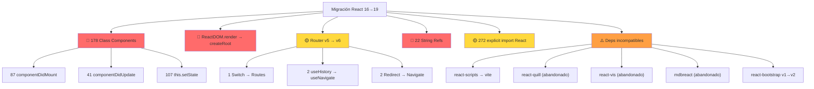

# MIGRATION_LOG.md — React 16 → 19 + CRA → Vite

> **Proyecto:** Dovela Frontend (Curaduría Urbana 1 de Bucaramanga)  
> **Fecha baseline:** 2026-02-18  
> **Branch:** `feat/react-19-migration`  
> **Referencia:** [AGENTS.md](AGENTS.md)

---

## Fase 0 — Diagnóstico pre-migración

### 1. Resumen del proyecto

| Métrica | Valor |
|---------|-------|
| Total archivos JS/JSX en `src/` | **357** |
| Versión React actual | **^16.9.0** |
| Build tool actual | **react-scripts 4.0.3 (CRA 4)** |
| Router | **react-router-dom ^5.2.0** |
| Estado global | Ninguno (useState/useReducer local) |
| Backend | PHP/MySQL (`C:\xampp\htdocs\dovela-backend`) |

---

### 2. Auditoría de dependencias

#### ❌ REMOVER (incompatibles con Vite / obsoletas con React 19)

| Dependencia | Versión actual | Razón |
|-------------|---------------|-------|
| `react-scripts` | 4.0.3 | CRA → Vite. Es el build tool a reemplazar |
| `env-cmd` | ^10.1.0 | Vite usa `.env` nativamente, no necesita wrapper |
| `web-vitals` | ^1.1.1 | CRA boilerplate, se puede reconfigurar después |

#### ⚠️ ACTUALIZAR (requieren nueva versión para React 19 / Vite)

| Dependencia | Versión actual | Versión target | Notas |
|-------------|---------------|----------------|-------|
| `react` | ^16.9.0 | ^19.0.0 | Core migration |
| `react-dom` | ^16.9.0 | ^19.0.0 | Core migration. `ReactDOM.render` → `createRoot` |
| `react-router-dom` | ^5.2.0 | ^6.x | `Switch` → `Routes`, `useHistory` → `useNavigate` |
| `scheduler` | ^0.20.2 | Alinear con React 19 | Peer dep de React |
| `@testing-library/react` | ^11.2.6 | ^16.x | Necesita React 18+ |
| `@testing-library/user-event` | ^12.8.3 | ^14.x | API cambia |
| `@testing-library/jest-dom` | ^5.12.0 | ^6.x | Matchers actualizados |
| `react-bootstrap` | ^1.6.8 | ^2.x | v1 no soporta React 18+ |
| `mdbreact` | ^5.2.0 | Evaluar reemplazo | Proyecto abandonado |
| `mdb-react-ui-kit` | ^1.0.0-beta3 | ^8.x+ | Versión estable para React 18+ |
| `styled-components` | ^5.3.0 | ^6.x | v6 soporta React 19, API de server mejorada |
| `sweetalert2` | ^10.16.7 | ^11.x | v11 es la actual, mejoras de API |
| `sweetalert2-react-content` | ^3.3.2 | ^5.x | Alineada con sweetalert2 v11 |
| `react-pdf` | ^5.3.0 | ^9.x | v9 soporta React 19, pdfjs actualizado |
| `react-i18next` | ^11.8.13 | ^15.x | Soportar React 19 `use()` |
| `i18next` | ^20.2.2 | ^24.x | Alineado |
| `react-quill` | ^1.3.5 | Evaluar `react-quill-new` o `@udecode/plate` | Proyecto abandonado, no soporta React 18+ |
| `react-vis` | ^1.11.7 | Migrar a `visx` o `recharts` | Uber abandonó react-vis |
| `react-data-table-component` | ^7.4.6 | ^7.6+ | Verificar compat React 19 |
| `@silevis/reactgrid` | ^4.0.4 | ^4.1+ | Verificar React 19 |
| `react-calendar` | ^3.4.0 | ^5.x | v5 soporta React 18+ |
| `react-date-picker` | ^8.2.0 | ^11.x | Alineado con react-calendar |
| `@wojtekmaj/react-daterange-picker` | ^3.4.0 | ^6.x | React 18+ compat |
| `react-modal` | ^3.14.3 | ^3.16+ | Minor update, verificar React 19 |
| `react-google-recaptcha` | ^2.1.0 | ^3.x | React 18+ |
| `react-form-stepper` | ^1.4.3 | ^2.x o reemplazo | Verificar status |
| `react-icons` | ^5.5.0 | ^5.5+ | ✅ Ya compatible |
| `rsuite` | ^5.15.0 | ^5.74+ o ^6.x | v5 soporta React 18, verificar 19 |
| `rsuite-table` | ^5.3.1 | ^5.20+ | Alineado con rsuite |
| `react-moment` | ^1.1.1 | Reemplazar por `dayjs` | moment.js está en modo legacy |
| `moment` | ^2.29.1 | Migrar a `dayjs` | moment.js +300KB |
| `moment-business-days` | ^1.2.0 | Migrar lógica a util propio con `dayjs` | |
| `react-multi-carousel` | ^2.6.2 | ^2.8+ | Verificar React 19 |
| `react-sidebar` | ^3.0.2 | Evaluar reemplazo | Puede estar abandonado |
| `react-google-maps` | ^9.4.5 | Migrar a `@react-google-maps/api` | v9 es legacy |
| `axios` | ^0.21.4 | ^1.7+ | Fix CVEs y mejoras |
| `popper.js` | ^1.16.1 | Remover (incluido en Bootstrap 5) | Redundante |
| `react-collapsible` | ^2.8.3 | Verificar | Puede necesitar update menor |
| `frappe-gantt` | ^1.0.4 | ^0.8+ | Verificar compat |
| `jodit-pro` | ^4.6.9 | ^4.6+ | ✅ Sin cambios importantes |
| `jodit-pro-react` | ^1.3.63 | Verificar React 19 compat | |
| `react-spreadsheet` | ^0.6.1 | ^0.9+ | React 18+ |
| `@pathofdev/react-tag-input` | ^1.0.7 | Evaluar reemplazo | Proyecto abandonado |
| `react-html-datalist` | ^2.0.4 | Evaluar necesidad | Poco mantenido |
| `react-markdown` | ^8.0.4 | ^9.x | ESM only en v9, evaluar |
| `markdown-to-jsx` | ^7.1.8 | ^7.5+ | ✅ Compatible |

#### ✅ COMPATIBLE (sin cambios o mínimos)

| Dependencia | Versión actual | Notas |
|-------------|---------------|-------|
| `bootstrap` | ^5.3.7 | ✅ Framework CSS puro, sin deps React |
| `@popperjs/core` | ^2.9.2 | ✅ No depende de React |
| `jspdf` | ^2.5.2 | ✅ Librería vanilla JS |
| `pdf-lib` | ^1.16.0 | ✅ Librería vanilla JS |
| `file-saver` | ^2.0.5 | ✅ Librería vanilla JS |
| `js-sha256` | ^0.9.0 | ✅ Librería vanilla JS |
| `js-file-download` | ^0.4.12 | ✅ Librería vanilla JS |
| `written-number` | ^0.11.1 | ✅ Librería vanilla JS |
| `quill-to-pdf` | ^1.0.7 | ✅ Depende de quill, no de React |
| `react-icons` | ^5.5.0 | ✅ Ya compatible React 18/19 |
| `i18next-browser-languagedetector` | ^6.1.0 | ✅ Plugin i18next |
| `@uiw/react-heat-map` | ^1.4.8 | Verificar React 19 |
| `pdf-viewer-reactjs` | ^2.2.3 | Verificar mantenimiento |

---

### 3. Conteo de patrones legacy en `src/`

| Patrón | Conteo | Riesgo | Acción en migración |
|--------|--------|--------|---------------------|
| `ReactDOM.render` | **2** (index.js + centralClocks) | 🔴 ALTO | Migrar a `createRoot()` |
| `import React` (explícito) | **272** archivos | 🟡 MEDIO | React 19 no requiere import para JSX, pero no rompe |
| `extends Component` (class comp.) | **178** archivos | 🔴 ALTO | Refactorizar a funcionales (largo plazo) |
| `componentDidMount` | **87** archivos | 🔴 ALTO | Migrar a `useEffect` (class → functional) |
| `componentDidUpdate` | **41** archivos | 🔴 ALTO | Migrar a `useEffect` con deps |
| `componentWillUnmount` | **1** archivo | 🟢 BAJO | Una sola migración |
| `componentWillMount` | **0** | ✅ NINGUNO | No hay UNSAFE lifecycle |
| `componentWillReceiveProps` | **0** | ✅ NINGUNO | |
| `UNSAFE_*` lifecycle | **0** | ✅ NINGUNO | |
| `this.setState` | **107** archivos | 🔴 ALTO | Parte de class → functional |
| `this.state` | **168** archivos | 🔴 ALTO | Parte de class → functional |
| `this.props` | **179** archivos | 🔴 ALTO | Parte de class → functional |
| `<Switch>` (router v5) | **1** (App.js) | 🟡 MEDIO | Migrar a `<Routes>` (router v6) |
| `useHistory` (router v5) | **2** archivos | 🟡 MEDIO | Migrar a `useNavigate` |
| `<Redirect>` (router v5) | **2** archivos | 🟡 MEDIO | Migrar a `<Navigate>` |
| `createRef()` | **8** archivos | 🟡 MEDIO | Migrar a `useRef()` |
| `string refs` (`ref="..."`) | **22** archivos | 🔴 ALTO | Eliminados en React 19, migrar a `useRef` |
| `findDOMNode` | **0** | ✅ NINGUNO | |
| `defaultProps` | **0** | ✅ NINGUNO | |
| `propTypes` | **0** | ✅ NINGUNO | |
| `render()` method (class) | **178** archivos | 🔴 ALTO | Correlaciona con extends Component |
| `class` (HTML attr en JSX) | Múltiples | 🟡 MEDIO | Usar `className` (linting) |
| `for` (HTML attr en JSX) | Múltiples | 🟡 MEDIO | Usar `htmlFor` (linting) |

---

### 4. Diagrama de riesgos



---

### 5. Tests de humo — Baseline

| Suite | Tests | Resultado | Notas |
|-------|-------|-----------|-------|
| App.smoke | 6 | ✅ PASS | App renderiza, login visible, footer, navbar, theme, recaptcha |
| Login.smoke | 4 | ✅ PASS | Form fields, submit, API call, error handling |
| Navigation.smoke | 23 | ✅ PASS | 7 rutas públicas + 15 privadas (redirect) + catch-all |
| Modules.smoke | 13 | ✅ PASS | Clocks import, Records import (5), Services import (5) |
| **TOTAL** | **46** | **✅ ALL PASS** | |

**Warnings detectados en tests (no bloquean):**
- `class` en lugar de `className` en `App.js:LoginPage` (JSX)
- `for` en lugar de `htmlFor` en `App.js:LoginPage` (JSX)
- Missing `key` prop en `vars.js:191` (lista de opciones)

---

### 6. Archivos creados en Fase 0

| Archivo | Propósito |
|---------|-----------|
| `src/__tests__/App.smoke.test.js` | Test de renderizado del shell de la app |
| `src/__tests__/Login.smoke.test.js` | Test del flujo de login |
| `src/__tests__/Navigation.smoke.test.js` | Test de rutas públicas/privadas |
| `src/__tests__/Modules.smoke.test.js` | Test de importación de módulos clave |
| `src/__mocks__/styleMock.js` | Mock para CSS de node_modules en Jest |
| `MIGRATION_LOG.md` | Este documento |

**Configuración de Jest actualizada** en `package.json`:
- `transformIgnorePatterns`: rsuite, @babel/runtime (ESM)
- `moduleNameMapper`: CSS imports de 9 paquetes de node_modules

---

### 7. Riesgos principales

1. **178 class components**: El mayor esfuerzo de migración. React 19 sigue soportando clases, pero funcionales son el estándar y muchas deps nuevas requieren hooks.
2. **22 string refs**: **Eliminados en React 19**. DEBEN migrarse antes de actualizar React.
3. **react-quill, react-vis, mdbreact**: Proyectos abandonados. Requieren reemplazo, no actualización.
4. **CSS imports desde node_modules**: Ya configurados en Jest, pero Vite maneja esto diferente.
5. **react-router-dom v5→v6**: Cambio de API significativo (`Switch`→`Routes`, `useHistory`→`useNavigate`, render props → element prop).

---

### 8. Plan de Fases (siguiente)

| Fase | Descripción | Prioridad |
|------|-------------|-----------|
| **Fase 1** | Migrar `ReactDOM.render` → `createRoot`, eliminar string refs | 🔴 Bloqueante |
| **Fase 2** | Actualizar React 16→18 (paso intermedio), actualizar deps core | 🔴 Alta |
| **Fase 3** | Migrar router v5→v6 | 🟡 Media |
| **Fase 4** | CRA→Vite (reemplazar react-scripts) | 🟡 Media |
| **Fase 5** | React 18→19, actualizar deps restantes | 🟡 Media |
| **Fase 6** | Refactorizar class→functional (incremental, por módulo) | 🟢 Continua |
| **Fase 7** | Reemplazar librerías abandonadas (react-quill, react-vis, mdbreact) | 🟢 Continua |

---

## Fase 1 — Eliminar patrones incompatibles React 18/19

> **Fecha:** 2026-02-18  
> **Commit:** `refactor(fase1): remove unnecessary import React in 250 files`  
> **Tests:** 46/46 PASS (App, Login, Navigation, Modules)

### 1. String refs (`ref="..."`)

| Conteo esperado | Conteo real | Acción |
|-----------------|-------------|--------|
| 22 archivos | **0** | No se requirió migración |

**Hallazgo:** Los 22 matches del diagnóstico eran falsos positivos de `href="..."` en etiquetas `<a>`. No existe ningún React string ref (`ref="myRef"`) en el código fuente. Confirmado con `grep -rPn '\bref="' src/ | grep -v 'href='`.

### 2. Lifecycles deprecated (`componentWill*`)

| Patrón | Conteo | Acción |
|--------|--------|--------|
| `componentWillMount` | 0 | ✅ Ninguno |
| `componentWillReceiveProps` | 0 | ✅ Ninguno |
| `componentWillUpdate` | 0 | ✅ Ninguno |
| `UNSAFE_*` | 0 | ✅ Ninguno |
| `componentWillUnmount` | 1 (`submit_list.component.js`) | ⚠️ No deprecated — lifecycle válido en class components |

**Resultado:** No hay lifecycles deprecated. El único `componentWillUnmount` es válido (cleanup method, soportado en React 19).

### 3. Import React innecesarios

| Categoría | Conteo | Acción |
|-----------|--------|--------|
| `import React from 'react'` removido completamente | **18** | Línea eliminada (no usa React APIs) |
| `import React, { ... }` simplificado a `import { ... }` | **232** | Removido default import, mantenidos named imports |
| Archivos que usan React API (mantienen import) | **24** | Sin cambios (`React.forwardRef`, `React.createRef`, `React.memo`, `React.Fragment`, `extends Component`) |
| **Total archivos modificados** | **250** | |

**Prerequisito verificado:** React 16.14.0 instalado (soporta `react/jsx-runtime`). CRA 4 auto-detecta y usa el nuevo JSX transform.

### 4. Archivos que mantienen `import React` (24)

Estos archivos usan React APIs directamente y requieren el import:

| Archivo | API usada |
|---------|-----------|
| `App.js` | `React.createContext`, `useContext` |
| `index.js` | `ReactDOM.render` |
| `navbar.js` | `React.forwardRef` |
| `ClockRow.js` | `React.useEffect` |
| `HolidayCalendar.js` | `React.memo`, `ReactDOM` |
| `centralClocks.component.js` | `ReactDOM` |
| `exp_clocks.component.js` | `React.Fragment` |
| `record_arc_areas*.js` (3) | `React.createRef` |
| `email.page.js`, `public.page.js` | `React.createRef` |
| Tests (3) | `React.forwardRef`, `React.useImperativeHandle` |
| Class components (6+) | `extends Component` |

### 5. Tests de humo — Post Fase 1

| Suite | Tests | Resultado |
|-------|-------|-----------|
| App.smoke | 6 | ✅ PASS |
| Login.smoke | 4 | ✅ PASS |
| Navigation.smoke | 23 | ✅ PASS |
| Modules.smoke | 13 | ✅ PASS |
| **TOTAL** | **46** | **✅ ALL PASS** |

### 6. Conteo actualizado de patrones legacy

| Patrón | Pre-Fase 1 | Post-Fase 1 | Cambio |
|--------|-----------|-------------|--------|
| `import React` (explícito) | 274 | **24** | -250 ✅ |
| `string refs` (`ref="..."`) | 0* | **0** | sin cambio (diagnóstico corregido) |
| `componentWill*` deprecated | 0 | **0** | sin cambio |
| `extends Component` (class) | 178 | **178** | sin cambio (Fase 6) |
| `ReactDOM.render` | 2 | **2** | sin cambio (Fase 2) |
| `<Switch>` (router v5) | 1 | **1** | sin cambio (Fase 3) |

*\*Diagnóstico Fase 0 reportó 22, eran falsos positivos de `href=`*

### 7. Estado: Fase 1 completada ✅

**Listo para Fase 2:** Actualizar React 16→18 (paso intermedio). Los bloqueantes (string refs, deprecated lifecycles) están confirmados como inexistentes. El código es compatible con el upgrade.

---

## Comandos para Fase 1

```bash
# 1. Migrar entry point: ReactDOM.render → createRoot
# En src/index.js cambiar:
#   ReactDOM.render(<App />, document.getElementById('root'))
# Por:
#   const root = createRoot(document.getElementById('root'))
#   root.render(<App />)

# 2. Buscar y listar todas las string refs para migrar
grep -rn 'ref="' src/ --include="*.js" --include="*.jsx"

# 3. Buscar ReactDOM.render adicionales
grep -rn 'ReactDOM.render' src/ --include="*.js" --include="*.jsx"

# 4. Correr tests baseline después de cada cambio
CI=true npx react-scripts test --watchAll=false --forceExit

# 5. Commit baseline Fase 0
git add -A && git commit -m "fase-0: baseline audit, smoke tests, MIGRATION_LOG.md

- Auditoría completa de 65 dependencias (clasificadas ✅/⚠️/❌)
- Conteo de patrones legacy: 178 class components, 22 string refs, 87 componentDidMount
- 46 smoke tests creados y pasando (App, Login, Navigation, Modules)
- Configuración Jest para CSS imports de node_modules
- MIGRATION_LOG.md con plan de 7 fases
"
```
