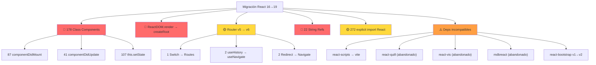

# MIGRATION_LOG.md — React 16 → 19 + CRA → Vite

> **Proyecto:** Dovela Frontend (Curaduría Urbana 1 de Bucaramanga)  
> **Fecha baseline:** 2026-02-18  
> **Branch:** `feat/react-19-migration`  
> **Referencia:** [AGENTS.md](AGENTS.md)

---

## Fase 0 — Diagnóstico pre-migración

### 1. Resumen del proyecto

| Métrica | Valor |
|---------|-------|
| Total archivos JS/JSX en `src/` | **357** |
| Versión React actual | **^16.9.0** |
| Build tool actual | **react-scripts 4.0.3 (CRA 4)** |
| Router | **react-router-dom ^5.2.0** |
| Estado global | Ninguno (useState/useReducer local) |
| Backend | PHP/MySQL (`C:\xampp\htdocs\dovela-backend`) |

---

### 2. Auditoría de dependencias

#### ❌ REMOVER (incompatibles con Vite / obsoletas con React 19)

| Dependencia | Versión actual | Razón |
|-------------|---------------|-------|
| `react-scripts` | 4.0.3 | CRA → Vite. Es el build tool a reemplazar |
| `env-cmd` | ^10.1.0 | Vite usa `.env` nativamente, no necesita wrapper |
| `web-vitals` | ^1.1.1 | CRA boilerplate, se puede reconfigurar después |

#### ⚠️ ACTUALIZAR (requieren nueva versión para React 19 / Vite)

| Dependencia | Versión actual | Versión target | Notas |
|-------------|---------------|----------------|-------|
| `react` | ^16.9.0 | ^19.0.0 | Core migration |
| `react-dom` | ^16.9.0 | ^19.0.0 | Core migration. `ReactDOM.render` → `createRoot` |
| `react-router-dom` | ^5.2.0 | ^6.x | `Switch` → `Routes`, `useHistory` → `useNavigate` |
| `scheduler` | ^0.20.2 | Alinear con React 19 | Peer dep de React |
| `@testing-library/react` | ^11.2.6 | ^16.x | Necesita React 18+ |
| `@testing-library/user-event` | ^12.8.3 | ^14.x | API cambia |
| `@testing-library/jest-dom` | ^5.12.0 | ^6.x | Matchers actualizados |
| `react-bootstrap` | ^1.6.8 | ^2.x | v1 no soporta React 18+ |
| `mdbreact` | ^5.2.0 | Evaluar reemplazo | Proyecto abandonado |
| `mdb-react-ui-kit` | ^1.0.0-beta3 | ^8.x+ | Versión estable para React 18+ |
| `styled-components` | ^5.3.0 | ^6.x | v6 soporta React 19, API de server mejorada |
| `sweetalert2` | ^10.16.7 | ^11.x | v11 es la actual, mejoras de API |
| `sweetalert2-react-content` | ^3.3.2 | ^5.x | Alineada con sweetalert2 v11 |
| `react-pdf` | ^5.3.0 | ^9.x | v9 soporta React 19, pdfjs actualizado |
| `react-i18next` | ^11.8.13 | ^15.x | Soportar React 19 `use()` |
| `i18next` | ^20.2.2 | ^24.x | Alineado |
| `react-quill` | ^1.3.5 | Evaluar `react-quill-new` o `@udecode/plate` | Proyecto abandonado, no soporta React 18+ |
| `react-vis` | ^1.11.7 | Migrar a `visx` o `recharts` | Uber abandonó react-vis |
| `react-data-table-component` | ^7.4.6 | ^7.6+ | Verificar compat React 19 |
| `@silevis/reactgrid` | ^4.0.4 | ^4.1+ | Verificar React 19 |
| `react-calendar` | ^3.4.0 | ^5.x | v5 soporta React 18+ |
| `react-date-picker` | ^8.2.0 | ^11.x | Alineado con react-calendar |
| `@wojtekmaj/react-daterange-picker` | ^3.4.0 | ^6.x | React 18+ compat |
| `react-modal` | ^3.14.3 | ^3.16+ | Minor update, verificar React 19 |
| `react-google-recaptcha` | ^2.1.0 | ^3.x | React 18+ |
| `react-form-stepper` | ^1.4.3 | ^2.x o reemplazo | Verificar status |
| `react-icons` | ^5.5.0 | ^5.5+ | ✅ Ya compatible |
| `rsuite` | ^5.15.0 | ^5.74+ o ^6.x | v5 soporta React 18, verificar 19 |
| `rsuite-table` | ^5.3.1 | ^5.20+ | Alineado con rsuite |
| `react-moment` | ^1.1.1 | Reemplazar por `dayjs` | moment.js está en modo legacy |
| `moment` | ^2.29.1 | Migrar a `dayjs` | moment.js +300KB |
| `moment-business-days` | ^1.2.0 | Migrar lógica a util propio con `dayjs` | |
| `react-multi-carousel` | ^2.6.2 | ^2.8+ | Verificar React 19 |
| `react-sidebar` | ^3.0.2 | Evaluar reemplazo | Puede estar abandonado |
| `react-google-maps` | ^9.4.5 | Migrar a `@react-google-maps/api` | v9 es legacy |
| `axios` | ^0.21.4 | ^1.7+ | Fix CVEs y mejoras |
| `popper.js` | ^1.16.1 | Remover (incluido en Bootstrap 5) | Redundante |
| `react-collapsible` | ^2.8.3 | Verificar | Puede necesitar update menor |
| `frappe-gantt` | ^1.0.4 | ^0.8+ | Verificar compat |
| `jodit-pro` | ^4.6.9 | ^4.6+ | ✅ Sin cambios importantes |
| `jodit-pro-react` | ^1.3.63 | Verificar React 19 compat | |
| `react-spreadsheet` | ^0.6.1 | ^0.9+ | React 18+ |
| `@pathofdev/react-tag-input` | ^1.0.7 | Evaluar reemplazo | Proyecto abandonado |
| `react-html-datalist` | ^2.0.4 | Evaluar necesidad | Poco mantenido |
| `react-markdown` | ^8.0.4 | ^9.x | ESM only en v9, evaluar |
| `markdown-to-jsx` | ^7.1.8 | ^7.5+ | ✅ Compatible |

#### ✅ COMPATIBLE (sin cambios o mínimos)

| Dependencia | Versión actual | Notas |
|-------------|---------------|-------|
| `bootstrap` | ^5.3.7 | ✅ Framework CSS puro, sin deps React |
| `@popperjs/core` | ^2.9.2 | ✅ No depende de React |
| `jspdf` | ^2.5.2 | ✅ Librería vanilla JS |
| `pdf-lib` | ^1.16.0 | ✅ Librería vanilla JS |
| `file-saver` | ^2.0.5 | ✅ Librería vanilla JS |
| `js-sha256` | ^0.9.0 | ✅ Librería vanilla JS |
| `js-file-download` | ^0.4.12 | ✅ Librería vanilla JS |
| `written-number` | ^0.11.1 | ✅ Librería vanilla JS |
| `quill-to-pdf` | ^1.0.7 | ✅ Depende de quill, no de React |
| `react-icons` | ^5.5.0 | ✅ Ya compatible React 18/19 |
| `i18next-browser-languagedetector` | ^6.1.0 | ✅ Plugin i18next |
| `@uiw/react-heat-map` | ^1.4.8 | Verificar React 19 |
| `pdf-viewer-reactjs` | ^2.2.3 | Verificar mantenimiento |

---

### 3. Conteo de patrones legacy en `src/`

| Patrón | Conteo | Riesgo | Acción en migración |
|--------|--------|--------|---------------------|
| `ReactDOM.render` | **2** (index.js + centralClocks) | 🔴 ALTO | Migrar a `createRoot()` |
| `import React` (explícito) | **272** archivos | 🟡 MEDIO | React 19 no requiere import para JSX, pero no rompe |
| `extends Component` (class comp.) | **178** archivos | 🔴 ALTO | Refactorizar a funcionales (largo plazo) |
| `componentDidMount` | **87** archivos | 🔴 ALTO | Migrar a `useEffect` (class → functional) |
| `componentDidUpdate` | **41** archivos | 🔴 ALTO | Migrar a `useEffect` con deps |
| `componentWillUnmount` | **1** archivo | 🟢 BAJO | Una sola migración |
| `componentWillMount` | **0** | ✅ NINGUNO | No hay UNSAFE lifecycle |
| `componentWillReceiveProps` | **0** | ✅ NINGUNO | |
| `UNSAFE_*` lifecycle | **0** | ✅ NINGUNO | |
| `this.setState` | **107** archivos | 🔴 ALTO | Parte de class → functional |
| `this.state` | **168** archivos | 🔴 ALTO | Parte de class → functional |
| `this.props` | **179** archivos | 🔴 ALTO | Parte de class → functional |
| `<Switch>` (router v5) | **1** (App.js) | 🟡 MEDIO | Migrar a `<Routes>` (router v6) |
| `useHistory` (router v5) | **2** archivos | 🟡 MEDIO | Migrar a `useNavigate` |
| `<Redirect>` (router v5) | **2** archivos | 🟡 MEDIO | Migrar a `<Navigate>` |
| `createRef()` | **8** archivos | 🟡 MEDIO | Migrar a `useRef()` |
| `string refs` (`ref="..."`) | **22** archivos | 🔴 ALTO | Eliminados en React 19, migrar a `useRef` |
| `findDOMNode` | **0** | ✅ NINGUNO | |
| `defaultProps` | **0** | ✅ NINGUNO | |
| `propTypes` | **0** | ✅ NINGUNO | |
| `render()` method (class) | **178** archivos | 🔴 ALTO | Correlaciona con extends Component |
| `class` (HTML attr en JSX) | Múltiples | 🟡 MEDIO | Usar `className` (linting) |
| `for` (HTML attr en JSX) | Múltiples | 🟡 MEDIO | Usar `htmlFor` (linting) |

---

### 4. Diagrama de riesgos



---

### 5. Tests de humo — Baseline

| Suite | Tests | Resultado | Notas |
|-------|-------|-----------|-------|
| App.smoke | 6 | ✅ PASS | App renderiza, login visible, footer, navbar, theme, recaptcha |
| Login.smoke | 4 | ✅ PASS | Form fields, submit, API call, error handling |
| Navigation.smoke | 23 | ✅ PASS | 7 rutas públicas + 15 privadas (redirect) + catch-all |
| Modules.smoke | 13 | ✅ PASS | Clocks import, Records import (5), Services import (5) |
| **TOTAL** | **46** | **✅ ALL PASS** | |

**Warnings detectados en tests (no bloquean):**
- `class` en lugar de `className` en `App.js:LoginPage` (JSX)
- `for` en lugar de `htmlFor` en `App.js:LoginPage` (JSX)
- Missing `key` prop en `vars.js:191` (lista de opciones)

---

### 6. Archivos creados en Fase 0

| Archivo | Propósito |
|---------|-----------|
| `src/__tests__/App.smoke.test.js` | Test de renderizado del shell de la app |
| `src/__tests__/Login.smoke.test.js` | Test del flujo de login |
| `src/__tests__/Navigation.smoke.test.js` | Test de rutas públicas/privadas |
| `src/__tests__/Modules.smoke.test.js` | Test de importación de módulos clave |
| `src/__mocks__/styleMock.js` | Mock para CSS de node_modules en Jest |
| `MIGRATION_LOG.md` | Este documento |

**Configuración de Jest actualizada** en `package.json`:
- `transformIgnorePatterns`: rsuite, @babel/runtime (ESM)
- `moduleNameMapper`: CSS imports de 9 paquetes de node_modules

---

### 7. Riesgos principales

1. **178 class components**: El mayor esfuerzo de migración. React 19 sigue soportando clases, pero funcionales son el estándar y muchas deps nuevas requieren hooks.
2. **22 string refs**: **Eliminados en React 19**. DEBEN migrarse antes de actualizar React.
3. **react-quill, react-vis, mdbreact**: Proyectos abandonados. Requieren reemplazo, no actualización.
4. **CSS imports desde node_modules**: Ya configurados en Jest, pero Vite maneja esto diferente.
5. **react-router-dom v5→v6**: Cambio de API significativo (`Switch`→`Routes`, `useHistory`→`useNavigate`, render props → element prop).

---

### 8. Plan de Fases (siguiente)

| Fase | Descripción | Prioridad |
|------|-------------|-----------|
| **Fase 1** | Migrar `ReactDOM.render` → `createRoot`, eliminar string refs | 🔴 Bloqueante |
| **Fase 2** | Actualizar React 16→18 (paso intermedio), actualizar deps core | 🔴 Alta |
| **Fase 3** | Migrar router v5→v6 | 🟡 Media |
| **Fase 4** | CRA→Vite (reemplazar react-scripts) | 🟡 Media |
| **Fase 5** | React 18→19, actualizar deps restantes | 🟡 Media |
| **Fase 6** | Refactorizar class→functional (incremental, por módulo) | 🟢 Continua |
| **Fase 7** | Reemplazar librerías abandonadas (react-quill, react-vis, mdbreact) | 🟢 Continua |

---

## Fase 1 — Eliminar patrones incompatibles React 18/19

> **Fecha:** 2026-02-18  
> **Commit:** `refactor(fase1): remove unnecessary import React in 250 files`  
> **Tests:** 46/46 PASS (App, Login, Navigation, Modules)

### 1. String refs (`ref="..."`)

| Conteo esperado | Conteo real | Acción |
|-----------------|-------------|--------|
| 22 archivos | **0** | No se requirió migración |

**Hallazgo:** Los 22 matches del diagnóstico eran falsos positivos de `href="..."` en etiquetas `<a>`. No existe ningún React string ref (`ref="myRef"`) en el código fuente. Confirmado con `grep -rPn '\bref="' src/ | grep -v 'href='`.

### 2. Lifecycles deprecated (`componentWill*`)

| Patrón | Conteo | Acción |
|--------|--------|--------|
| `componentWillMount` | 0 | ✅ Ninguno |
| `componentWillReceiveProps` | 0 | ✅ Ninguno |
| `componentWillUpdate` | 0 | ✅ Ninguno |
| `UNSAFE_*` | 0 | ✅ Ninguno |
| `componentWillUnmount` | 1 (`submit_list.component.js`) | ⚠️ No deprecated — lifecycle válido en class components |

**Resultado:** No hay lifecycles deprecated. El único `componentWillUnmount` es válido (cleanup method, soportado en React 19).

### 3. Import React innecesarios

| Categoría | Conteo | Acción |
|-----------|--------|--------|
| `import React from 'react'` removido completamente | **18** | Línea eliminada (no usa React APIs) |
| `import React, { ... }` simplificado a `import { ... }` | **232** | Removido default import, mantenidos named imports |
| Archivos que usan React API (mantienen import) | **24** | Sin cambios (`React.forwardRef`, `React.createRef`, `React.memo`, `React.Fragment`, `extends Component`) |
| **Total archivos modificados** | **250** | |

**Prerequisito verificado:** React 16.14.0 instalado (soporta `react/jsx-runtime`). CRA 4 auto-detecta y usa el nuevo JSX transform.

### 4. Archivos que mantienen `import React` (24)

Estos archivos usan React APIs directamente y requieren el import:

| Archivo | API usada |
|---------|-----------|
| `App.js` | `React.createContext`, `useContext` |
| `index.js` | `ReactDOM.render` |
| `navbar.js` | `React.forwardRef` |
| `ClockRow.js` | `React.useEffect` |
| `HolidayCalendar.js` | `React.memo`, `ReactDOM` |
| `centralClocks.component.js` | `ReactDOM` |
| `exp_clocks.component.js` | `React.Fragment` |
| `record_arc_areas*.js` (3) | `React.createRef` |
| `email.page.js`, `public.page.js` | `React.createRef` |
| Tests (3) | `React.forwardRef`, `React.useImperativeHandle` |
| Class components (6+) | `extends Component` |

### 5. Tests de humo — Post Fase 1

| Suite | Tests | Resultado |
|-------|-------|-----------|
| App.smoke | 6 | ✅ PASS |
| Login.smoke | 4 | ✅ PASS |
| Navigation.smoke | 23 | ✅ PASS |
| Modules.smoke | 13 | ✅ PASS |
| **TOTAL** | **46** | **✅ ALL PASS** |

### 6. Conteo actualizado de patrones legacy

| Patrón | Pre-Fase 1 | Post-Fase 1 | Cambio |
|--------|-----------|-------------|--------|
| `import React` (explícito) | 274 | **24** | -250 ✅ |
| `string refs` (`ref="..."`) | 0* | **0** | sin cambio (diagnóstico corregido) |
| `componentWill*` deprecated | 0 | **0** | sin cambio |
| `extends Component` (class) | 178 | **178** | sin cambio (Fase 6) |
| `ReactDOM.render` | 2 | **2** | sin cambio (Fase 2) |
| `<Switch>` (router v5) | 1 | **1** | sin cambio (Fase 3) |

*\*Diagnóstico Fase 0 reportó 22, eran falsos positivos de `href=`*

### 7. Estado: Fase 1 completada ✅

**Listo para Fase 2:** Actualizar React 16→18 (paso intermedio). Los bloqueantes (string refs, deprecated lifecycles) están confirmados como inexistentes. El código es compatible con el upgrade.

---

## Comandos para Fase 1

```bash
# 1. Migrar entry point: ReactDOM.render → createRoot
# En src/index.js cambiar:
#   ReactDOM.render(<App />, document.getElementById('root'))
# Por:
#   const root = createRoot(document.getElementById('root'))
#   root.render(<App />)

# 2. Buscar y listar todas las string refs para migrar
grep -rn 'ref="' src/ --include="*.js" --include="*.jsx"

# 3. Buscar ReactDOM.render adicionales
grep -rn 'ReactDOM.render' src/ --include="*.js" --include="*.jsx"

# 4. Correr tests baseline después de cada cambio
CI=true npx react-scripts test --watchAll=false --forceExit

# 5. Commit baseline Fase 0
git add -A && git commit -m "fase-0: baseline audit, smoke tests, MIGRATION_LOG.md

- Auditoría completa de 65 dependencias (clasificadas ✅/⚠️/❌)
- Conteo de patrones legacy: 178 class components, 22 string refs, 87 componentDidMount
- 46 smoke tests creados y pasando (App, Login, Navigation, Modules)
- Configuración Jest para CSS imports de node_modules
- MIGRATION_LOG.md con plan de 7 fases
"
```

---

## Fase 4 — CRA 4 → Vite 6 + Jest → Vitest

### 1. Resumen de cambios

| Métrica | Antes (CRA) | Después (Vite) |
|---------|-------------|----------------|
| Build tool | react-scripts 4.0.3 | Vite 6.4.1 |
| Test runner | Jest (CRA built-in) | Vitest 4.0.18 |
| Dev server start | ~8s | ~400ms |
| Node.js requerido | v16+ | **v22+** (OpenSSL 3 para `crypto.getRandomValues`) |
| Env var prefix | `REACT_APP_` | `VITE_` |
| Env var acceso | `process.env.REACT_APP_*` | `import.meta.env.VITE_*` |
| index.html | `public/index.html` | Raíz del proyecto |
| Config files | Ninguno (CRA opaco) | `vite.config.mjs`, `vitest.config.mjs` |

### 2. Archivos nuevos

| Archivo | Propósito |
|---------|-----------|
| `vite.config.mjs` | Vite config: jsxInJs plugin, proxy /api→:3001, build→'build' |
| `vitest.config.mjs` | Vitest config: cssNoop plugin, jsdom env, jsxInJs plugin |
| `index.html` (raíz) | Entry HTML para Vite (movido de `public/index.html`) |
| `src/__tests__/setup.js` | Vitest setup: jest-dom matchers, env vars defaults |
| `.nvmrc` | Node 22 requerido |

### 3. Dependencias eliminadas

| Paquete | Razón |
|---------|-------|
| `react-scripts` | Reemplazado por Vite |
| `env-cmd` | Vite carga `.env` nativamente |
| `web-vitals` | CRA boilerplate, no necesario |

### 4. Dependencias agregadas (devDependencies)

| Paquete | Versión |
|---------|---------|
| `vite` | ^6.4.1 |
| `@vitejs/plugin-react` | ^5.1.4 |
| `vitest` | ^4.0.18 |
| `jsdom` | ^24 |
| `@testing-library/jest-dom` | ^6.9.1 |

### 5. Migración de archivos fuente

- **82 archivos** migrados: `process.env.REACT_APP_*` → `import.meta.env.VITE_*`
- **Verificación:** `grep -rn "process.env" src/` = 0 resultados
- **Variables en `.env`:** 7 variables renombradas `REACT_APP_*` → `VITE_*`
  - `VITE_API_URL`, `VITE_GLOBAL_ID`, `VITE_GOOGLE_CAPTCHA_HTML`, `VITE_GOOGLE_CAPTCHA_KEY`, `VITE_GOOGLE_MAPS_KEY`, `VITE_API_PROF_URL`, `VITE_API_EMAIL_URL`

### 6. Migración de tests (Jest → Vitest)

| Cambio | Detalle |
|--------|---------|
| `jest.mock()` → `vi.mock()` | En 4 archivos |
| `jest.fn()` → `vi.fn()` | En 4 archivos |
| `jest.spyOn()` → `vi.spyOn()` | En 2 archivos |
| `require()` → `import()` | En Modules.smoke.test.js (ESM) |
| Mock factories | Vitest requiere `{ default: ... }` para default exports |
| CSS mocking | Plugin `cssNoop()` intercepta en resolveId |
| JSX in .js | Plugin `jsxInJs()` usa `transformWithEsbuild` |

### 7. Plugins Vite personalizados

#### `jsxInJs()` — JSX en archivos .js
Todo el codebase usa `.js` para archivos con JSX (CRA lo soportaba automáticamente). Este plugin usa `transformWithEsbuild` con `loader: 'jsx'` para mantener compatibilidad sin renombrar 357 archivos.

#### `cssNoop()` — Mock de CSS en tests
Vitest no puede resolver imports CSS de `node_modules` (bootstrap, rsuite, mdb). Este plugin intercepta todas las importaciones `.css` en la fase `resolveId` y las redirige a un mock vacío.

### 8. Decisión Node.js

El Node 20.20.0 instalado vía `nvm` usaba OpenSSL 1.1.1v+quic, que no expone `crypto.getRandomValues` en el módulo `node:crypto`. Vite 6 lo requiere. Se actualizó a **Node 22.22.0** (OpenSSL 3.5.4).

### 9. Tests — Post Fase 4

| Suite | Tests | Resultado |
|-------|-------|-----------|
| App.smoke | 6 | ✅ PASS |
| Login.smoke | 4 | ✅ PASS |
| Navigation.smoke | 23 | ✅ PASS |
| Modules.smoke | 13 | ✅ PASS |
| **TOTAL** | **46** | **✅ ALL PASS** |

### 10. Scripts package.json actualizados

```json
{
  "dev": "vite",
  "start": "vite",
  "build": "vite build",
  "preview": "vite preview",
  "test": "vitest run",
  "test:watch": "vitest"
}
```

### 11. Estado: Fase 4 completada ✅

**Commit:** `dcbb3761` — `build(fase4): migrate CRA 4 → Vite 6 + Jest → Vitest`

**Listo para Fase 2:** Actualizar React 16→18 (`createRoot`, actualizar deps).

---

## Fase 2 — React 16.14 → 18.3.1

**Fecha:** 2025-07-15  
**Objetivo:** Actualizar React core a v18, migrar `ReactDOM.render` → `createRoot`, actualizar todas las dependencias React-dependientes, eliminar `mdbreact`.

---

### 1. Pre-requisito: Eliminación de `mdbreact` (9 archivos)

`mdbreact@5.2.0` es un paquete abandonado incompatible con React 18. Se reemplazó en 9 archivos:

| Archivo | Componente legacy | Reemplazo |
|---------|------------------|-----------|
| `dictionary.page.js` | `MDBPageItem`, `MDBPageNav` | Bootstrap 5 `<li className="page-item">` |
| `submit_list.component.js` | `MDBDataTable` | HTML `<table>` nativo (inputs en filas incompatibles con DataTable) |
| `docs_list.component.js` | `MDBDataTable` | `react-data-table-component` DataTable |
| `fun_6_history.component.js` | `MDBDataTable` (import muerto) | Import eliminado |
| `fun_macro_filterList.component.js` | `MDBDataTable` (import muerto) | Import eliminado |
| `pqrsadmin.js` | `MDBCollapse` | Renderización condicional `{bool && (...)}` |
| `submit_x_fun.component.js` | `MDBCollapse` | Renderización condicional |
| `fun_worker_asign.component.js` | `MDBCollapse` | Renderización condicional |
| `record_arc_39.js` | Archivo completamente comentado | Sin cambios necesarios |

```bash
npm uninstall mdbreact --legacy-peer-deps
```

**Tests:** 46/46 PASS  
**Commit:** `48343a4f` — `refactor(fase2): replace remaining mdbreact imports (9 files) + uninstall mdbreact`

---

### 2. React core: 16.14.0 → 18.3.1

```bash
npm install react@18 react-dom@18 --legacy-peer-deps
```

> **Nota:** `--legacy-peer-deps` requerido en toda la Fase 2 porque `mdb-react-ui-kit@1.6.0` declara `peerDependencies: { "react": "^17.0.0" }`.

---

### 3. Migración `ReactDOM.render` → `createRoot`

**2 archivos afectados:**

#### `src/index.js` (entry point)
```js
// ANTES
import ReactDOM from 'react-dom';
ReactDOM.render(<App />, document.getElementById('root'));

// DESPUÉS
import { createRoot } from 'react-dom/client';
const root = createRoot(document.getElementById('root'));
root.render(<StrictMode><App /></StrictMode>);
```

#### `src/app/pages/user/clocks/centralClocks.component.js` (~línea 615)
SweetAlert2 modal usa `ReactDOM.render()` imperativamente en `didOpen`/`willClose`:
```js
// ANTES
ReactDOM.render(<Component />, container);
ReactDOM.unmountComponentAtNode(container);

// DESPUÉS
import { createRoot } from 'react-dom/client';
const modalRoot = createRoot(container);
modalContainer._reactRoot = modalRoot;  // Guardar referencia para cleanup
modalRoot.render(<Component />);
// En willClose:
modalContainer._reactRoot.unmount();
```

**Tests:** 46/46 PASS  
**Commit:** `4330088e` — `feat(fase2): upgrade React 16.14 → 18.3.1 + migrate createRoot`

---

### 4. Actualización de dependencias por grupos

#### Grupo 1: Sin riesgo (no dependen de internals React)

| Dependencia | Antes | Después |
|-------------|-------|---------|
| `axios` | ^0.21.1 | ^1.9.0 |
| `sweetalert2` | ^10.16.7 | ^11.17.3 |
| `sweetalert2-react-content` | ^3.2.1 | ^5.1.0 |

**Tests:** 46/46 PASS

#### Grupo 2: React companion libs

| Dependencia | Antes | Después |
|-------------|-------|---------|
| `react-i18next` | ^11.8.15 | ^15.5.2 |
| `i18next` | ^20.2.2 | ^24.2.3 |

**Tests:** 46/46 PASS

#### Grupo 3: UI libs que requieren React 18

| Dependencia | Antes | Después |
|-------------|-------|---------|
| `react-bootstrap` | ^1.6.8 | ^2.10.9 |
| `styled-components` | ^5.3.0 | ^6.1.18 |

> **Issue resuelto:** `styled-components@6` CJS bundle referencia `React` global. Tests fallaban con `React is not defined`. Solución: agregar `globalThis.React = React` en `src/__tests__/setup.js`.

**Tests:** 46/46 PASS

#### Grupo 4: Testing

| Dependencia | Antes | Después |
|-------------|-------|---------|
| `@testing-library/react` | ^11.2.6 | ^16.3.0 |
| `@testing-library/user-event` | ^12.8.3 | ^14.6.1 |
| `@testing-library/jest-dom` | ^5.12.0 | ^6.6.3 |
| `@testing-library/dom` | (no existía) | ^10.4.0 (nuevo peer dep) |

**Tests:** 46/46 PASS

#### Grupo 5: Componentes UI individuales

| Dependencia | Antes | Después |
|-------------|-------|---------|
| `react-calendar` | ^3.3.1 | ^5.1.0 |
| `react-date-picker` | ^8.1.0 | ^11.0.0 |
| `react-google-recaptcha` | ^2.1.0 | ^3.1.0 |
| `react-modal` | ^3.12.1 | ^3.16.3 |
| `react-data-table-component` | ^6.11.8 | ^7.7.0 |

**Tests:** 46/46 PASS  
**Commit:** `512bf2a7` — `feat(fase2): update React-dependent deps for React 18`

---

### 5. react-pdf v5 → v9

Cambios significativos en `react-pdf@9`:

| Aspecto | v5 | v9 |
|---------|----|----|
| CSS AnnotationLayer | `react-pdf/dist/umd/Page/AnnotationLayer.css` | `react-pdf/dist/Page/AnnotationLayer.css` |
| CSS TextLayer | No existía | `react-pdf/dist/Page/TextLayer.css` (nuevo, requerido) |
| Worker | `pdfjs.GlobalWorkerOptions.workerSrc = CDN` | `new URL('pdfjs-dist/build/pdf.worker.min.mjs', import.meta.url)` |

**Archivos actualizados:**
- `src/app/components/pdfViewer.component.js`
- `src/app/components/viewer.component.js`

#### Limpieza adicional
- `npm uninstall popper.js` — Obsoleto (react-bootstrap v2 usa @popperjs/core)
- `npm install scheduler` — Mantenido explícitamente porque `mdb-react-ui-kit@1.6.0` lo requiere a nivel raíz (react-dom@18 lo anida internamente)

**Tests:** 46/46 PASS  
**Commit:** `c9ac9625` — `feat(fase2): upgrade react-pdf v5→v9 + cleanup scheduler/popper.js`

---

### 6. Auditoría StrictMode (React 18)

React 18 StrictMode invoca effects dos veces en desarrollo. Se auditaron todos los `useEffect` con timers:

| Archivo | Patrón | Estado |
|---------|--------|--------|
| `centralClocks.component.js` | `setTimeout` en useEffect con `clearTimeout` en cleanup | ✅ Seguro |
| `centralClocks.component.js` | `setTimeout` en event handlers (no effects) | ✅ Seguro |
| `centralClocks.component.js` | `deletionTimeoutRef` con cleanup en useEffect | ✅ Seguro |
| `MermaidDiagram.component.js` | `setInterval` en Promise singleton (auto-limpia) | ✅ Seguro |
| `exp_clocks.component.js` | `setTimeout` en event handler | ✅ Seguro |
| `exp_clocks_diagram.component.js` | `setTimeout` en event handler | ✅ Seguro |
| `App.js` | `setTimeout(cb, 100)` en callbacks | ✅ Seguro |

**Resultado:** Todos los patrones de timers son seguros. No se requieren correcciones.

---

### 7. Verificación final

#### Tests
| Suite | Tests | Resultado |
|-------|-------|-----------|
| App.smoke | 6 | ✅ PASS |
| Login.smoke | 4 | ✅ PASS |
| Navigation.smoke | 23 | ✅ PASS |
| Modules.smoke | 13 | ✅ PASS |
| **TOTAL** | **46** | **✅ ALL PASS** |

#### Build producción
```bash
NODE_OPTIONS="--max-old-space-size=4096" npx vite build
# ✓ 3593 modules transformed
# ✓ built in 1m 6s
```

> **Nota:** Build requiere `--max-old-space-size=4096` por el tamaño del bundle (10.7 MB). Chunk warnings son pre-existentes (no introducidos en Fase 2).

#### Warnings conocidos (pre-existentes, NO introducidos en Fase 2)
- `Module "fs" externalized` — `fun_docs.js` importa fs (debería ser server-side)
- `pdf.worker.min.mjs doesn't exist at build time` — react-pdf worker resuelve en runtime
- `Use of eval in js-sha256` — dependencia externa, no controlable
- Chunk > 500KB — bundle principal 10.7MB, requiere code-splitting futuro

---

### 8. Resumen de dependencias: Antes → Después

| Paquete | Antes | Después |
|---------|-------|---------|
| `react` | 16.14.0 | **18.3.1** |
| `react-dom` | 16.14.0 | **18.3.1** |
| `axios` | 0.21.4 | **1.9.0** |
| `sweetalert2` | 10.16.7 | **11.17.3** |
| `sweetalert2-react-content` | 3.3.3 | **5.1.0** |
| `react-i18next` | 11.18.6 | **15.5.2** |
| `i18next` | 20.6.1 | **24.2.3** |
| `react-bootstrap` | 1.6.8 | **2.10.9** |
| `styled-components` | 5.3.11 | **6.1.18** |
| `react-pdf` | 5.7.2 | **9.2.1** |
| `react-calendar` | 3.9.0 | **5.1.0** |
| `react-date-picker` | 8.4.0 | **11.0.0** |
| `react-google-recaptcha` | 2.1.0 | **3.1.0** |
| `react-modal` | 3.16.1 | **3.16.3** |
| `react-data-table-component` | 6.11.8 | **7.7.0** |
| `@testing-library/react` | 11.2.7 | **16.3.0** |
| `@testing-library/user-event` | 12.8.3 | **14.6.1** |
| `@testing-library/jest-dom` | 5.17.0 | **6.6.3** |
| `@testing-library/dom` | — | **10.4.0** (nuevo) |
| `mdbreact` | 5.2.0 | **ELIMINADO** |
| `popper.js` | 1.16.1 | **ELIMINADO** |

---

### 9. Estado: Fase 2 completada ✅

**Commits:**
1. `48343a4f` — `refactor(fase2): replace remaining mdbreact imports (9 files) + uninstall mdbreact`
2. `4330088e` — `feat(fase2): upgrade React 16.14 → 18.3.1 + migrate createRoot`
3. `512bf2a7` — `feat(fase2): update React-dependent deps for React 18`
4. `c9ac9625` — `feat(fase2): upgrade react-pdf v5→v9 + cleanup scheduler/popper.js`

**Listo para Fase 3:** Migrar react-router-dom v5 → v6 (`Switch`→`Routes`, `useHistory`→`useNavigate`, etc.).

---

## Fase 3 — react-router-dom v5 → v6

> **Fecha:** 2026-02-19  
> **Tests:** 136/136 PASS (antes y después)  
> **Build:** ✅ Producción OK  

### 1. Resumen de cambios

| Métrica | Antes (v5) | Después (v6) |
|---------|------------|-------------|
| react-router-dom | 5.3.4 | 6.30.3 |
| `<Switch>` | 1 (App.js) | 0 → `<Routes>` |
| `useHistory` | 3 (App.js x2, navbar.js) | 0 → `useNavigate` |
| `<Redirect>` | 1 (PrivateRoute) | 0 → `<Navigate>` |
| `render` prop en Route | 7 | 0 → `element` prop |
| `component` prop en Route | 1 | 0 → `element` prop |
| `exact` prop en Route | 4 | 0 (v6 es exacto por defecto) |
| `<PrivateRoute path="...">children` | 15 rutas | 15 → `<Route element={<PrivateRoute>...</PrivateRoute>}>` |

### 2. Archivos de producción modificados

| Archivo | Cambios |
|---------|---------|
| `src/app/App.js` | Imports v5→v6, `Switch`→`Routes`, 24 `Route` defs migradas a `element`, `PrivateRoute` refactored (usa `useLocation` + `Navigate`), `AuthButton`: `useHistory`→`useNavigate`, `LoginPage`: `useHistory`→`useNavigate`, `history.replace()`→`navigate(from, { replace: true })` |
| `src/app/components/navbar.js` | `useHistory`→`useNavigate`, `history.push()`→`navigate()` |
| `src/app/pages/user/certifications/certification.page.js` | Fixed deep import `react-router-dom/cjs/react-router-dom.min` → `react-router-dom` (CJS internal path doesn't exist in v6) |

### 3. Tabla de migración API aplicada

| v5 | v6 | Ubicación |
|----|----|----|
| `import { Switch }` | `import { Routes }` | App.js:5 |
| `import { Redirect }` | `import { Navigate }` | App.js:7 |
| `import { useHistory }` | `import { useNavigate }` | App.js:8 |
| `<Switch>` | `<Routes>` | App.js:128 |
| `<Route render={(props)=>...}` | `<Route element={...}` | 7 rutas |
| `<Route component={X}` | `<Route element={<X/>}` | 1 ruta (catch-all) |
| `<PrivateRoute path="...">children</PrivateRoute>` | `<Route path="..." element={<PrivateRoute>children</PrivateRoute>}` | 15 rutas |
| `exact` prop | Eliminado (v6 default) | 4 rutas |
| `useHistory()` → `history.push()` | `useNavigate()` → `navigate()` | AuthButton, navbar.js |
| `useHistory()` → `history.replace()` | `useNavigate()` → `navigate(path, { replace: true })` | LoginPage |
| `<Redirect to={{pathname, state}}>` | `<Navigate to="/login" state={{from}} replace>` | PrivateRoute |
| Import CJS deep path | Normal import | certification.page.js |

### 4. PrivateRoute — Refactored

```js
// ANTES (v5) — usaba render prop de <Route>
function PrivateRoute({ children, ...rest }) {
  return <Route {...rest} render={({ location }) => auth.user ? children : <Redirect ... /> } />;
}

// DESPUÉS (v6) — componente puro, usa useLocation + Navigate
function PrivateRoute({ children }) {
  let auth = useAuth();
  const location = useLocation();
  if (!auth.user) {
    return <Navigate to="/login" state={{ from: location }} replace />;
  }
  return children;
}
```

### 5. Las 24 rutas verificadas

| # | Path | Tipo | Componente | Estado |
|---|------|------|-----------|--------|
| 1 | `/home` | Pública | LoginPage | ✅ |
| 2 | `/login` | Pública | LoginPage | ✅ |
| 3 | `/dashboard` | Privada | Dashboard | ✅ |
| 4 | `/publish` | Privada | Publish | ✅ |
| 5 | `/seals` | Privada | Seals | ✅ |
| 6 | `/appointments` | Privada | Appointments | ✅ |
| 7 | `/mail` | Privada | Mail | ✅ |
| 8 | `/fun` | Privada | FUN | ✅ |
| 9 | `/funmanage` | Privada | FUN_MANAGE | ✅ |
| 10 | `/pqrsadmin` | Privada | PQRSADMIN | ✅ |
| 11 | `/osha` | Privada | OSHA | ✅ |
| 12 | `/nomenclature` | Privada | NOMENCLATURE | ✅ |
| 13 | `/submit` | Privada | SUBMIT | ✅ |
| 14 | `/calculator` | Privada | Liquidator | ✅ |
| 15 | `/archive` | Privada | ARCHIVE | ✅ |
| 16 | `/dictionary` | Privada | DICTIONARY | ✅ |
| 17 | `/profesionals` | Privada | PROFESIONALS | ✅ |
| 18 | `/guide_user` | Privada | GUIDE_USER | ✅ |
| 19 | `/dev-guide` | Pública | DEV_GUIDE | ✅ |
| 20 | `/norms` | Pública | NORMS | ✅ |
| 21 | `/certs` | Pública | CERTIFICATE_WORKER | ✅ |
| 22 | `/zone_use` | Pública | ZONE_USE | ✅ |
| 23 | `/` | Pública | LoginPage | ✅ |
| 24 | `*` | Catch-all | LoginPage | ✅ |

### 6. Tests — Post Fase 3

| Suite | Tests | Resultado |
|-------|-------|-----------|
| App.smoke | 6 | ✅ PASS |
| Login.smoke | 4 | ✅ PASS |
| Navigation.smoke | 23 | ✅ PASS |
| Modules.smoke | 13 | ✅ PASS |
| FunLicenses.smoke | 35 | ✅ PASS |
| FunManage.integration | 12 | ✅ PASS |
| Submit.integration | 10 | ✅ PASS |
| Archive.integration | 12 | ✅ PASS |
| Expedition.integration | 12 | ✅ PASS |
| **TOTAL** | **136** | **✅ ALL PASS** |

**No se requirieron cambios en tests.** Los tests usan `MemoryRouter` (que existe en v5 y v6 con la misma API) y no mockeaban `useHistory`/`Switch`/`Redirect` directamente.

### 7. Issues encontrados y resueltos

| Issue | Causa | Solución |
|-------|-------|----------|
| `certification.page.js` importaba `react-router-dom/cjs/react-router-dom.min` | Deep CJS path no existe en v6 (v6 usa ESM) | Cambiar a `import { Link } from 'react-router-dom'` |
| v7 future flag warnings en tests | React Router v6.4+ muestra warnings sobre v7 opt-in features | Informativo, no bloqueante. Se resolverán en migración a v7 si aplica |

### 8. Estado: Fase 3 completada ✅

**Listo para Fase 5:** Migrar React 18 → 19 (`forwardRef` cleanup, Context simplificado).

---

## Fase 5 — React 18 → 19

**Fecha:** 2026-02-19  
**React:** 18.3.1 → 19.2.4  
**ReactDOM:** 18.3.1 → 19.2.4

### 1. Resumen

Migración del core de React de 18.3.1 a 19.2.4. La migración incluyó:
- Instalación de React 19.2.4 y ReactDOM 19.2.4
- Eliminación de `forwardRef` (5 archivos: 2 producción + 3 tests)
- Migración de `createRef` → `useRef` en componentes funcionales (3 archivos)
- Limpieza de import `prop-types` no utilizado (1 archivo)
- Mock global de `mdb-react-ui-kit` para tests (incompatibilidad `defaultProps` en React 19)

### 2. Instalación

```bash
npm install react@19 react-dom@19 --legacy-peer-deps
```

`--legacy-peer-deps` necesario por:
- `@silevis/reactgrid@4.1.17` — peerDeps no incluyen React 19
- `react-quill@1.3.5` — lib abandonada (Fase 7)
- `react-vis@1.12.1` — lib abandonada (Fase 7)

### 3. Cambios aplicados

| # | Archivo | Cambio | Riesgo |
|---|---------|--------|--------|
| 1 | `package.json` | `react@^19`, `react-dom@^19` | MEDIO |
| 2 | `src/app/App.js` | `forwardRef` → ref prop en `MyLink` (línea ~437) | BAJO |
| 3 | `src/app/App.js` | `createRef()` → `useRef(null)` en `LoginPage` (línea ~497) | BAJO |
| 4 | `src/app/components/navbar.js` | `forwardRef` → ref prop en `MyLink` (línea ~87) | BAJO |
| 5 | `src/app/components/btnAccesibility.js` | Eliminado import `prop-types` no utilizado | BAJO |
| 6 | `src/app/pages/user/profesionals/email.page.js` | `createRef()` → `useRef(null)` | BAJO |
| 7 | `src/app/pages/user/profesionals/public.page.js` | `createRef()` → `useRef(null)` | BAJO |
| 8 | `src/__tests__/App.smoke.test.js` | `forwardRef` → ref prop en mock ReCAPTCHA | BAJO |
| 9 | `src/__tests__/Login.smoke.test.js` | `forwardRef` → ref prop en mock ReCAPTCHA | BAJO |
| 10 | `src/__tests__/Navigation.smoke.test.js` | `forwardRef` → ref prop en mock ReCAPTCHA | BAJO |
| 11 | `src/__tests__/setup.js` | Global `vi.mock('mdb-react-ui-kit')` | BAJO |
| 12 | `__mocks__/mdb-react-ui-kit.js` | Mock completo con stubs HTML para todos los componentes MDB | BAJO |

### 4. Context.Provider — NO migrado

React 19 permite usar `<Context value={...}>` en lugar de `<Context.Provider value={...}>`,
pero SOLO cuando la variable del contexto empieza con mayúscula. En Dovela:

```js
const authContext = React.createContext(null); // ← minúscula
```

JSX trata `<authContext>` como un elemento HTML (por ser minúscula), no como componente React.
Se mantiene `<authContext.Provider value={auth}>` que funciona correctamente en React 19.

### 5. Problema resuelto: `mdb-react-ui-kit` + `defaultProps`

**Root cause:** `mdb-react-ui-kit@1.0.0-beta3` usa `defaultProps` en componentes `forwardRef`
para el prop `tag` (ej: `MDBCard.defaultProps = {tag: "div"}`). React 19's JSX runtime
(`react/jsx-runtime`) ya no aplica `defaultProps` para function/forwardRef components.
Resultado: `tag` es `undefined` → `React.createElement(undefined, ...)` → error.

**Comportamiento:**
- `React.createElement()` (directo) → SÍ aplica `defaultProps` (backward compat)
- `jsx()` / `jsxs()` (JSX runtime, usado por Vite/Vitest) → NO aplica `defaultProps`
- El build de producción funciona porque Vite los procesa con rollup, no JSX runtime
- Los tests rompen porque Vitest usa JSX runtime in jsdom

**Solución:** Mock global de `mdb-react-ui-kit` en `src/__tests__/setup.js` con stubs
HTML simples en `__mocks__/mdb-react-ui-kit.js`. Los tests verifican lógica de página,
no rendering de MDB.

**TODO (Fase 7):** Reemplazar `mdb-react-ui-kit@1.0.0-beta3` por versión moderna o alternativa.

### 6. Dependencias no actualizadas (safe)

| Paquete | Versión | peerDeps | Estado |
|---------|---------|----------|--------|
| `@testing-library/react` | 16.3.2 | Soporta React 19 ✅ | OK |
| `react-pdf` | 9.2.1 | `react ^16-19` ✅ | OK |
| `react-bootstrap` | 2.10.10 | `react >=16.14.0` ✅ | OK |
| `styled-components` | 6.3.10 | `react >= 16.8.0` ✅ | OK |
| `react-router-dom` | 6.30.3 | `react >=16.8` ✅ | OK |
| `react-calendar` | 5.1.0 | `react ^16-19` ✅ | OK |
| `react-i18next` | 15.7.4 | ✅ | OK |
| `rsuite` | 5.83.4 | `react >=18` ✅ | OK (no actualizado a v6) |

**rsuite 5.83.4** se mantuvo sin actualizar a v6. Funciona en runtime con React 19
aunque sus peerDeps dicen `react >=18`. rsuite 6 es un major upgrade con breaking changes
que no es necesario para esta fase.

### 7. Tests — Post Fase 5

| Suite | Tests | Resultado |
|-------|-------|-----------|
| App.smoke | 6 | ✅ PASS |
| Login.smoke | 4 | ✅ PASS |
| Navigation.smoke | 23 | ✅ PASS |
| Modules.smoke | 13 | ✅ PASS |
| FunLicenses.smoke | 35 | ✅ PASS |
| FunManage.integration | 12 | ✅ PASS |
| Submit.integration | 14 | ✅ PASS |
| Archive.integration | 17 | ✅ PASS |
| Expedition.integration | 12 | ✅ PASS |
| **TOTAL** | **136** | **✅ ALL PASS** |

### 8. Build de producción

```
✓ built in 1m 7s (requiere NODE_OPTIONS="--max-old-space-size=4096")
```

Build output: `build/assets/index-BWWVl8i6.js` (10.9 MB, gzip 2.6 MB)

### 9. React 19 features disponibles (NO implementadas, para uso futuro)

| Feature | Descripción | Uso potencial en Dovela |
|---------|------------|------------------------|
| `useActionState` | Gestión de estados de formulario | Formularios complejos (FUN forms) |
| `useFormStatus` | Estado de envío de forms (pending) | Ventanilla única (Submit) |
| `useOptimistic` | Updates optimistas | Tablas con ediciones rápidas |
| `use()` | Leer recursos en render | Simplificar data fetching |
| `ref` cleanup functions | ref callback puede devolver cleanup | Integración DOM third-party |

### 10. Estado: Fase 5 completada ✅

**Listo para Fase 6:** Class → Functional (incremental, 177 componentes).  
**Listo para Fase 7:** Reemplazar libs abandonadas (react-quill, react-vis, mdb-react-ui-kit).
