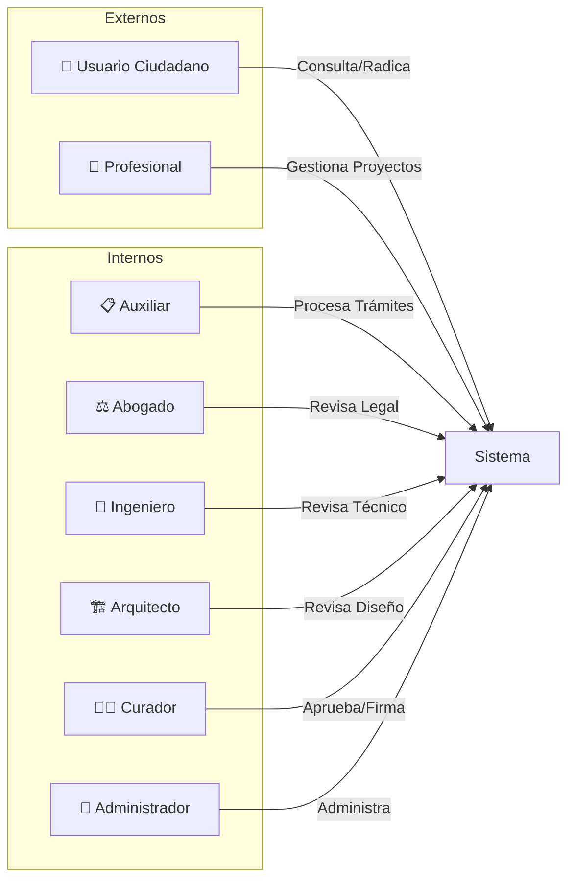
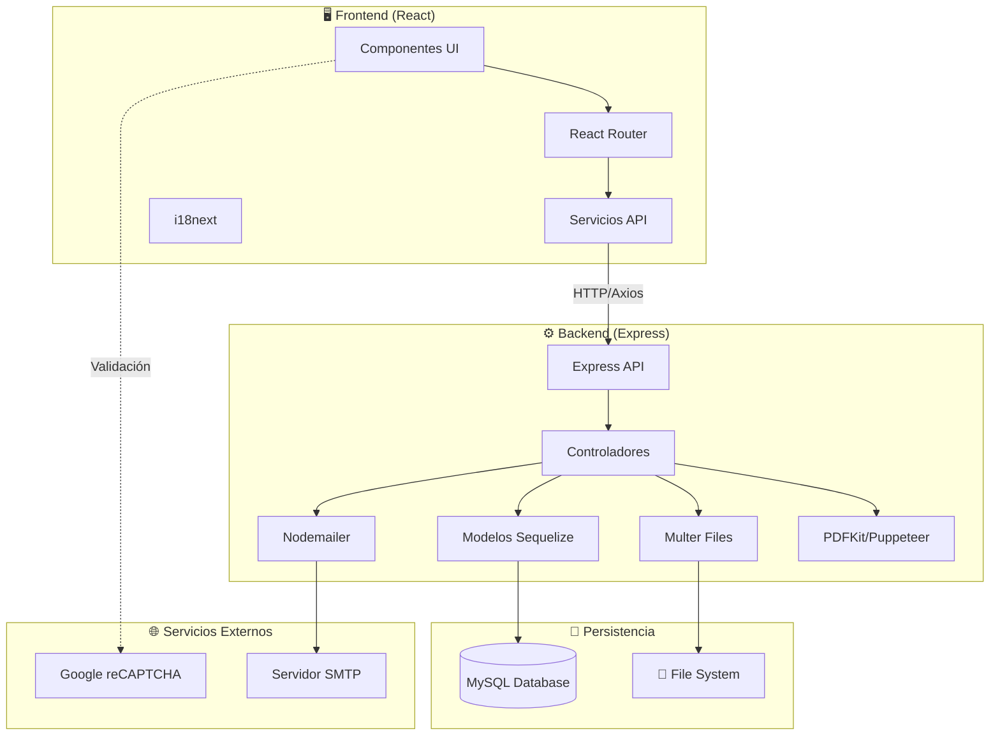

# 1. Visión General

Esta guía de desarrollo documenta la arquitectura, patrones y convenciones del sistema **DOVELA** - una aplicación web para la gestión de procesos de Curaduría Urbana.

---

## 1.1 Objetivo de la Aplicación

**DOVELA** es un sistema integral de gestión para Curadurías Urbanas que permite:

- **Radicación de trámites** (FUN, PQRS, Nomenclaturas, Submit)
- **Gestión de expedientes** y archivos documentales
- **Seguimiento de procesos** legales y administrativos
- **Generación de resoluciones** y actos administrativos
- **Citas y agendamientos** con usuarios
- **Gestión de profesionales** registrados
- **Consulta de normatividad** urbana
- **Cálculo de tarifas** y liquidaciones

El sistema está diseñado para estandarizar los procesos legales y administrativos de la curaduría, manteniendo las relaciones entre entidades siempre conectadas y sincronizadas.

---

## 1.2 Tipos de Usuarios

### Roles del Sistema

| Rol | Descripción | Permisos Principales |
|-----|-------------|---------------------|
| **Ciudadano** | Usuario externo que radica solicitudes | Consultar, Radicar, Ver estado |
| **Profesional** | Arquitecto/Ingeniero registrado | Gestionar proyectos, Firmar planos |
| **Auxiliar** | Personal de ventanilla | Recibir documentos, Gestionar citas |
| **Abogado** | Revisor jurídico | Revisar legalidad, Generar conceptos |
| **Ingeniero** | Revisor técnico | Revisar estructuras, Cálculos |
| **Arquitecto** | Revisor de diseño | Revisar planos, Cumplimiento norma |
| **Curador** | Autoridad firmante | Aprobar, Firmar resoluciones |
| **Admin** | Administrador del sistema | Configurar, Gestionar usuarios |

---

## 1.3 Tecnologías Principales

### Frontend
| Tecnología | Versión | Propósito |
|------------|---------|-----------|
| **React** | 16.9.0 | Framework UI |
| **React Router** | 5.2.0 | Navegación SPA |
| **Axios** | 0.21.4 | Cliente HTTP |
| **i18next** | 21.6.14 | Internacionalización |
| **Bootstrap** | 5.3.7 | Framework CSS |
| **RSuite** | 5.15.0 | Componentes UI |
| **SweetAlert2** | 11.4.8 | Alertas y modales |
| **styled-components** | 5.3.5 | CSS-in-JS |

### Backend
| Tecnología | Versión | Propósito |
|------------|---------|-----------|
| **Express** | 4.21.2 | Framework servidor |
| **Sequelize** | 6.6.2 | ORM para MySQL |
| **MySQL2** | 3.14.1 | Driver base de datos |
| **Multer** | 2.0.1 | Manejo de archivos |
| **Nodemailer** | 7.0.3 | Envío de emails |
| **PDFKit** | 0.11.0 | Generación PDF |
| **Puppeteer** | 5.5.0 | Renderizado HTML→PDF |

---

## 1.4 Diagrama de Arquitectura

### Flujo General de Comunicación

1. **Usuario** interactúa con componentes React
2. **React Router** gestiona la navegación SPA
3. **Servicios** envían peticiones HTTP vía Axios
4. **Express API** recibe y enruta las peticiones
5. **Controladores** procesan la lógica de negocio
6. **Modelos Sequelize** interactúan con MySQL
7. **Respuesta** viaja de vuelta al cliente

> ⚠️ **Importante**: Todo el código representa el modelado de un proceso de la curaduría con relaciones legales entre entidades. Es crucial mantener las funcionalidades y relaciones conectadas sin modificar a menos que se solicite explícitamente.
