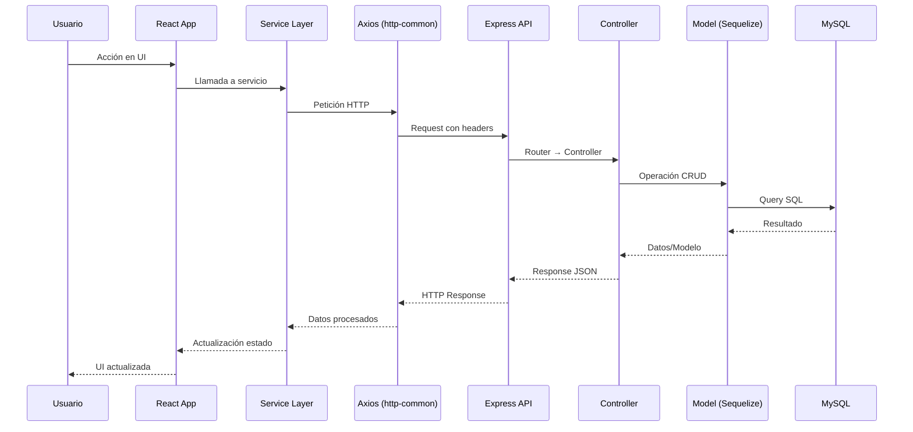
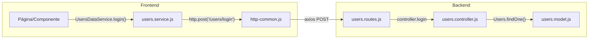
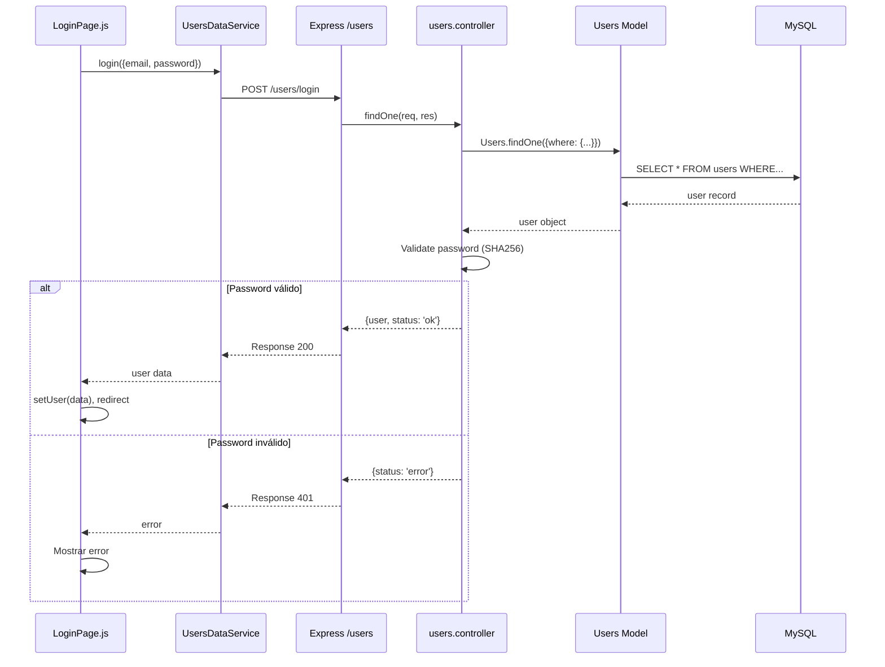
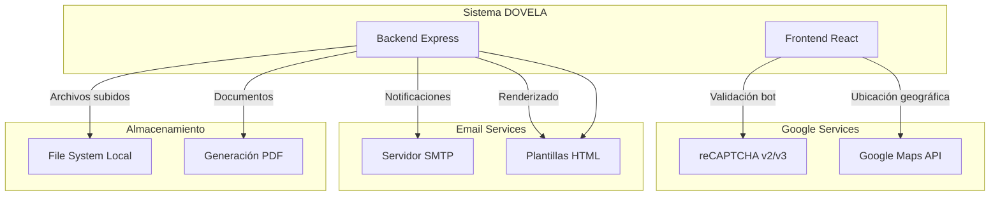
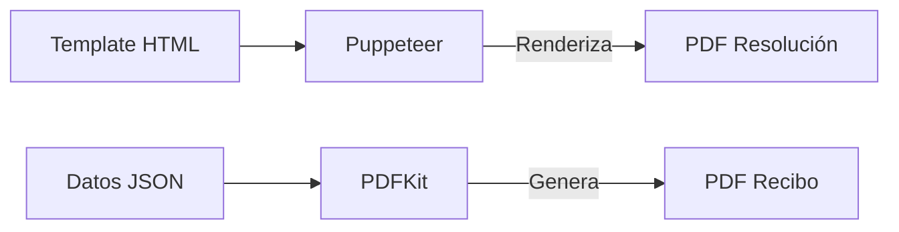

# 2. Arquitectura del Sistema

Esta sección detalla la arquitectura técnica del sistema DOVELA, los patrones de comunicación y la integración con servicios externos.

---

## 2.1 Comunicación Frontend-Backend

El sistema utiliza una arquitectura **cliente-servidor** con comunicación vía **REST API**.



### Configuración del Cliente HTTP

El archivo `src/http-common.js` centraliza la configuración de Axios:

```javascript
// Configuración base
import axios from "axios";

export default axios.create({
  baseURL: process.env.REACT_APP_API_URL,
  headers: {
    "Content-type": "application/json"
  }
});
```

**Variables de entorno clave:**
- `REACT_APP_API_URL`: URL base del backend (ej: `http://localhost:3001`)

---

## 2.2 Flujo de Datos

### Patrón de Servicios

Cada módulo del sistema tiene su propio archivo de servicio que encapsula las llamadas API:



### Ejemplo de Flujo: Login de Usuario



---

## 2.3 Servicios Externos

El sistema integra varios servicios externos para funcionalidades específicas:



### Google reCAPTCHA

Usado en formularios públicos para prevenir spam:
- **Login** de usuarios
- **Radicación** de PQRS
- **Registro** de profesionales

### Servidor de Email (Nodemailer)

Configuración en `app/mailer/`:
- Notificaciones de estado de trámites
- Recordatorios de citas
- Envío de documentos

### Sistema de Archivos

Multer gestiona uploads con destinos dinámicos:

```javascript
// Prefijos de archivos y sus destinos
pqrs_      → ./uploads/pqrs/
fun6_      → ./uploads/fun/
submit_    → ./uploads/submit/
norm_      → ./uploads/norms/
nomenclature_ → ./uploads/nomenclature/
```

### Generación de PDFs

Dos enfoques según el tipo de documento:

| Librería | Uso | Ejemplo |
|----------|-----|---------|
| **PDFKit** | Documentos simples, recibos | Constancias, comprobantes |
| **Puppeteer** | Documentos complejos desde HTML | Resoluciones, actas |


