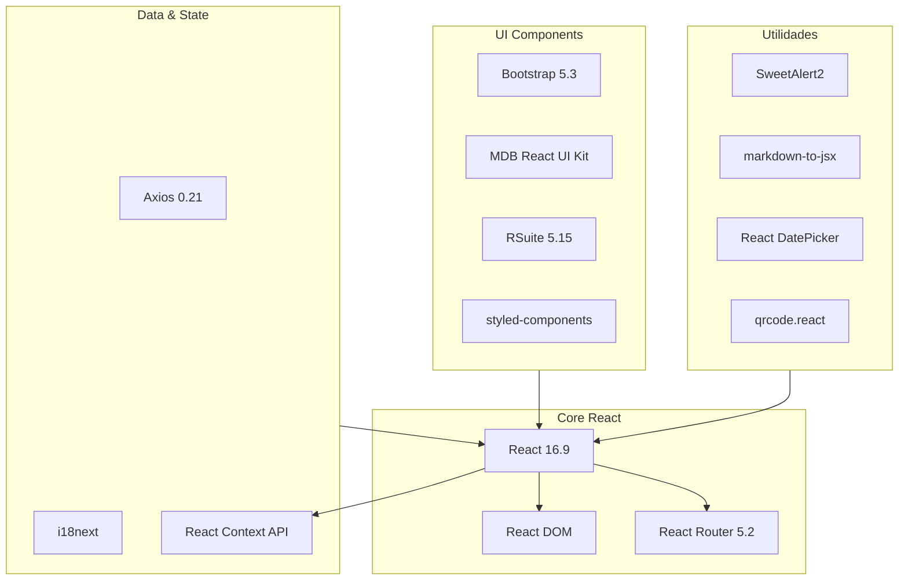
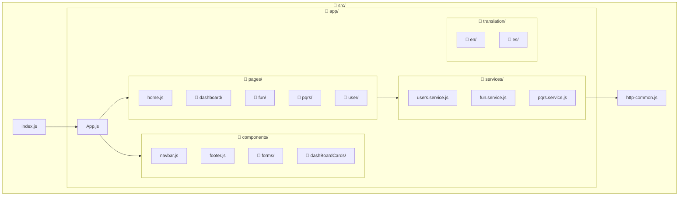
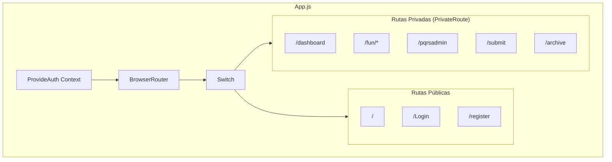
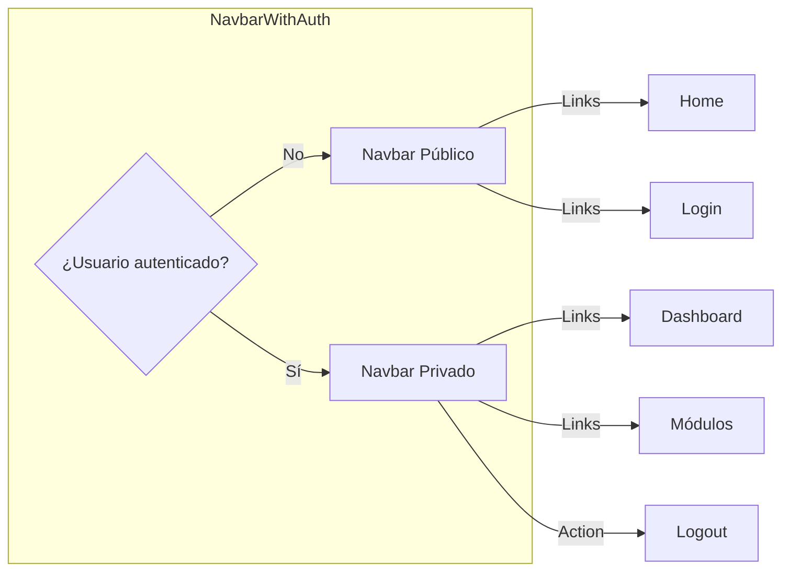
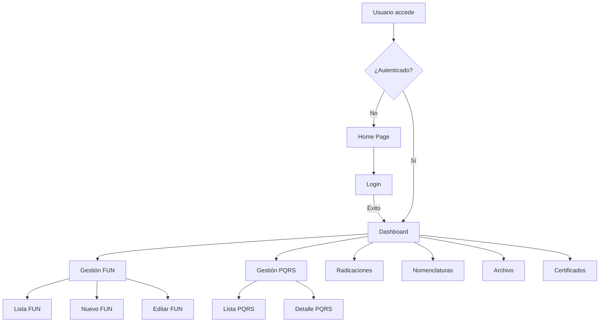
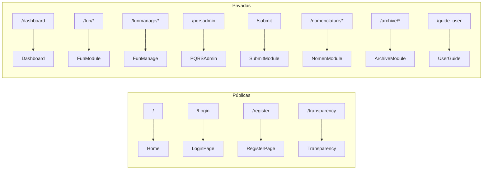
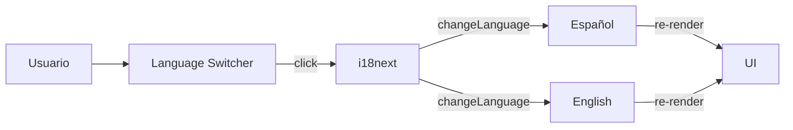

# 3. Frontend (React)

Documentación completa del frontend React, su estructura, componentes principales y patrones de desarrollo.

---

## 3.1 Stack y Librerías

### Dependencias Principales



### Tabla de Librerías

| Librería | Versión | Uso Principal |
|----------|---------|---------------|
| `react` | 16.9.0 | Core del framework |
| `react-router-dom` | 5.2.0 | Navegación y rutas |
| `axios` | 0.21.4 | Cliente HTTP |
| `i18next` | 21.6.14 | Traducciones ES/EN |
| `bootstrap` | 5.3.7 | Grid y utilidades CSS |
| `mdb-react-ui-kit` | 3.0.0 | Componentes Material Design |
| `rsuite` | 5.15.0 | Componentes complejos (tablas, forms) |
| `styled-components` | 5.3.5 | CSS-in-JS para componentes |
| `sweetalert2` | 11.4.8 | Alertas y confirmaciones |
| `markdown-to-jsx` | 7.1.7 | Renderizado de Markdown |
| `react-datepicker` | 4.7.0 | Selector de fechas |
| `qrcode.react` | 1.0.1 | Generación de códigos QR |

---

## 3.2 Estructura de Directorios

```
src/
├── index.js              # Entry point
├── index.css             # Estilos globales
├── http-common.js        # Configuración Axios
├── reportWebVitals.js    # Métricas
│
├── app/
│   ├── App.js            # Router principal + Auth
│   ├── App.css           # Estilos del App
│   │
│   ├── components/       # Componentes reutilizables
│   │   ├── navbar.js
│   │   ├── footer.js
│   │   ├── button.component.jsx
│   │   ├── forms/        # Formularios comunes
│   │   ├── dashBoardCards/   # Tarjetas dashboard
│   │   └── customClasses/    # Clases CSS custom
│   │
│   ├── pages/            # Páginas por módulo
│   │   ├── home.js
│   │   ├── dashboard/
│   │   ├── fun/
│   │   ├── pqrs/
│   │   ├── submit/
│   │   ├── nomenclature/
│   │   ├── user/
│   │   └── ...
│   │
│   ├── services/         # Servicios API
│   │   ├── users.service.js
│   │   ├── fun.service.js
│   │   ├── pqrs.service.js
│   │   └── ...
│   │
│   ├── translation/      # Archivos i18n
│   │   ├── en/
│   │   └── es/
│   │
│   ├── utils/            # Utilidades
│   │   └── PrivateRoute.js
│   │
│   └── img/              # Imágenes estáticas
│
└── styles/               # Estilos adicionales
    └── docs-expediente.css
```

### Diagrama Visual de Estructura



---

## 3.3 Componentes Principales

### App.js - Router Principal

El archivo `App.js` es el corazón del frontend:



### Sistema de Autenticación

```javascript
// Contexto de autenticación
const authContext = createContext();

function useProvideAuth() {
    const [user, setUser] = useState(null);
    // Métodos: login, logout, getUser
    return { user, setUser };
}

// PrivateRoute - Protege rutas
function PrivateRoute({ children, ...rest }) {
    let auth = useAuth();
    return (
        <Route {...rest}
            render={({ location }) =>
                auth.user ? (children) : (
                    <Redirect to={{ pathname: "/Login" }} />
                )
            }
        />
    );
}
```

### Navbar y Footer

Componentes globales que se renderizan según el estado de autenticación:



---

## 3.4 Servicios (API Clients)

Cada módulo tiene su servicio dedicado en `src/app/services/`:

### Patrón de Servicio

```javascript
// Ejemplo: users.service.js
import http from "../../http-common";

class UsersDataService {
    login(data) {
        return http.post("/users/login", data);
    }
    
    getAll() {
        return http.get("/users");
    }
    
    get(id) {
        return http.get(`/users/${id}`);
    }
    
    create(data) {
        return http.post("/users", data);
    }
    
    update(id, data) {
        return http.put(`/users/${id}`, data);
    }
    
    delete(id) {
        return http.delete(`/users/${id}`);
    }
}

export default new UsersDataService();
```

### Lista de Servicios Disponibles

| Archivo | Módulo | Endpoints Base |
|---------|--------|----------------|
| `users.service.js` | Usuarios | `/users` |
| `fun.service.js` | FUN | `/fun` |
| `pqrs.service.js` | PQRS | `/pqrs` |
| `appointments.service.js` | Citas | `/appointments` |
| `nomenclature.service.js` | Nomenclaturas | `/nomenclature` |
| `submit.service.js` | Radicaciones | `/submit` |
| `profesionals.service.js` | Profesionales | `/profesionals` |
| `norms.service.js` | Normatividad | `/norms` |
| `record.service.js` | Expedientes | `/record` |
| `archive.service.js` | Archivo | `/archive` |

---

## 3.5 Flujos de Navegación

### Flujo Principal



### Rutas Definidas



---

## 3.6 Sistema de Traducciones

El sistema usa **i18next** para internacionalización ES/EN.

### Estructura de Archivos

```
translation/
├── en/
│   ├── translation.json    # Traducciones inglés
│   └── ...
└── es/
    ├── translation.json    # Traducciones español
    └── ...
```

### Uso en Componentes

```javascript
import { useTranslation } from 'react-i18next';

function MyComponent() {
    const { t } = useTranslation();
    
    return (
        <h1>{t('welcome_message')}</h1>
    );
}
```

### Cambio de Idioma

El componente `languageSwitcher.js` permite cambiar entre idiomas:

```javascript
import i18n from 'i18next';

// Cambiar a español
i18n.changeLanguage('es');

// Cambiar a inglés
i18n.changeLanguage('en');
```


