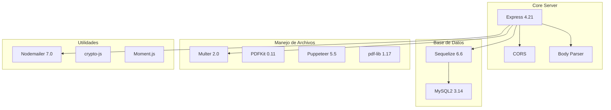
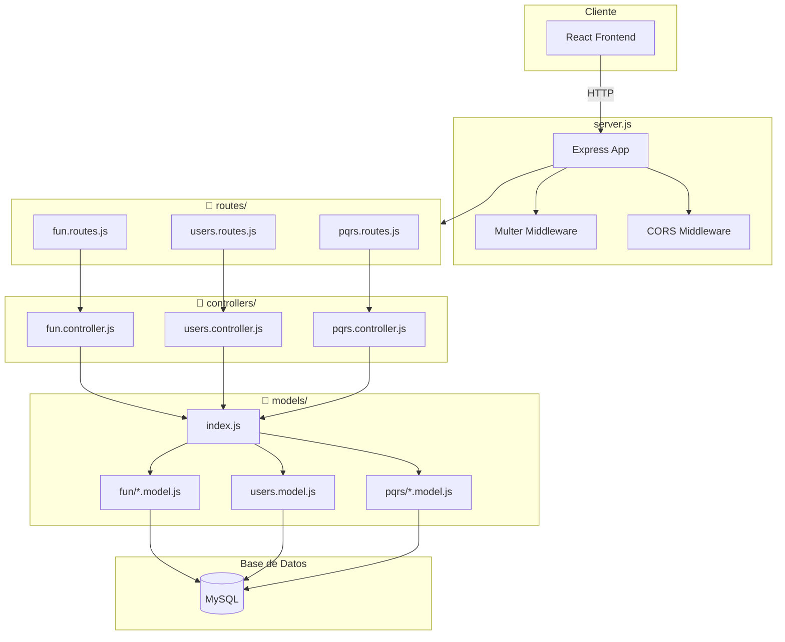
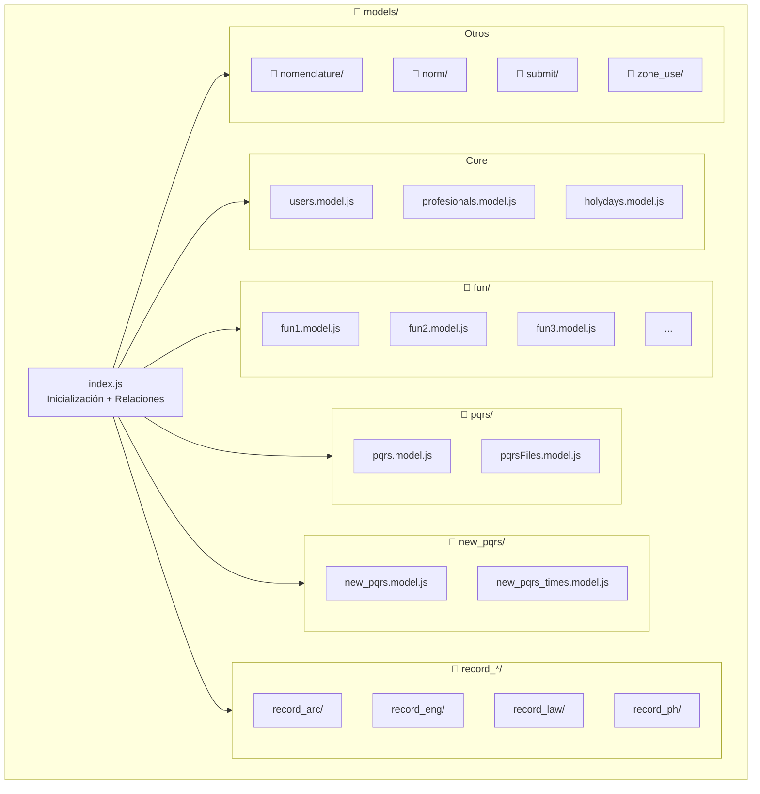
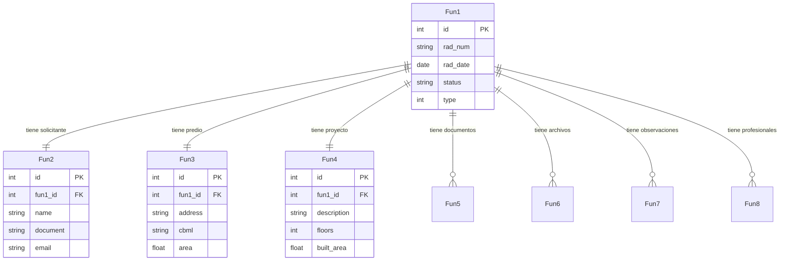
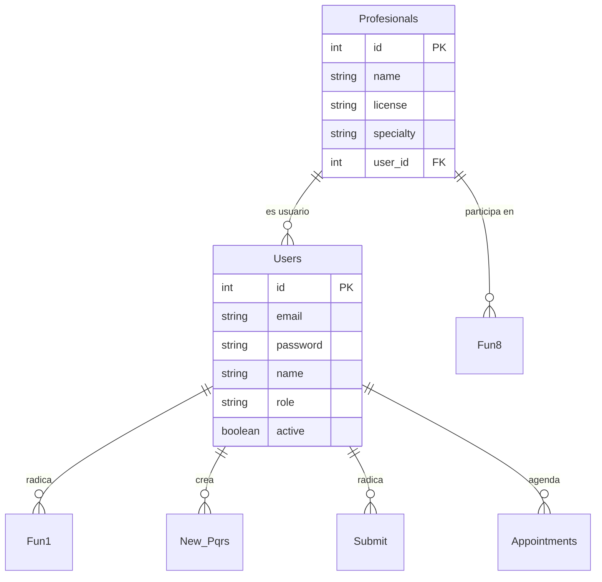
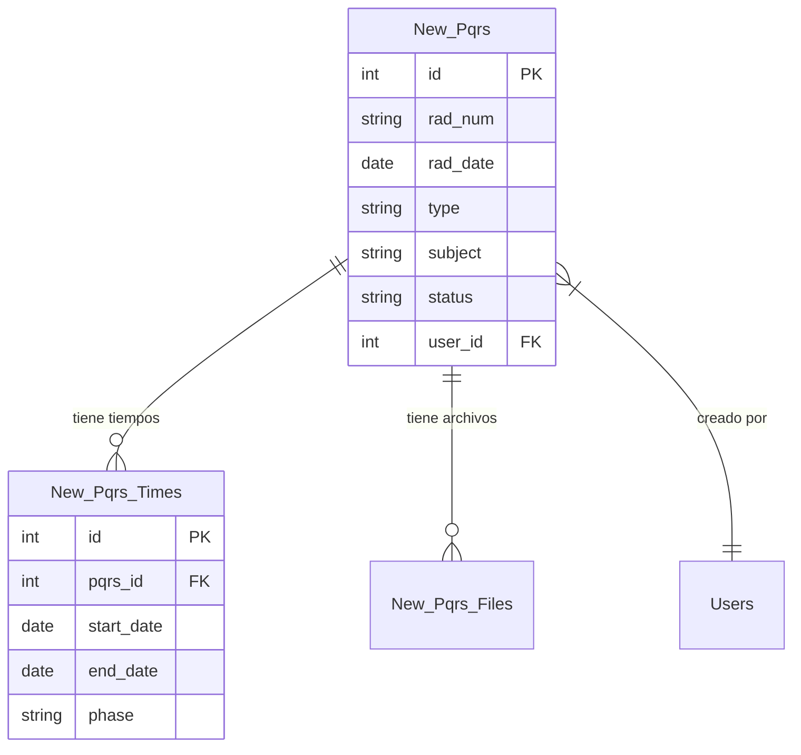
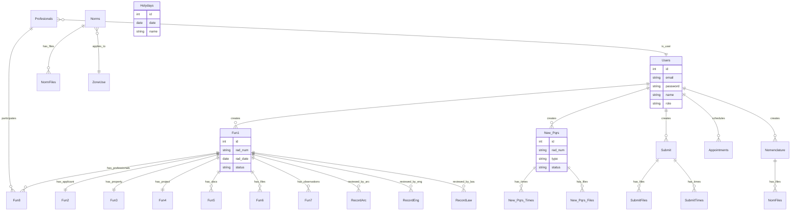
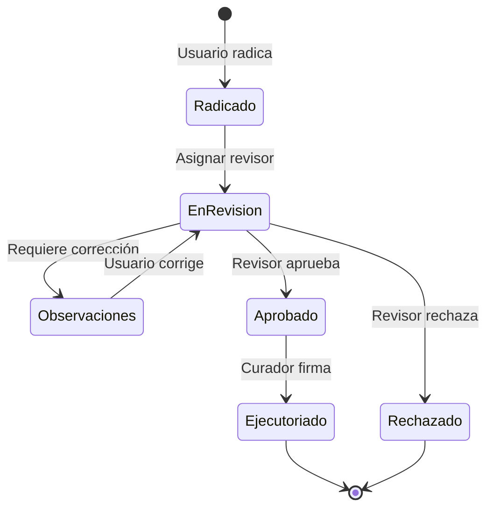
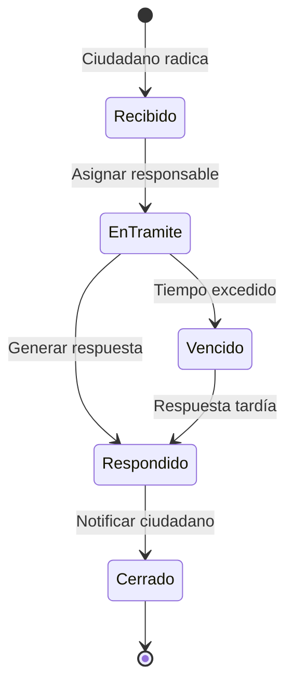

# 4. Backend (Express + Sequelize)

Documentación del servidor backend, su arquitectura MVC, modelos de datos y relaciones entre entidades.

---

## 4.1 Stack del Backend

### Dependencias Principales



### Tabla de Dependencias

| Paquete | Versión | Propósito |
|---------|---------|-----------|
| `express` | 4.21.2 | Framework web |
| `sequelize` | 6.6.2 | ORM para MySQL |
| `mysql2` | 3.14.1 | Driver MySQL |
| `multer` | 2.0.1 | Upload de archivos |
| `nodemailer` | 7.0.3 | Envío de emails |
| `pdfkit` | 0.11.0 | Generación de PDFs |
| `puppeteer-core` | 5.5.0 | HTML a PDF |
| `pdf-lib` | 1.17.1 | Manipulación PDFs |
| `crypto-js` | 4.0.0 | Encriptación |
| `cors` | 2.8.5 | Cross-Origin |

---

## 4.2 Estructura de Directorios

```
backend/
├── server.js              # Entry point
├── package.json
│
├── app/
│   ├── config/
│   │   └── db.config.js   # Configuración MySQL
│   │
│   ├── controllers/       # Lógica de negocio
│   │   ├── fun.controller.js
│   │   ├── users.controller.js
│   │   ├── pqrs.controller.js
│   │   └── ...
│   │
│   ├── models/            # Modelos Sequelize
│   │   ├── index.js       # Inicialización y relaciones
│   │   ├── users.model.js
│   │   ├── fun/           # Modelos FUN
│   │   ├── pqrs/          # Modelos PQRS
│   │   ├── nomenclature/  # Modelos Nomenclatura
│   │   └── ...
│   │
│   ├── routes/            # Definición de rutas
│   │   ├── fun.routes.js
│   │   ├── users.routes.js
│   │   └── ...
│   │
│   ├── mailer/            # Configuración email
│   │   └── mailer.js
│   │
│   └── templates/         # Plantillas HTML
│       ├── resolution/
│       ├── Executory/
│       └── ActDesist/
│
└── uploads/               # Archivos subidos
    ├── fun/
    ├── pqrs/
    ├── submit/
    ├── norms/
    └── nomenclature/
```

### Diagrama de Arquitectura MVC



---

## 4.3 Modelos y Entidades

El sistema tiene más de **70 modelos** organizados por dominio.

### Organización de Modelos



### Modelos Principales

| Modelo | Tabla | Descripción |
|--------|-------|-------------|
| `Users` | `users` | Usuarios del sistema |
| `Profesionals` | `profesionals` | Profesionales registrados |
| `Fun1` | `fun_1` | FUN - Datos generales |
| `Fun2` | `fun_2` | FUN - Solicitante |
| `Fun3` | `fun_3` | FUN - Predio |
| `Fun4` | `fun_4` | FUN - Proyecto |
| `Fun5` | `fun_5` | FUN - Documentos |
| `Fun6` | `fun_6` | FUN - Archivos |
| `Pqrs` | `pqrs` | PQRS antiguos |
| `New_Pqrs` | `new_pqrs` | PQRS nuevo sistema |
| `Submit` | `submits` | Radicaciones |
| `Nomenclature` | `nomenclatures` | Nomenclaturas |
| `Norms` | `norms` | Normatividad |

---

## 4.4 Relaciones entre Entidades

### Relaciones del FUN

El Formulario Único Nacional (FUN) es la entidad central:



### Relaciones de Usuarios



### Relaciones de PQRS



---

## 4.5 Diagrama ER

### Diagrama General del Sistema



### Flujo de Estados FUN



### Flujo de Estados PQRS


