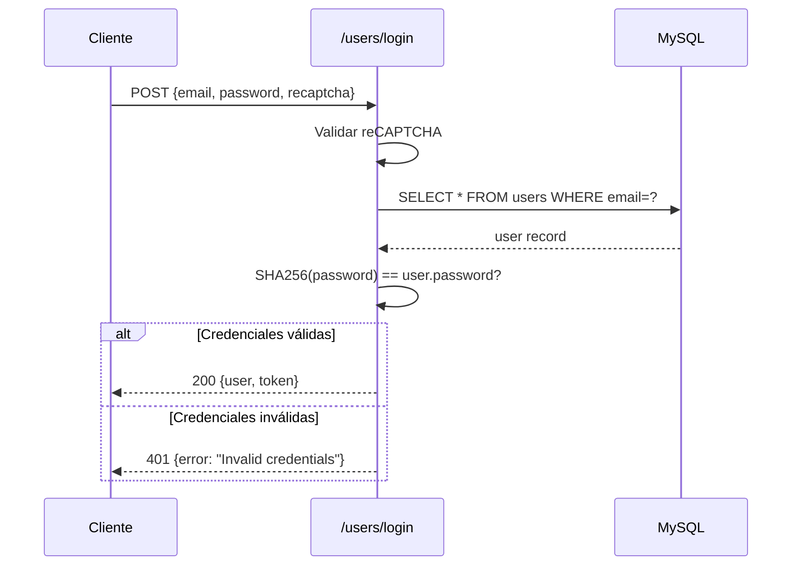
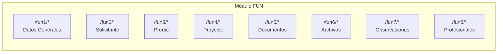
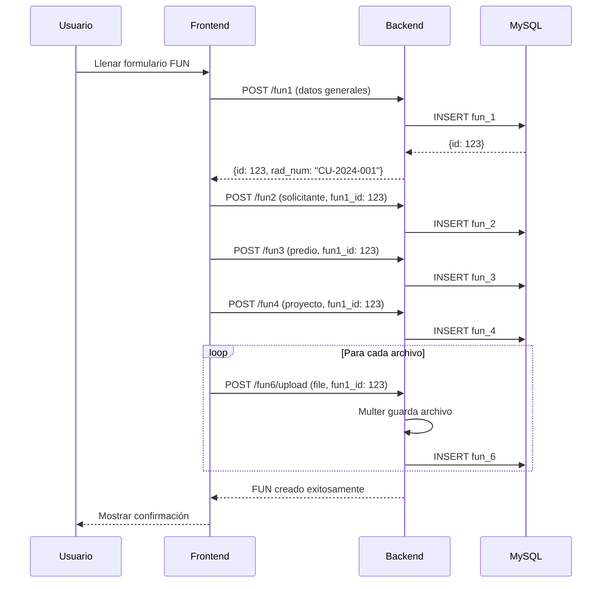
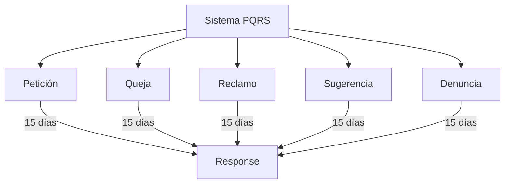
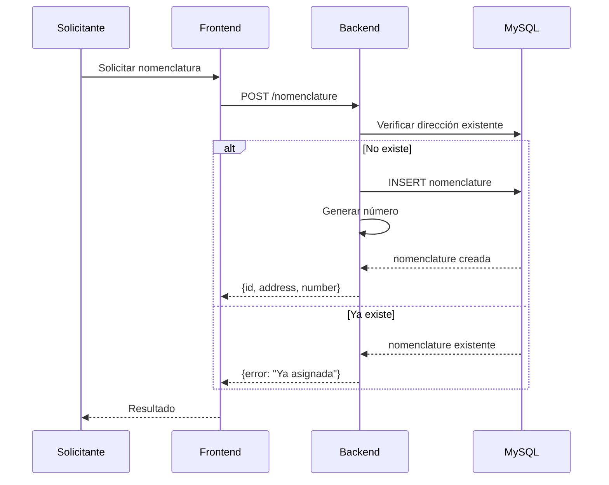
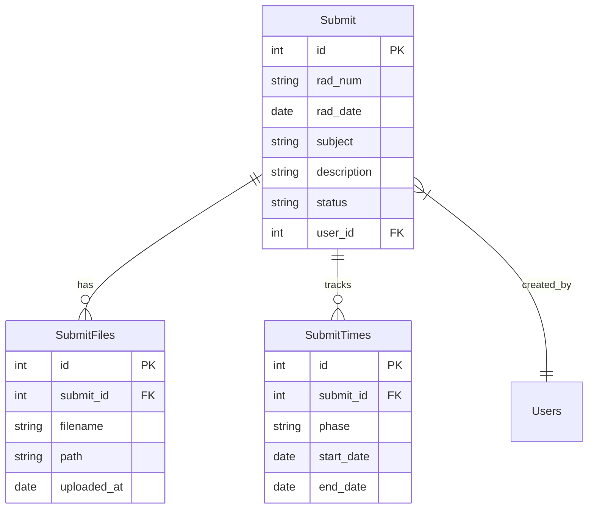
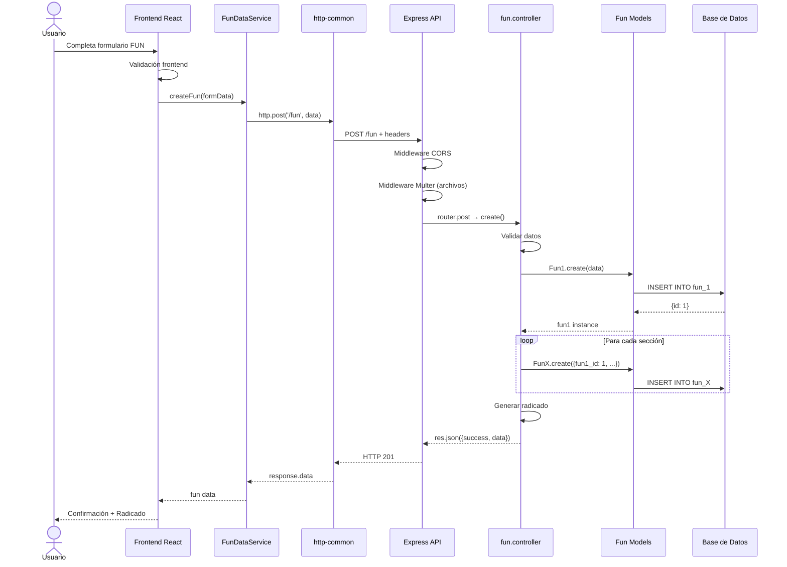
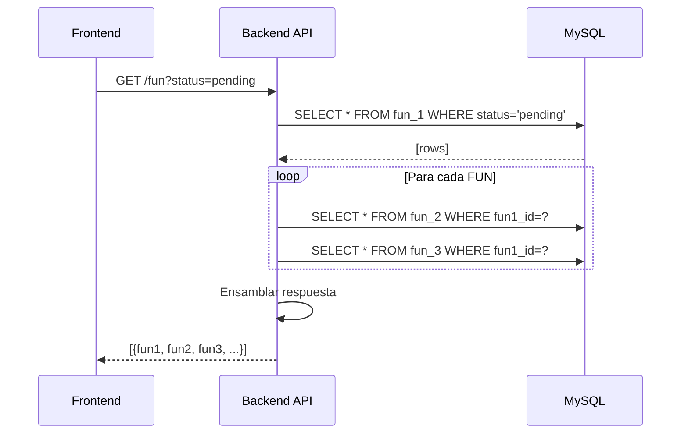
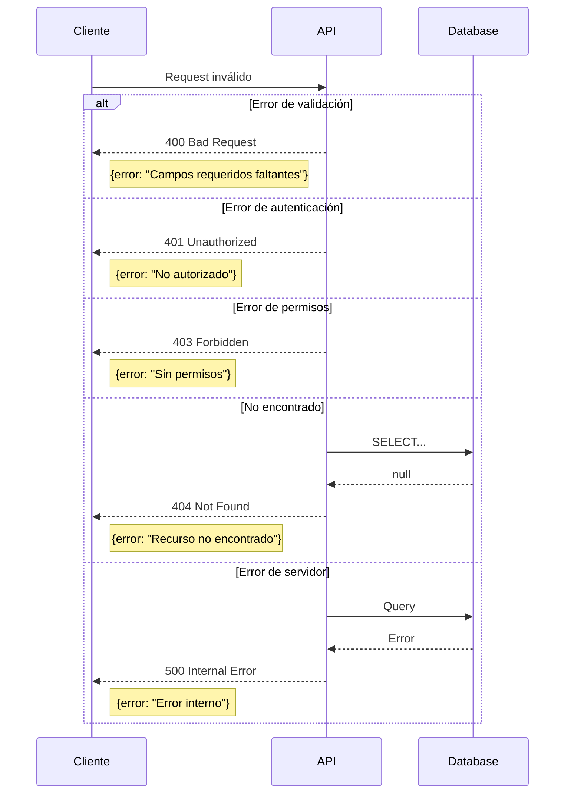

# 5. APIs y Endpoints

Documentación de los endpoints REST disponibles en el backend, organizados por módulo.

---

## 5.1 Usuarios y Autenticación

### Endpoints de Usuarios

| Método | Endpoint | Descripción | Auth |
|--------|----------|-------------|------|
| `POST` | `/users/login` | Iniciar sesión | ❌ |
| `POST` | `/users` | Crear usuario | ❌ |
| `GET` | `/users` | Listar usuarios | ✅ |
| `GET` | `/users/:id` | Obtener usuario | ✅ |
| `PUT` | `/users/:id` | Actualizar usuario | ✅ |
| `DELETE` | `/users/:id` | Eliminar usuario | ✅ |
| `GET` | `/users/email/:email` | Buscar por email | ✅ |

### Flujo de Autenticación



### Ejemplo: Login

**Request:**
```json
POST /users/login
{
    "email": "usuario@ejemplo.com",
    "password": "contraseña123",
    "recaptcha": "token_recaptcha"
}
```

**Response (éxito):**
```json
{
    "id": 1,
    "email": "usuario@ejemplo.com",
    "name": "Usuario Ejemplo",
    "role": "auxiliar",
    "active": true
}
```

---

## 5.2 FUN (Formulario Único Nacional)

### Endpoints Principales

| Método | Endpoint | Descripción |
|--------|----------|-------------|
| `GET` | `/fun` | Listar todos los FUN |
| `GET` | `/fun/:id` | Obtener FUN por ID |
| `POST` | `/fun` | Crear nuevo FUN |
| `PUT` | `/fun/:id` | Actualizar FUN |
| `DELETE` | `/fun/:id` | Eliminar FUN |
| `GET` | `/fun/rad/:rad_num` | Buscar por radicado |
| `GET` | `/fun/status/:status` | Filtrar por estado |

### Endpoints por Sección



| Módulo | Endpoint Base | Operaciones |
|--------|---------------|-------------|
| Fun1 | `/fun1` | CRUD datos generales |
| Fun2 | `/fun2` | CRUD solicitante |
| Fun3 | `/fun3` | CRUD predio |
| Fun4 | `/fun4` | CRUD proyecto |
| Fun5 | `/fun5` | CRUD documentos |
| Fun6 | `/fun6` | Upload/Download archivos |
| Fun7 | `/fun7` | CRUD observaciones |
| Fun8 | `/fun8` | CRUD profesionales |

### Flujo de Creación FUN



---

## 5.3 PQRS

### Endpoints PQRS

| Método | Endpoint | Descripción |
|--------|----------|-------------|
| `GET` | `/pqrs` | Listar PQRS |
| `GET` | `/pqrs/:id` | Obtener PQRS |
| `POST` | `/pqrs` | Crear PQRS |
| `PUT` | `/pqrs/:id` | Actualizar PQRS |
| `GET` | `/pqrs/rad/:rad_num` | Buscar por radicado |
| `GET` | `/pqrs/status/:status` | Filtrar por estado |

### Endpoints New PQRS

| Método | Endpoint | Descripción |
|--------|----------|-------------|
| `GET` | `/new_pqrs` | Listar nuevos PQRS |
| `POST` | `/new_pqrs` | Crear nuevo PQRS |
| `GET` | `/new_pqrs/:id` | Obtener PQRS |
| `PUT` | `/new_pqrs/:id` | Actualizar PQRS |
| `GET` | `/new_pqrs/times/:id` | Obtener tiempos |
| `POST` | `/new_pqrs/times` | Registrar tiempo |

### Tipos de PQRS



---

## 5.4 Nomenclaturas

### Endpoints Nomenclatura

| Método | Endpoint | Descripción |
|--------|----------|-------------|
| `GET` | `/nomenclature` | Listar nomenclaturas |
| `POST` | `/nomenclature` | Crear nomenclatura |
| `GET` | `/nomenclature/:id` | Obtener por ID |
| `PUT` | `/nomenclature/:id` | Actualizar |
| `DELETE` | `/nomenclature/:id` | Eliminar |
| `GET` | `/nomenclature/address/:address` | Buscar por dirección |

### Flujo de Asignación



---

## 5.5 Submit (Radicaciones)

### Endpoints Submit

| Método | Endpoint | Descripción |
|--------|----------|-------------|
| `GET` | `/submit` | Listar radicaciones |
| `POST` | `/submit` | Crear radicación |
| `GET` | `/submit/:id` | Obtener radicación |
| `PUT` | `/submit/:id` | Actualizar |
| `GET` | `/submit/rad/:rad_num` | Buscar por radicado |
| `POST` | `/submit/files` | Subir archivos |
| `GET` | `/submit/files/:id` | Descargar archivo |

### Estructura de Radicación



---

## 5.6 Diagrama de Secuencia API

### Flujo Completo: Radicación de FUN



### Flujo de Consulta



### Manejo de Errores


