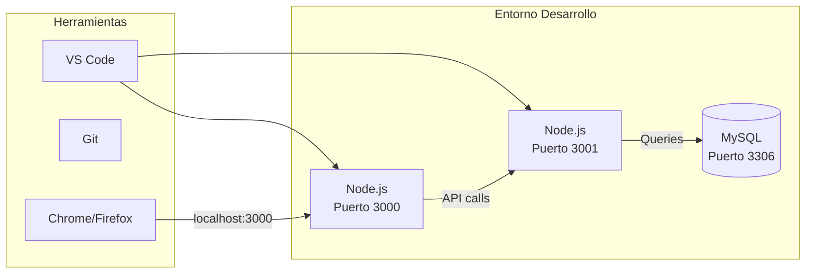
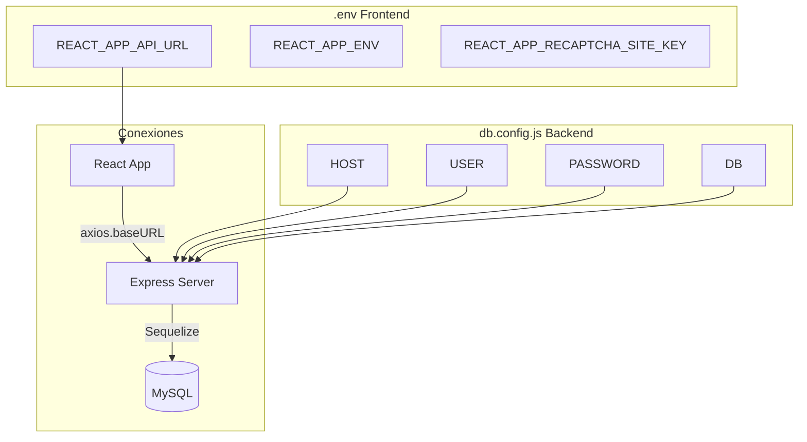
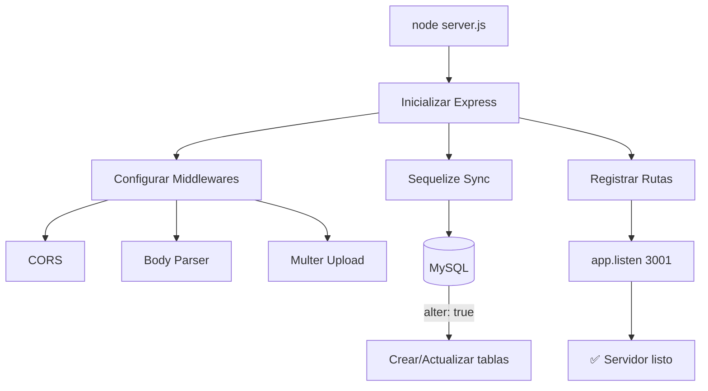
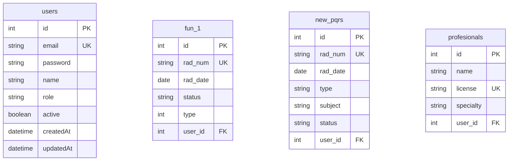
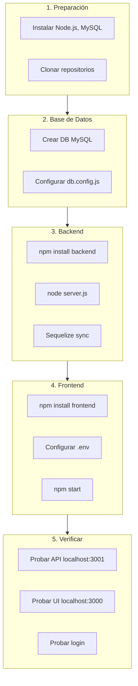

# 6. Configuración y Entorno

Guía para configurar el entorno de desarrollo, variables de entorno y puesta en marcha del sistema.

---

## 6.1 Requisitos del Sistema

### Software Requerido

| Software | Versión Mínima | Propósito |
|----------|----------------|-----------|
| **Node.js** | 14.x | Runtime JavaScript |
| **npm** | 6.x | Gestor de paquetes |
| **MySQL** | 5.7 / 8.0 | Base de datos |
| **Git** | 2.x | Control de versiones |

### Requisitos de Hardware (Desarrollo)

| Recurso | Mínimo | Recomendado |
|---------|--------|-------------|
| RAM | 4 GB | 8 GB |
| CPU | 2 cores | 4 cores |
| Disco | 10 GB | 20 GB |

### Diagrama de Entorno



---

## 6.2 Variables de Entorno

### Frontend (.env)

Crear archivo `.env` en la raíz del proyecto frontend:

```bash
# API Backend URL
REACT_APP_API_URL=http://localhost:3001

# Entorno
REACT_APP_ENV=development

# Google reCAPTCHA (opcional en desarrollo)
REACT_APP_RECAPTCHA_SITE_KEY=tu_clave_publica

# Otras configuraciones
REACT_APP_VERSION=1.0.0
```

### Backend (Configuración directa)

El backend usa configuración en `app/config/db.config.js`:

```javascript
module.exports = {
    HOST: "localhost",
    USER: "root",
    PASSWORD: "tu_password",
    DB: "dovela_db",
    dialect: "mysql",
    pool: {
        max: 5,
        min: 0,
        acquire: 30000,
        idle: 10000
    }
};
```

### Variables de Entorno - Diagrama



---

## 6.3 Levantar el Frontend

### Instalación

```bash
# 1. Navegar al directorio frontend
cd /home/dg21/dovela/frontend

# 2. Instalar dependencias
npm install

# 3. Configurar variables de entorno
cp .env.example .env
# Editar .env con tus valores
```

### Comandos de Desarrollo

```bash
# Iniciar servidor de desarrollo
npm start
# Abre http://localhost:3000

# Construir para producción
npm run build

# Ejecutar tests
npm test
```

### Estructura de Scripts (package.json)

```json
{
  "scripts": {
    "start": "react-scripts start",
    "build": "react-scripts build",
    "test": "react-scripts test",
    "eject": "react-scripts eject"
  }
}
```

### Flujo de Inicio

```mermaid
flowchart TB
    Start[npm start] --> CRA[react-scripts start]
    CRA --> Webpack[Webpack Dev Server]
    Webpack --> HMR[Hot Module Replacement]
    HMR --> Browser[Abre localhost:3000]
    
    Build[npm run build] --> CRABuild[react-scripts build]
    CRABuild --> Optimize[Optimización]
    Optimize --> Static[/build folder]
```

---

## 6.4 Levantar el Backend

### Instalación

```bash
# 1. Navegar al directorio backend
cd /projects/dovela-backend

# 2. Instalar dependencias
npm install

# 3. Configurar base de datos
# Editar app/config/db.config.js con tus credenciales
```

### Comandos de Desarrollo

```bash
# Iniciar servidor
node server.js
# O con nodemon para recarga automática
npx nodemon server.js

# El servidor inicia en http://localhost:3001
```

### Configuración del Servidor (server.js)

```javascript
const express = require("express");
const cors = require("cors");
const multer = require("multer");

const app = express();

// Middlewares
app.use(cors());
app.use(express.json());
app.use(express.urlencoded({ extended: true }));

// Configuración Multer para uploads
const storage = multer.diskStorage({
    destination: (req, file, cb) => {
        // Lógica de destino basada en prefijo
        if (file.originalname.startsWith("pqrs_")) {
            cb(null, "./uploads/pqrs/");
        } else if (file.originalname.startsWith("fun6_")) {
            cb(null, "./uploads/fun/");
        }
        // ... más destinos
    },
    filename: (req, file, cb) => {
        cb(null, file.originalname);
    }
});

// Sincronizar base de datos
db.sequelize.sync({ alter: true });

// Puerto
const PORT = process.env.PORT || 3001;
app.listen(PORT, () => {
    console.log(`Server running on port ${PORT}`);
});
```

### Flujo de Inicio Backend



---

## 6.5 Base de Datos

### Crear Base de Datos

```sql
-- Conectar a MySQL
mysql -u root -p

-- Crear base de datos
CREATE DATABASE dovela_db CHARACTER SET utf8mb4 COLLATE utf8mb4_unicode_ci;

-- Crear usuario (opcional)
CREATE USER 'dovela_user'@'localhost' IDENTIFIED BY 'password_seguro';
GRANT ALL PRIVILEGES ON dovela_db.* TO 'dovela_user'@'localhost';
FLUSH PRIVILEGES;
```

### Sincronización Automática

Sequelize sincroniza automáticamente las tablas al iniciar:

```javascript
// En server.js
db.sequelize.sync({ alter: true }).then(() => {
    console.log("Database synced");
});
```

**Opciones de sync:**
- `{ force: true }`: Elimina y recrea tablas (⚠️ pérdida de datos)
- `{ alter: true }`: Modifica tablas existentes (recomendado desarrollo)
- `{}`: Solo crea tablas nuevas

### Diagrama de Tablas Principales



### Backup y Restauración

```bash
# Backup
mysqldump -u root -p dovela_db > backup_$(date +%Y%m%d).sql

# Restaurar
mysql -u root -p dovela_db < backup_20240101.sql
```

### Flujo Completo de Setup


