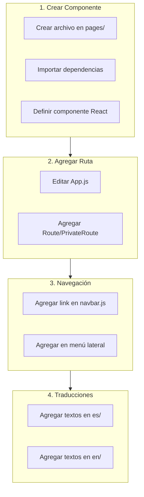
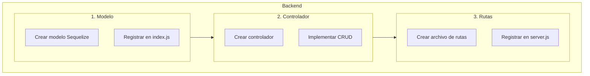
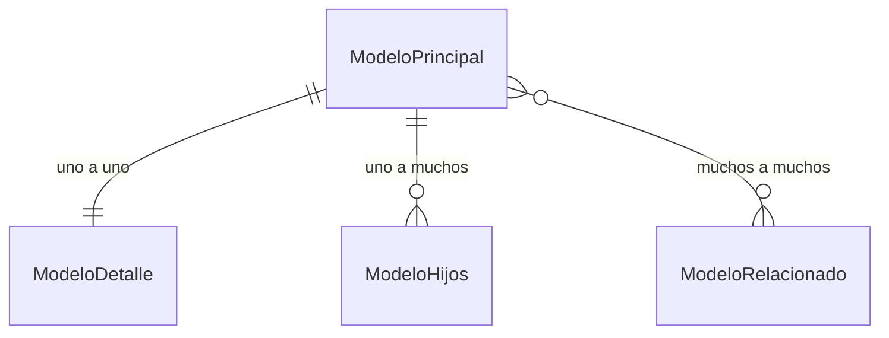
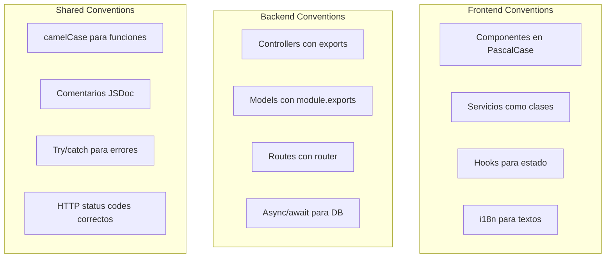

# 7. Extensibilidad y Convenciones

Guía para extender el sistema con nuevas funcionalidades siguiendo los patrones establecidos.

---

## 7.1 Añadir Nuevas Páginas

### Flujo para Crear una Nueva Página



### Ejemplo: Crear Página de Reportes

**1. Crear el componente** (`src/app/pages/reports/reports.page.js`):

```jsx
import React, { useState, useEffect } from 'react';
import { useTranslation } from 'react-i18next';
import { MDBContainer, MDBCard, MDBCardBody } from 'mdb-react-ui-kit';

// Importar servicio
import ReportsDataService from '../../services/reports.service';

const ReportsPage = () => {
    const { t } = useTranslation();
    const [reports, setReports] = useState([]);
    const [loading, setLoading] = useState(true);

    useEffect(() => {
        loadReports();
    }, []);

    const loadReports = async () => {
        try {
            const response = await ReportsDataService.getAll();
            setReports(response.data);
        } catch (error) {
            console.error('Error loading reports:', error);
        } finally {
            setLoading(false);
        }
    };

    return (
        <MDBContainer className="py-4">
            <h1>{t('reports.title')}</h1>
            <MDBCard>
                <MDBCardBody>
                    {loading ? (
                        <p>{t('common.loading')}</p>
                    ) : (
                        // Renderizar reportes
                        <div>...</div>
                    )}
                </MDBCardBody>
            </MDBCard>
        </MDBContainer>
    );
};

export default ReportsPage;
```

**2. Agregar ruta en App.js**:

```jsx
// Importar componente
import ReportsPage from './pages/reports/reports.page';

// En el Switch, agregar:
<PrivateRoute path='/reports'>
    <NavbarWithAuth />
    <ReportsPage />
</PrivateRoute>
```

**3. Agregar al navbar** (`components/navbar.js`):

```jsx
<MDBNavbarLink href='/reports'>
    {t('navbar.reports')}
</MDBNavbarLink>
```

---

## 7.2 Añadir Nuevos Servicios

### Patrón de Servicio

```mermaid
flowchart LR
    subgraph Service["nuevo.service.js"]
        Class[class NuevoDataService]
        Methods[getAll, get, create, update, delete]
    end
    
    subgraph HTTP["http-common.js"]
        Axios[axios instance]
    end
    
    subgraph API["Backend"]
        Endpoint[/nuevo/*]
    end
    
    Class --> Methods
    Methods --> Axios
    Axios --> Endpoint
```

### Plantilla de Servicio

Crear archivo en `src/app/services/nuevo.service.js`:

```javascript
import http from "../../http-common";

class NuevoDataService {
    /**
     * Obtener todos los registros
     * @param {Object} params - Parámetros de consulta (opcional)
     * @returns {Promise} Promesa con la respuesta
     */
    getAll(params = {}) {
        return http.get("/nuevo", { params });
    }

    /**
     * Obtener un registro por ID
     * @param {number} id - ID del registro
     * @returns {Promise} Promesa con la respuesta
     */
    get(id) {
        return http.get(`/nuevo/${id}`);
    }

    /**
     * Crear nuevo registro
     * @param {Object} data - Datos del registro
     * @returns {Promise} Promesa con la respuesta
     */
    create(data) {
        return http.post("/nuevo", data);
    }

    /**
     * Actualizar registro existente
     * @param {number} id - ID del registro
     * @param {Object} data - Datos actualizados
     * @returns {Promise} Promesa con la respuesta
     */
    update(id, data) {
        return http.put(`/nuevo/${id}`, data);
    }

    /**
     * Eliminar registro
     * @param {number} id - ID del registro
     * @returns {Promise} Promesa con la respuesta
     */
    delete(id) {
        return http.delete(`/nuevo/${id}`);
    }

    /**
     * Subir archivo asociado
     * @param {FormData} formData - Datos del formulario con archivo
     * @returns {Promise} Promesa con la respuesta
     */
    upload(formData) {
        return http.post("/nuevo/upload", formData, {
            headers: {
                "Content-Type": "multipart/form-data"
            }
        });
    }

    /**
     * Búsqueda personalizada
     * @param {string} query - Término de búsqueda
     * @returns {Promise} Promesa con la respuesta
     */
    search(query) {
        return http.get(`/nuevo/search?q=${query}`);
    }
}

export default new NuevoDataService();
```

### Uso en Componentes

```javascript
import NuevoDataService from '../../services/nuevo.service';

// En componente
const [data, setData] = useState([]);

useEffect(() => {
    NuevoDataService.getAll()
        .then(response => setData(response.data))
        .catch(error => console.error(error));
}, []);
```

---

## 7.3 Añadir Nuevos Endpoints

### Flujo de Creación



### 1. Crear Modelo

Archivo: `app/models/nuevo.model.js`

```javascript
module.exports = (sequelize, Sequelize) => {
    const Nuevo = sequelize.define("nuevo", {
        id: {
            type: Sequelize.INTEGER,
            primaryKey: true,
            autoIncrement: true
        },
        nombre: {
            type: Sequelize.STRING(100),
            allowNull: false
        },
        descripcion: {
            type: Sequelize.TEXT
        },
        estado: {
            type: Sequelize.ENUM('activo', 'inactivo'),
            defaultValue: 'activo'
        },
        fecha_creacion: {
            type: Sequelize.DATE,
            defaultValue: Sequelize.NOW
        },
        user_id: {
            type: Sequelize.INTEGER,
            references: {
                model: 'users',
                key: 'id'
            }
        }
    }, {
        tableName: 'nuevos',
        timestamps: true  // createdAt, updatedAt
    });

    return Nuevo;
};
```

### 2. Registrar en index.js

En `app/models/index.js`:

```javascript
// Importar modelo
db.Nuevo = require("./nuevo.model.js")(sequelize, Sequelize);

// Definir relaciones
db.Users.hasMany(db.Nuevo, { foreignKey: 'user_id' });
db.Nuevo.belongsTo(db.Users, { foreignKey: 'user_id' });
```

### 3. Crear Controlador

Archivo: `app/controllers/nuevo.controller.js`

```javascript
const db = require("../models");
const Nuevo = db.Nuevo;
const Op = db.Sequelize.Op;

// Crear nuevo registro
exports.create = async (req, res) => {
    try {
        // Validar request
        if (!req.body.nombre) {
            return res.status(400).send({
                message: "El nombre es requerido"
            });
        }

        // Crear objeto
        const nuevo = {
            nombre: req.body.nombre,
            descripcion: req.body.descripcion,
            estado: req.body.estado || 'activo',
            user_id: req.body.user_id
        };

        // Guardar en base de datos
        const data = await Nuevo.create(nuevo);
        res.status(201).send(data);
    } catch (err) {
        res.status(500).send({
            message: err.message || "Error al crear registro"
        });
    }
};

// Obtener todos
exports.findAll = async (req, res) => {
    try {
        const { estado, nombre } = req.query;
        let condition = {};

        if (estado) condition.estado = estado;
        if (nombre) condition.nombre = { [Op.like]: `%${nombre}%` };

        const data = await Nuevo.findAll({ 
            where: condition,
            include: [{ model: db.Users, attributes: ['id', 'name', 'email'] }]
        });
        res.send(data);
    } catch (err) {
        res.status(500).send({
            message: err.message || "Error al obtener registros"
        });
    }
};

// Obtener uno por ID
exports.findOne = async (req, res) => {
    try {
        const id = req.params.id;
        const data = await Nuevo.findByPk(id, {
            include: [{ model: db.Users }]
        });
        
        if (data) {
            res.send(data);
        } else {
            res.status(404).send({
                message: `No encontrado con id=${id}`
            });
        }
    } catch (err) {
        res.status(500).send({
            message: `Error al obtener id=${req.params.id}`
        });
    }
};

// Actualizar
exports.update = async (req, res) => {
    try {
        const id = req.params.id;
        const [num] = await Nuevo.update(req.body, {
            where: { id: id }
        });

        if (num === 1) {
            res.send({ message: "Actualizado exitosamente" });
        } else {
            res.status(404).send({
                message: `No se pudo actualizar id=${id}`
            });
        }
    } catch (err) {
        res.status(500).send({
            message: `Error al actualizar id=${req.params.id}`
        });
    }
};

// Eliminar
exports.delete = async (req, res) => {
    try {
        const id = req.params.id;
        const num = await Nuevo.destroy({
            where: { id: id }
        });

        if (num === 1) {
            res.send({ message: "Eliminado exitosamente" });
        } else {
            res.status(404).send({
                message: `No se pudo eliminar id=${id}`
            });
        }
    } catch (err) {
        res.status(500).send({
            message: `Error al eliminar id=${req.params.id}`
        });
    }
};
```

### 4. Crear Rutas

Archivo: `app/routes/nuevo.routes.js`

```javascript
module.exports = app => {
    const nuevo = require("../controllers/nuevo.controller.js");
    const router = require("express").Router();

    // Crear nuevo
    router.post("/", nuevo.create);

    // Obtener todos
    router.get("/", nuevo.findAll);

    // Obtener uno
    router.get("/:id", nuevo.findOne);

    // Actualizar
    router.put("/:id", nuevo.update);

    // Eliminar
    router.delete("/:id", nuevo.delete);

    // Registrar router
    app.use("/nuevo", router);
};
```

### 5. Registrar en server.js

```javascript
// En server.js, agregar:
require("./app/routes/nuevo.routes")(app);
```

---

## 7.4 Añadir Nuevos Modelos

### Relaciones Comunes



### Tipos de Relaciones en Sequelize

```javascript
// Uno a Uno
db.ModeloPrincipal.hasOne(db.ModeloDetalle);
db.ModeloDetalle.belongsTo(db.ModeloPrincipal);

// Uno a Muchos
db.ModeloPrincipal.hasMany(db.ModeloHijos);
db.ModeloHijos.belongsTo(db.ModeloPrincipal);

// Muchos a Muchos
db.ModeloA.belongsToMany(db.ModeloB, { through: 'tabla_pivot' });
db.ModeloB.belongsToMany(db.ModeloA, { through: 'tabla_pivot' });
```

### Ejemplo: Modelo con Archivos

```javascript
// nuevo.model.js
module.exports = (sequelize, Sequelize) => {
    const Nuevo = sequelize.define("nuevo", {
        // ... campos
    });
    return Nuevo;
};

// nuevo_files.model.js
module.exports = (sequelize, Sequelize) => {
    const NuevoFiles = sequelize.define("nuevo_files", {
        id: { type: Sequelize.INTEGER, primaryKey: true, autoIncrement: true },
        nuevo_id: { type: Sequelize.INTEGER },
        filename: { type: Sequelize.STRING },
        path: { type: Sequelize.STRING },
        mimetype: { type: Sequelize.STRING }
    });
    return NuevoFiles;
};

// En index.js - Relaciones
db.Nuevo.hasMany(db.NuevoFiles, { foreignKey: 'nuevo_id', as: 'files' });
db.NuevoFiles.belongsTo(db.Nuevo, { foreignKey: 'nuevo_id' });
```

---

## 7.5 Convenciones de Código

### Nomenclatura

| Elemento | Convención | Ejemplo |
|----------|------------|---------|
| Archivos componente | `nombre.component.js` | `button.component.js` |
| Archivos página | `nombre.page.js` | `home.page.js` |
| Archivos servicio | `nombre.service.js` | `users.service.js` |
| Archivos modelo | `nombre.model.js` | `users.model.js` |
| Archivos rutas | `nombre.routes.js` | `users.routes.js` |
| Archivos controlador | `nombre.controller.js` | `users.controller.js` |
| Componentes React | PascalCase | `UserProfile` |
| Funciones | camelCase | `getUserById` |
| Constantes | UPPER_SNAKE | `MAX_FILE_SIZE` |
| Variables CSS | kebab-case | `--primary-color` |

### Estructura de Componentes React

```jsx
// 1. Imports
import React, { useState, useEffect } from 'react';
import { useTranslation } from 'react-i18next';
import './styles.css';

// 2. Componente
const NombreComponente = ({ prop1, prop2 }) => {
    // 3. Hooks
    const { t } = useTranslation();
    const [state, setState] = useState(null);

    // 4. Effects
    useEffect(() => {
        // Lógica de efecto
    }, []);

    // 5. Handlers
    const handleClick = () => {
        // Lógica
    };

    // 6. Render
    return (
        <div className="container">
            {/* JSX */}
        </div>
    );
};

// 7. Export
export default NombreComponente;
```

### Diagrama de Convenciones



### Manejo de Errores

**Frontend:**
```javascript
try {
    const response = await Service.create(data);
    Swal.fire('Éxito', 'Creado correctamente', 'success');
} catch (error) {
    console.error('Error:', error);
    Swal.fire('Error', error.response?.data?.message || 'Error desconocido', 'error');
}
```

**Backend:**
```javascript
exports.create = async (req, res) => {
    try {
        // Lógica
        res.status(201).send(data);
    } catch (err) {
        res.status(500).send({
            message: err.message || "Error interno"
        });
    }
};
```

### Importante ⚠️

> **Recordatorio**: Todo el código representa el modelado de un proceso de la curaduría, con relaciones legales entre entidades. Es crucial mantener las funcionalidades y relaciones conectadas sin modificar a menos que se solicite explícitamente.

Antes de hacer cambios:
1. ✅ Entender el flujo de negocio afectado
2. ✅ Verificar relaciones entre entidades
3. ✅ Probar impacto en módulos relacionados
4. ✅ Documentar cambios realizados
