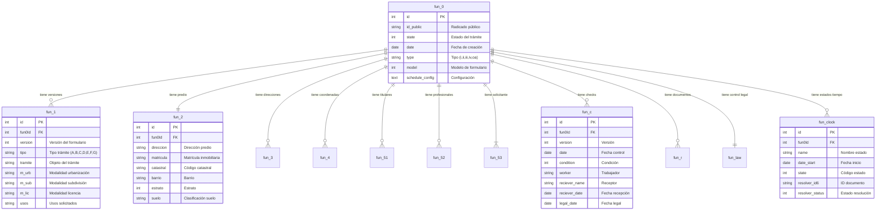
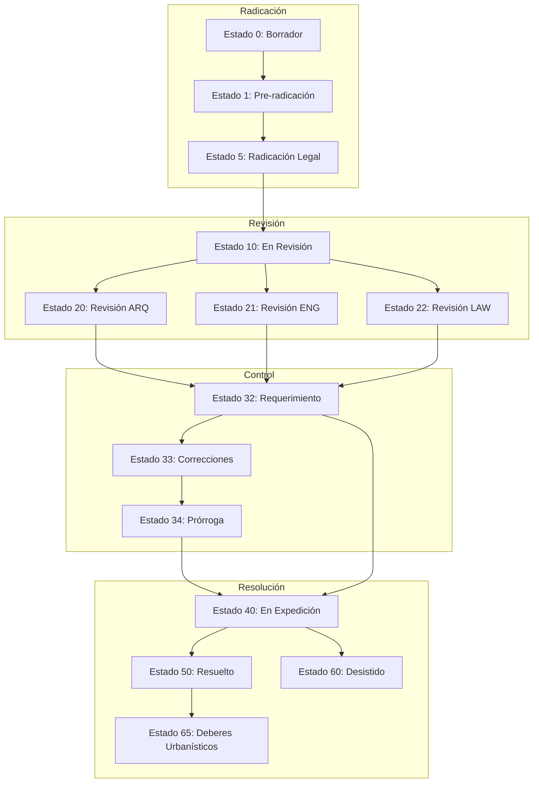
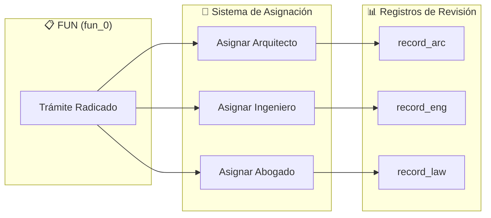
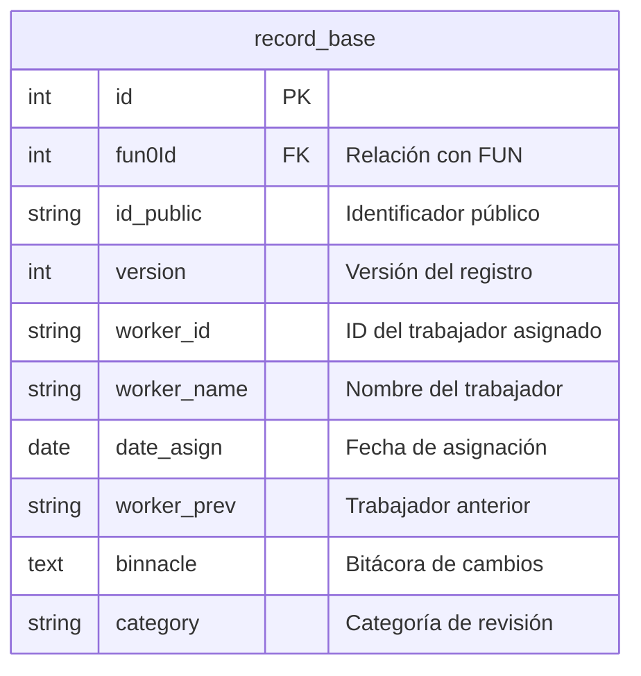
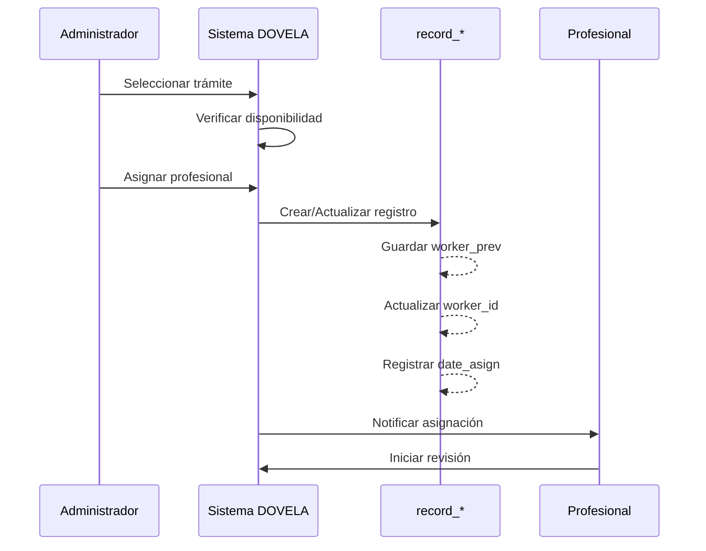
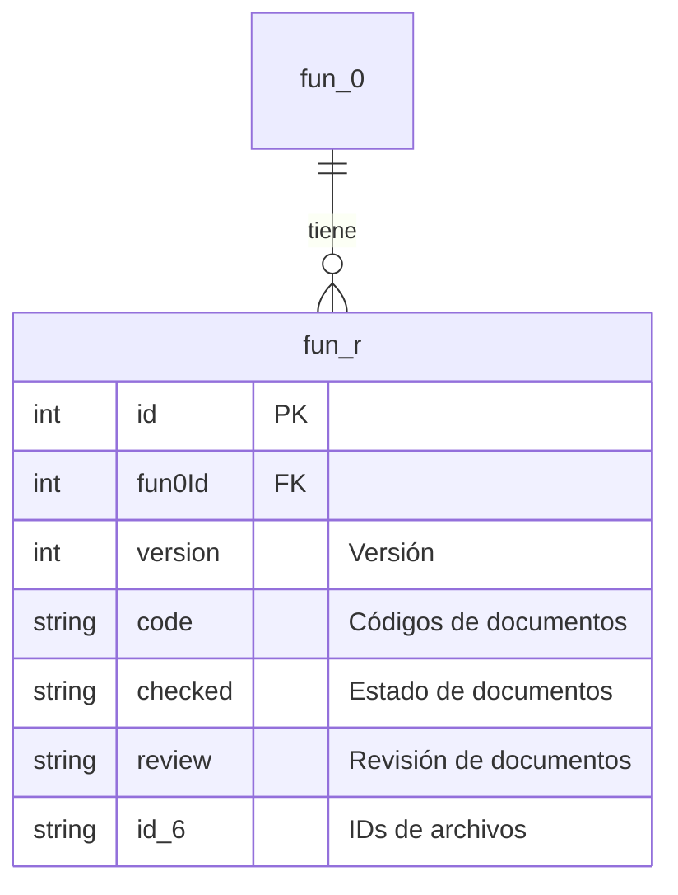
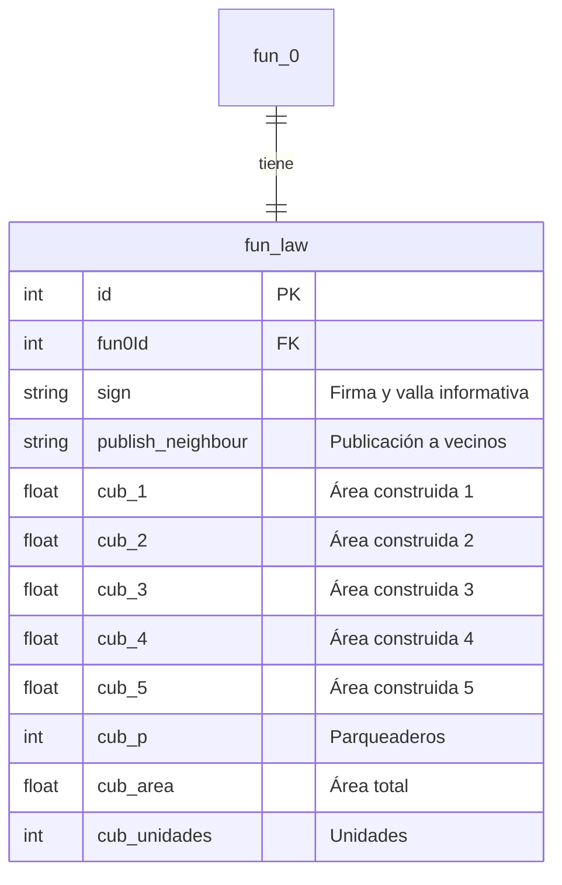
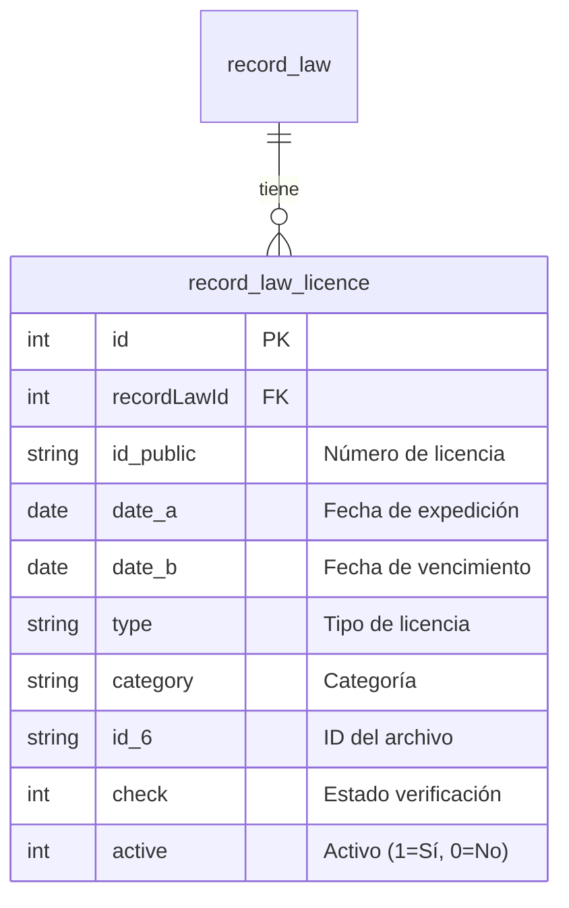
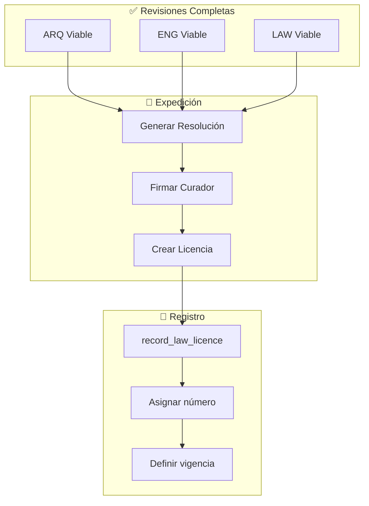
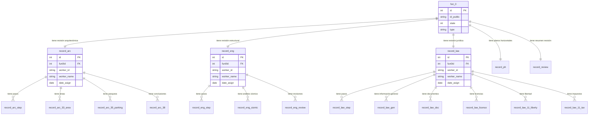

# 8. Sistema de Licencias y Asignación

Esta sección documenta el sistema de gestión de licencias urbanísticas, incluyendo la estructura del Formulario Único Nacional (FUN), el proceso de asignación a profesionales y el control temporal de los trámites.

---

## 8.1 Estructura del Sistema FUN

El **FUN (Formulario Único Nacional)** es la entidad central que representa una solicitud de licencia urbanística. La estructura se compone de un registro maestro (`fun_0`) y múltiples tablas relacionadas que almacenan información específica del trámite.

### Diagrama de Entidades FUN



### Tipos de Trámite

El campo `fun_1.tipo` define el tipo de actuación urbanística:

| Código | Tipo de Licencia |
|--------|------------------|
| **A** | Urbanización |
| **B** | Parcelación |
| **C** | Subdivisión |
| **D** | Construcción |
| **E** | Intervención y Ocupación del Espacio Público |
| **F** | Reconocimiento de Edificaciones |
| **G** | Otras Actuaciones |

### Categorías por Complejidad

El campo `fun_0.type` clasifica el trámite por complejidad:

| Categoría | Días Hábiles | Descripción |
|-----------|--------------|-------------|
| **i** | 20 | Proyecto simple |
| **ii** | 25 | Proyecto medio |
| **iii** | 35 | Proyecto complejo |
| **iv** | 45 | Proyecto muy complejo |
| **oa** | 15 | Otras actuaciones |

---

## 8.2 Sistema de Control Temporal (fun_clock)

El modelo `fun_clock` registra todos los estados temporales del trámite, permitiendo calcular tiempos legales, suspensiones y vencimientos.

### Diagrama de Estados del Trámite



### Campos Críticos de Tiempo

| Campo | Descripción | Uso |
|-------|-------------|-----|
| `date_start` | Fecha de inicio del estado | Cálculo de tiempos |
| `state` | Código numérico del estado | Identificación |
| `resolver_id6` | ID del documento asociado | Trazabilidad |
| `resolver_status` | Estado de la resolución | Seguimiento |
| `resolver_context` | Contexto adicional | Metadatos |

### Cálculo de Fecha Límite

El sistema calcula la fecha de desistimiento basándose en:

```javascript
// Tiempo base según categoría
const tiempoRevision = { 'i': 20, 'ii': 25, 'iii': 35, 'iv': 45, 'oa': 15 };

// Si hay requerimiento (estado 32/33)
if (estado32 || estado33) {
    const diasProrroga = estado34 ? 45 : 30;
    fechaLimite = calcularDiasHabiles(fechaRequerimiento, diasProrroga);
} else {
    fechaLimite = calcularDiasHabiles(fechaRadicacion, tiempoRevision[tipo]);
}
```

---

## 8.3 Sistema de Asignación a Profesionales

Cada trámite puede ser asignado a diferentes profesionales según el tipo de revisión requerida. El patrón de asignación es consistente en todos los módulos `record_*`.

### Diagrama de Asignación



### Estructura de Asignación (Común a todos los records)

Cada registro de revisión (`record_arc`, `record_eng`, `record_law`) comparte la siguiente estructura de asignación:



### Flujo de Asignación



---

## 8.4 Control de Documentos (fun_c y fun_r)

### Modelo fun_c (Control de Checks)

El modelo `fun_c` registra los puntos de control documental del trámite:

| Campo | Tipo | Descripción |
|-------|------|-------------|
| `version` | int | Versión del control |
| `date` | date | Fecha del control |
| `condition` | int | Condición (0=Rechazado, 1=Aprobado, 2=N/A) |
| `worker` | string | Trabajador que realizó el control |
| `reciever_name` | string | Nombre del receptor |
| `reciever_date` | date | Fecha de recepción |
| `legal_date` | date | Fecha legal válida |

### Modelo fun_r (Documentos Radicados)



El campo `code` almacena códigos de documentos separados por comas (ej: `"511,512,513,516"`), mientras que `checked` indica el estado de cada documento (`0`=No aportado, `1`=Aportado, `2`=N/A).

---

## 8.5 Control Legal (fun_law)

El modelo `fun_law` almacena información específica del control jurídico del trámite:



### Campos de Áreas (cub_*)

| Campo | Descripción |
|-------|-------------|
| `cub_1` | Área construida primer piso |
| `cub_2` | Área pisos superiores |
| `cub_3` | Área sótanos |
| `cub_4` | Área equipamentos |
| `cub_5` | Área zonas comunes |
| `cub_p` | Número de parqueaderos |
| `cub_area` | Área total calculada |
| `cub_unidades` | Total de unidades |

---

## 8.6 Licencias Expedidas (record_law_licence)

El modelo `record_law_licence` registra las licencias efectivamente expedidas para un trámite:



### Flujo de Expedición de Licencia



### Tipos de Licencia

El campo `type` puede contener valores como:

| Tipo | Descripción |
|------|-------------|
| `URB` | Licencia de Urbanización |
| `PAR` | Licencia de Parcelación |
| `SUB` | Licencia de Subdivisión |
| `CON` | Licencia de Construcción |
| `REC` | Reconocimiento de Edificación |
| `MOD` | Modificación de Licencia |
| `PRO` | Prórroga de Licencia |

---

## 8.7 Relación Completa del Sistema

El siguiente diagrama muestra la relación completa entre FUN y los sistemas de revisión:



---

## 8.8 API de Asignación y Licencias

### Endpoints Principales

| Método | Endpoint | Descripción |
|--------|----------|-------------|
| `POST` | `/api/record_arc` | Crear registro arquitectónico |
| `PUT` | `/api/record_arc/:id` | Actualizar asignación ARQ |
| `POST` | `/api/record_eng` | Crear registro estructural |
| `PUT` | `/api/record_eng/:id` | Actualizar asignación ENG |
| `POST` | `/api/record_law` | Crear registro jurídico |
| `PUT` | `/api/record_law/:id` | Actualizar asignación LAW |
| `POST` | `/api/record_law/licence` | Crear licencia |
| `PUT` | `/api/record_law/licence/:id` | Actualizar licencia |

### Ejemplo de Asignación

```javascript
// POST /api/record_arc
{
    "fun0Id": 12345,
    "id_public": "ARC-2024-001",
    "version": 1,
    "worker_id": "USER001",
    "worker_name": "Arquitecto Revisor",
    "date_asign": "2024-01-15",
    "worker_prev": null
}
```

### Ejemplo de Creación de Licencia

```javascript
// POST /api/record_law/licence
{
    "recordLawId": 5678,
    "id_public": "LC-2024-0123",
    "date_a": "2024-02-01",
    "date_b": "2027-02-01",
    "type": "CON",
    "category": "Construcción Nueva",
    "check": 1,
    "active": 1
}
```
