# 9. Sistema de Revisiones Técnicas

Esta sección documenta el sistema de revisiones técnicas que evalúan cada trámite de licencia urbanística. El sistema incluye tres tipos de revisión principales: **Arquitectónica (ARC)**, **Estructural (ENG)** y **Jurídica (LAW)**.

---

## 9.1 Visión General del Sistema de Revisiones

El proceso de revisión sigue un flujo paralelo donde cada profesional evalúa aspectos específicos del proyecto de manera independiente, pero sincronizada.

### Diagrama de Flujo de Revisiones

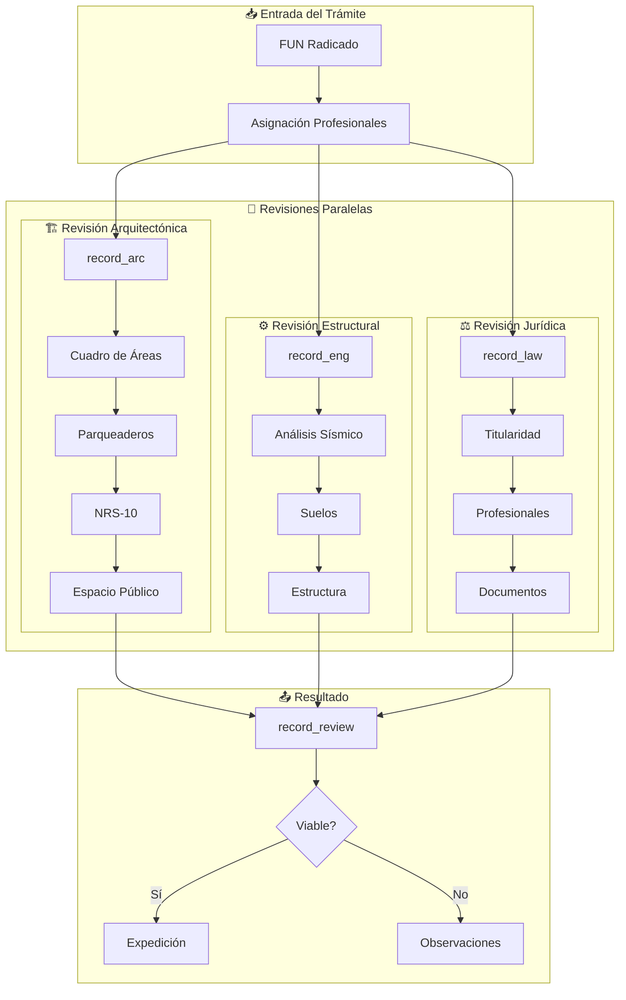

### Estados de Viabilidad

| Estado | Descripción | Color |
|--------|-------------|-------|
| **VIABLE** | Cumple todos los requisitos | 🟢 Verde |
| **NO VIABLE** | Tiene observaciones pendientes | 🔴 Rojo |
| **PENDIENTE** | En proceso de revisión | 🟡 Amarillo |

---

## 9.2 Revisión Arquitectónica (record_arc)

La revisión arquitectónica evalúa el cumplimiento normativo del diseño, áreas, parqueaderos, espacio público y normas de sismo-resistencia.

### Diagrama ER - Revisión Arquitectónica

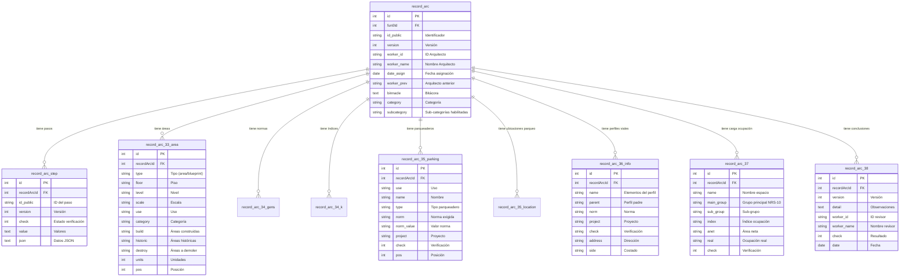

### Subcategorías de Revisión Arquitectónica

El campo `subcategory` define qué secciones de revisión están habilitadas:

| Índice | Subcategoría | Descripción |
|--------|--------------|-------------|
| 0 | URBANAS | Determinantes urbanísticas |
| 1 | PARKING | Parqueaderos |
| 2 | PUBLIC SPACE | Espacio público |
| 3 | NSR10 | Norma sismo-resistente |

### Pasos de Revisión (record_arc_step)

Los pasos se identifican por `id_public`:

| ID Público | Descripción |
|------------|-------------|
| `a_config` | Configuración general |
| `s33` | Cuadro de áreas |
| `s34` | Determinantes urbanísticas |
| `s35` | Parqueaderos |
| `s36` | Espacio público |
| `s37` | NRS-10 |
| `rar_0` - `rar_16` | Revisiones alternativas |

### Flujo de Revisión Arquitectónica

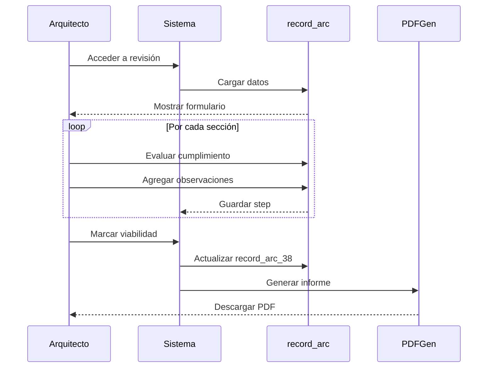

---

## 9.3 Revisión Estructural (record_eng)

La revisión estructural evalúa el cumplimiento de la normativa sismo-resistente, estudios de suelos y diseño estructural.

### Diagrama ER - Revisión Estructural

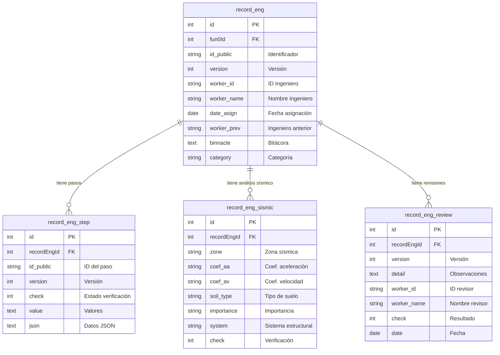

### Parámetros Sísmicos (record_eng_sismic)

| Campo | Descripción | Valores Ejemplo |
|-------|-------------|-----------------|
| `zone` | Zona de amenaza sísmica | Alta, Intermedia, Baja |
| `coef_aa` | Coeficiente de aceleración | 0.15, 0.20, 0.25 |
| `coef_av` | Coeficiente de velocidad | 0.10, 0.15, 0.20 |
| `soil_type` | Clasificación del suelo | A, B, C, D, E, F |
| `importance` | Grupo de importancia | I, II, III, IV |
| `system` | Sistema estructural | Pórticos, Muros, Dual |

### Flujo de Revisión Estructural

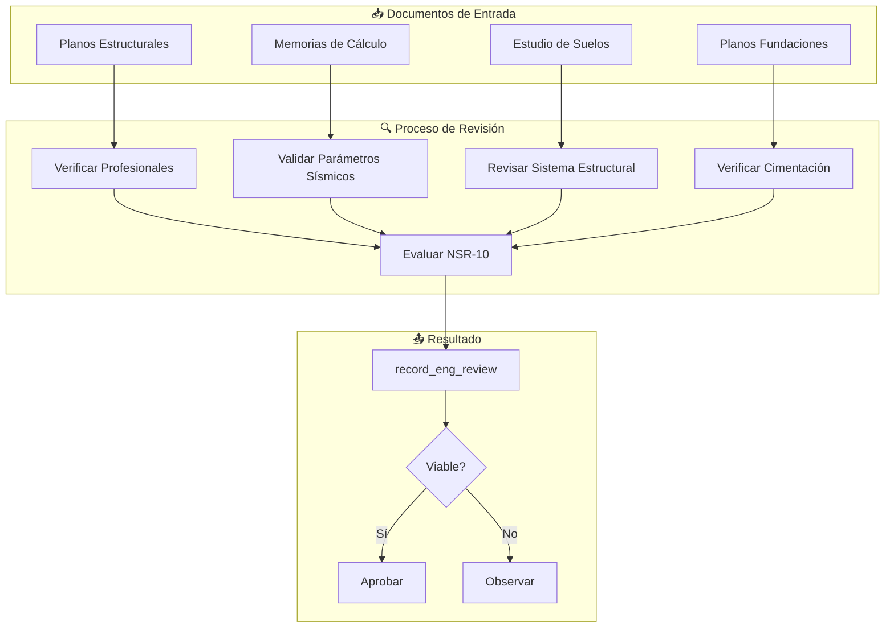

---

## 9.4 Revisión Jurídica (record_law)

La revisión jurídica verifica la titularidad del predio, legitimación de los solicitantes, documentación legal y cumplimiento de requisitos normativos.

### Diagrama ER - Revisión Jurídica

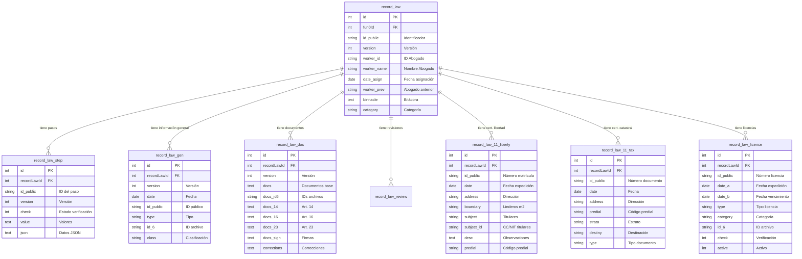

### Pasos de Revisión Jurídica

| ID Público | Sección | Descripción |
|------------|---------|-------------|
| `s1` | Inventario | Documentación aportada |
| `s23` | FUN | Formulario Único Nacional |
| `s24` | Predio | Información del predio |
| `f51` | Titulares | Verificación titulares |
| `f52` | Profesionales | Verificación profesionales |
| `f53` | Solicitante | Responsable solicitud |
| `sc1` | Cert. Libertad | Certificado de tradición |
| `sc2` | Cert. Catastral | Boletín catastral |
| `flaw` | Publicidad | Valla informativa |

### Flujo de Revisión Jurídica

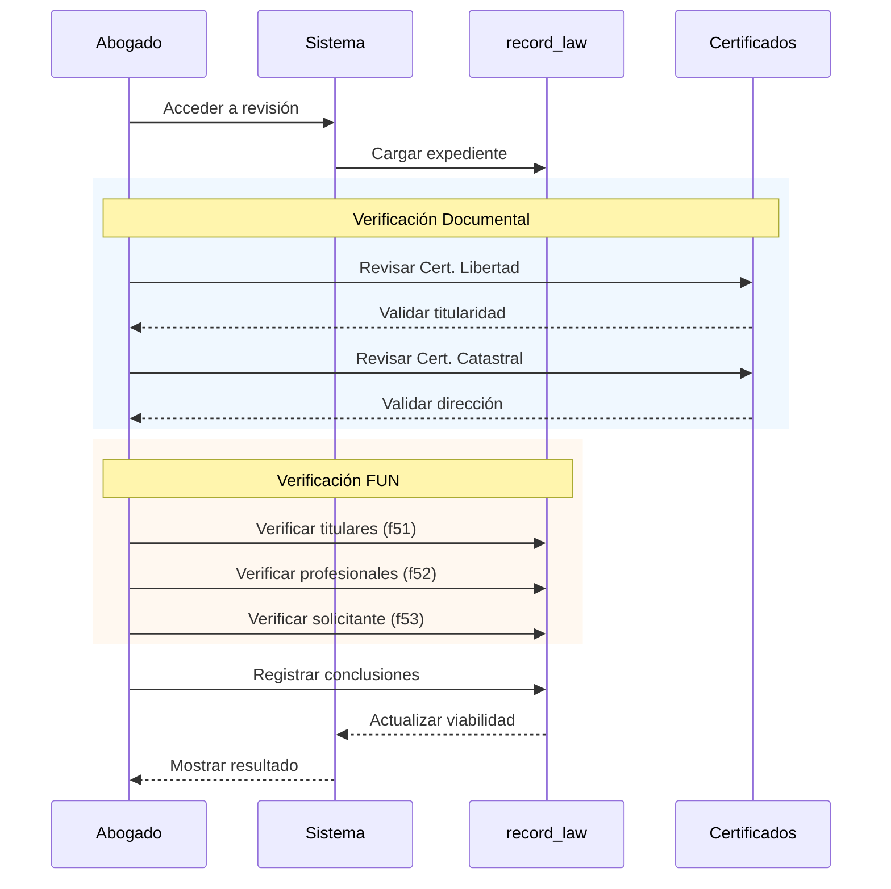

### Verificaciones del Certificado de Libertad

La tabla `record_law_11_liberty` permite verificar:

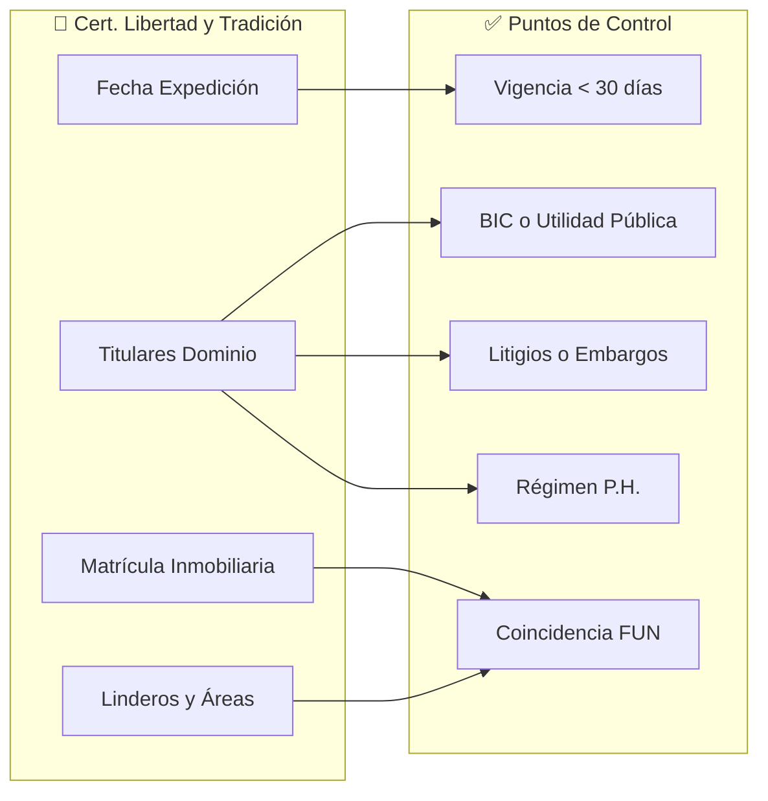

---

## 9.5 Registro Consolidado (record_review)

El modelo `record_review` consolida el resultado de todas las revisiones:

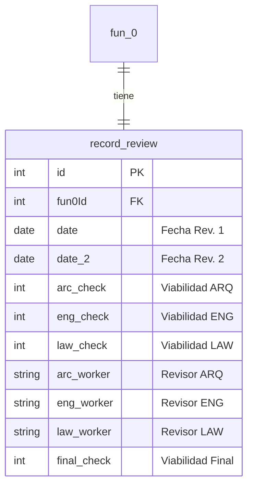

### Matriz de Viabilidad

| ARQ | ENG | LAW | Resultado Final |
|-----|-----|-----|-----------------|
| ✅ | ✅ | ✅ | **VIABLE** |
| ✅ | ✅ | ❌ | NO VIABLE |
| ✅ | ❌ | ✅ | NO VIABLE |
| ❌ | ✅ | ✅ | NO VIABLE |
| ❌ | ❌ | ❌ | NO VIABLE |
| ⏳ | ⏳ | ⏳ | PENDIENTE |

---

## 9.6 Generación de Informes PDF

Cada revisión puede generar un informe PDF detallado mediante el endpoint correspondiente.

### Endpoint de Generación

| Revisión | Endpoint | Descripción |
|----------|----------|-------------|
| ARQ | `POST /api/record_arc/pdfgen` | Informe arquitectónico |
| ENG | `POST /api/record_eng/pdfgen` | Informe estructural |
| LAW | `POST /api/record_law/pdfgen` | Informe jurídico |

### Parámetros del Informe

```javascript
// POST /api/record_arc/pdfgen
{
    "id": 12345,           // ID del FUN
    "version": 1,          // Versión del informe
    "type_rev": 1,         // 1=Observaciones, 2=Correcciones
    "header": "1",         // Incluir encabezado
    "r_worker": "Arq. Revisor",
    "r_check": "VIABLE",   // o "NO VIABLE"
    "r_date": "2024-01-20",
    "r_arc_pending": "false"
}
```

### Estructura del PDF Generado

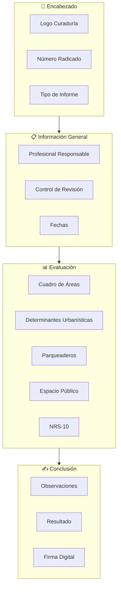

---

## 9.7 API de Revisiones

### Endpoints record_arc

| Método | Endpoint | Descripción |
|--------|----------|-------------|
| `GET` | `/api/record_arc` | Listar todos |
| `GET` | `/api/record_arc/single/:id` | Obtener por FUN ID |
| `GET` | `/api/record_arc/steps/:id` | Obtener pasos |
| `POST` | `/api/record_arc` | Crear registro |
| `PUT` | `/api/record_arc/:id` | Actualizar registro |
| `POST` | `/api/record_arc/step` | Crear paso |
| `PUT` | `/api/record_arc/step/:id` | Actualizar paso |
| `POST` | `/api/record_arc/33area` | Crear área |
| `PUT` | `/api/record_arc/33area/:id` | Actualizar área |
| `POST` | `/api/record_arc/35parking` | Crear parqueadero |
| `PUT` | `/api/record_arc/35parking/:id` | Actualizar parqueadero |
| `POST` | `/api/record_arc/pdfgen` | Generar PDF |

### Endpoints record_law

| Método | Endpoint | Descripción |
|--------|----------|-------------|
| `GET` | `/api/record_law` | Listar todos |
| `GET` | `/api/record_law/single/:id` | Obtener por FUN ID |
| `POST` | `/api/record_law` | Crear registro |
| `PUT` | `/api/record_law/:id` | Actualizar registro |
| `POST` | `/api/record_law/step` | Crear paso |
| `PUT` | `/api/record_law/step/:id` | Actualizar paso |
| `POST` | `/api/record_law/11liberty` | Crear cert. libertad |
| `PUT` | `/api/record_law/11liberty/:id` | Actualizar cert. |
| `POST` | `/api/record_law/licence` | Crear licencia |
| `PUT` | `/api/record_law/licence/:id` | Actualizar licencia |
| `POST` | `/api/record_law/pdfgen` | Generar PDF |

---

## 9.8 Consideraciones de Implementación

### Versionamiento

Cada revisión mantiene un historial de versiones:

```javascript
// Al crear nueva versión
const nuevaVersion = versionActual + 1;

// Los steps se filtran por versión
const steps = await record_arc_step.findAll({
    where: { 
        recordArcId: arcId,
        version: version 
    }
});
```

### Bitácora de Cambios

El campo `binnacle` almacena un registro de cambios:

```javascript
// Formato de bitácora
const entradaBitacora = JSON.stringify({
    fecha: new Date(),
    usuario: userId,
    accion: "Actualización de áreas",
    detalle: "Modificado cuadro de áreas piso 3"
});

// Agregar a bitácora existente
record.binnacle = record.binnacle 
    ? record.binnacle + ";" + entradaBitacora 
    : entradaBitacora;
```

### Reasignación de Profesional

```javascript
// Al reasignar profesional
await record_arc.update({
    worker_prev: record.worker_id,  // Guardar anterior
    worker_id: nuevoWorkerId,
    worker_name: nuevoWorkerName,
    date_asign: new Date()
}, { where: { id: recordId } });
```

### Validación de Completitud

Antes de marcar como viable, se verifica que todos los pasos requeridos estén completos:

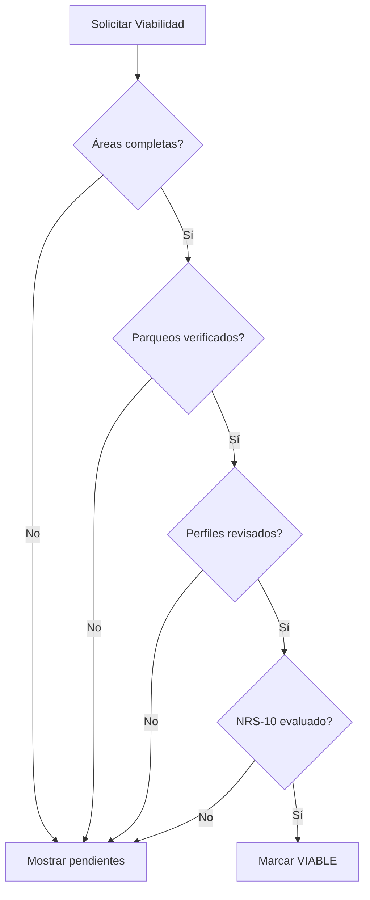
